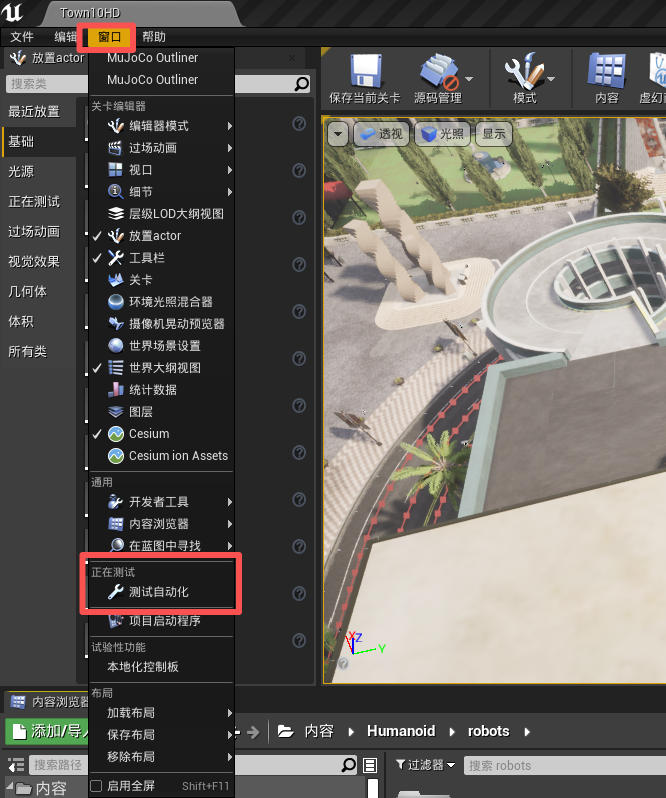
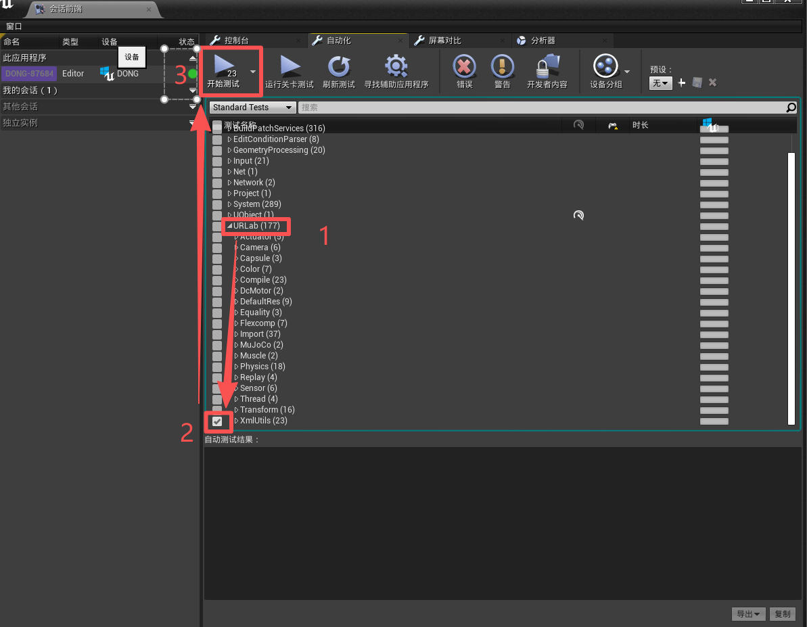

# 自动化测试

## 1. 开启测试相关的插件

在项目/插件 [.uproject](https://github.com/OpenHUTB/hutb/blob/hutb/Unreal/CarlaUE4/Plugins/UnrealRoboticsLab/UnrealRoboticsLab.uplugin) 中添加：

```conf
	"Plugins": [
		{
			"Name": "FunctionalTestingEditor",
			"Enabled": true
		}
	]
```


或者通过虚幻编辑器打开这个插件：
单击编辑器菜单中设置->插件按钮，从弹出的插件界面中选择“Testing”分类中的 Functional Testing Editor（和 Runtime Tests）。

在编辑器的`窗口(Window)`菜单中，单击`测试自动化`按钮，弹出测试的会话前端：



选择 URLab 的 [XmlUtils](https://github.com/OpenHUTB/hutb/blob/hutb/Unreal/CarlaUE4/Plugins/UnrealRoboticsLab/Source/URLabEditor/Private/Tests/MjXmlUtilsTests.cpp) 进行测试：



最后弹出测试的过程和结果。


