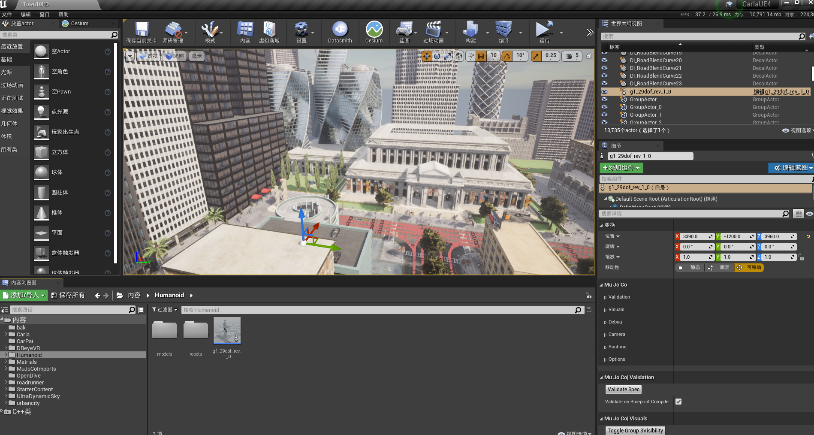
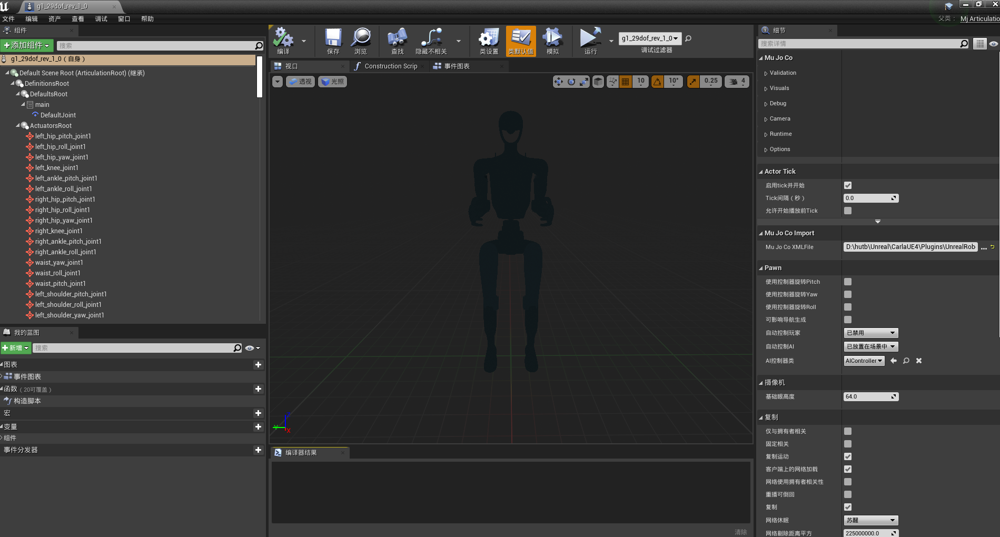
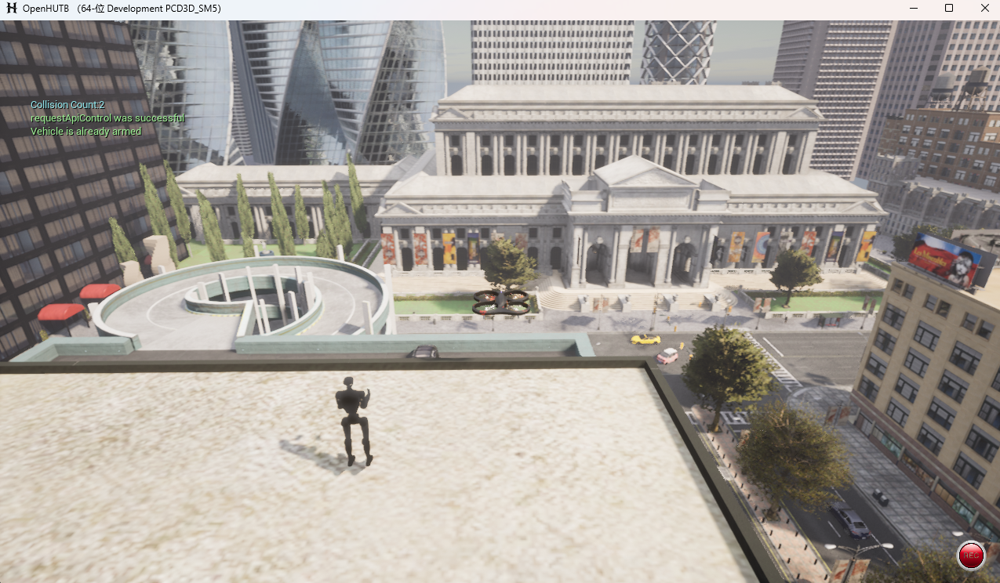

# 适配 [hutb 模拟器](https://github.com/OpenHUTB/hutb)

1.通过将 mujoco 的 xml 文件拖拽到虚幻编辑器的“内容浏览器”，将 xml 转成 _ue.xml 文件。hutb 引擎中默认使用的是 [Engine/Binaries/ThirdParty/Python3/Win64](https://github.com/OpenHUTB/engine/tree/hutb/Engine/Binaries/ThirdParty/Python3/Win64) 中的 Python 3.7.7（UE 5.7 中默认使用的是 Python 3.11.8）。解析 xml由 [UMujocoGenerationAction::ParseAssetsRecursive](https://github.com/OpenHUTB/hutb/tree/hutb/Unreal/CarlaUE4/Plugins/UnrealRoboticsLab/Source/URLabEditor/Private/MujocoXmlParser.cpp#L1014) 负责。其中 Mujoco 管理器 [Source/URLab/Public/MuJoCo/Core/AMjManager.h](https://github.com/OpenHUTB/hutb/blob/hutb/Unreal/CarlaUE4/Plugins/UnrealRoboticsLab/Source/URLab/Public/MuJoCo/Core/AMjManager.h) 是一个参与者，通过它进行xml文件的加载。

2.上一步执行完成会在“内容浏览器”中生成蓝图，然后将生成的蓝图拖拽到场景的合适位置（参考 [mujoco_plugin](https://github.com/OpenHUTB/hutb/commit/2cc693c1248f3f65d71a5d95c23231f9dfa928a1) ），



3.打开导入的蓝图进行查看（可选，如果模型未显示全，则第1步的导入有问题）：



4.运行模拟，在场景中指定位置查看蓝图实例化效果：




## 问题

* 打开生成的蓝图没有显示对应的网格

    表现：在蓝图编辑器中双击worldbody中生成的GeomMesh（UE5生成的是AUTONAME_Geom），没有显示对应的网格。

    打开蓝图和拖入场景中运行都只有两个圆柱体。
    
    生成的蓝图在UE5中有267个蓝图组件（Blueprint Components），而在UE4中只有208个。

    报错日志分析：
    59 个 导入网格 [ImportSingleMesh()](https://github.com/OpenHUTB/hutb/blob/2ed4eb9d5a9b25b3f5df498267f288124eb16a52/Unreal/CarlaUE4/Plugins/UnrealRoboticsLab/Source/URLabEditor/Private/MujocoMeshImporter.cpp#L113) 报错，最后一个网格为 `right_rubber_hand`，第 2 个为`pelvis_contour_link`：

    每个导入网格的报错信息依次为：
    ```text
    Failed to read file '' error.
    ...
    Failed to import mesh 'pelvis_contour_link' with MikkTSpace, attempting fallback
    ...
    Failed to read file '' error.
    ...
    Failed to import mesh 'pelvis_contour_link' - all import methods failed
    ```

    其中，MikkTSpace 是一种由 Mikkel S. Olsson 定义的切线空间（tangent space）生成算法，用于为每个顶点生成一致的切线（tangent）和副切线（bitangent）。
    切线空间用于法线贴图（normal mapping）：它决定如何把切线空间的法线变换到模型世界/切线坐标，从而影响光照和 PBR 表现。

    [ImportAssetTasks](https://github.com/OpenHUTB/engine/blob/ab78e8bbd557471bdc132ba0e17abdd02d6920c0/Engine/Source/Developer/AssetTools/Private/AssetTools.cpp#L1144) 执行成功：将 .glb 文件导入到 hutb\Unreal\CarlaUE4\Content\MuJoCoImports\g1_29dof_rev_1_0_ue_Assets\Meshes\*uasset

    修改参考：[UE5 的 AssetTools.cpp](https://github.com/EpicGames/UnrealEngine/commit/9e1786b97b3e986a4034cf5d3aeeeeb0cd028fb4) 。
    
    定位方法：通过网页的`git blame`查找某一行的所有修改记录（打开编辑器的警告也不见了）。

---

* 将 g1_29dof_rev_1_0.xml 拖拽到内容浏览器时并没有在当前目录下生成 meshes/*.glb
    
    解决：安装插件[glTFForUE4](https://github.com/code4game/glTFForUE4/tags)后成功发现导入的资产。
    
    注意：使用自带的插件不能导入资产。


* 虚幻中验证pip报错：
    ```text
    FPlatformProcess::ExecProcess(*PythonPath, TEXT("-m pip --version"), &PipCheck, &PipOut, &PipErr);

    File "D:\hutb\Build\engine\Engine\Binaries\ThirdParty\Python3\Win64\lib\site-packages\pip\_internal\vcs\subversion.py", line 180, in __init__
        use_interactive = sys.stdin.isatty()
    AttributeError: 'NoneType' object has no attribute 'isatty'
    ```
    解决：手动执行包的安装
    ```shell
    python -m pip install trimesh numpy scipy
    ```
    就可以生成_ue.xml文件和meshes/*glb文件。

* 打包报错：`UnrealBuildTool: ERROR: Non-editor build cannot depend on non-redistributable modules.`

    原因：将一些编辑器相关的内容打包进来了，参考[链接](https://imzlp.com/posts/9050/)。

    解决：打开 Build/engine/UE4.sln，右键项目 UnrealBuildTool 进行`生成`。


    资产打包报错：
    ```text
    LogAssetRegistry: Error: Package ../../../../../Unreal/CarlaUE4/Plugins/UnrealRoboticsLab/Content/Input/IA_TwistMove.uasset is too old
    LogAssetRegistry: Error: Package ../../../../../Unreal/CarlaUE4/Plugins/UnrealRoboticsLab/Content/Input/IMC_TwistControl.uasset is too old
    LogAssetRegistry: Error: Package ../../../../../Unreal/CarlaUE4/Plugins/UnrealRoboticsLab/Content/Materials/M_MuJoCo_Master.uasset is too old
    LogAssetRegistry: Error: Package ../../../../../Unreal/CarlaUE4/Plugins/UnrealRoboticsLab/Content/Demo/example_BP/M_HoverGlow.uasset is too old
    LogAssetRegistry: Error: Package ../../../../../Unreal/CarlaUE4/Plugins/UnrealRoboticsLab/Content/UI/WBP_MjCameraFeedEntry.uasset is too old
    LogAssetRegistry: Error: Package ../../../../../Unreal/CarlaUE4/Plugins/UnrealRoboticsLab/Content/UI/WBP_MjPropertyRow.uasset is too old
    LogAssetRegistry: Error: Package ../../../../../Unreal/CarlaUE4/Plugins/UnrealRoboticsLab/Content/UI/WBP_MjSimulate.uasset is too old
    LogAssetRegistry: Error: Package ../../../../../Unreal/CarlaUE4/Plugins/UnrealRoboticsLab/Content/Input/IA_TwistTurn.uasset is too old
    LogAssetRegistry: Error: Package ../../../../../Unreal/CarlaUE4/Plugins/UnrealRoboticsLab/Content/Demo/example_BP/BP_RandomActions.uasset is too old
    ```
    解决：在资源浏览器中删除资产。


* error C2039: "byte": is not a member "std" C++14
原因：mujoco 和 CoACD 使用的是 C++ 17 进行编译，而虚幻工程使用 C++ 14

    解决：将 C++ 17 的一些语法改为 C++ 14
    ```cpp
    // Unreal\CarlaUE4\Plugins\UnrealRoboticsLab\third_party\install\MuJoCo\include\mujoco\mjspec.h
    // using mjByteVec     = std::vector<std:byte>;
    using mjByteVec     = std::vector<unsigned char>;

    // Unreal\CarlaUE4\Plugins\UnrealRoboticsLab\third_party\install\CoACD\include\CoACD\coacd.h
    void set_log_level(); // void set_log_level(std::string_view level);
    ```

* UnrealBuildTool: ERROR: Could not find definition for module 'GeometryFramework', (referenced via Target -> URLab.Build.cs)

    模块 GeometryFramework 位于 UE5 的`Engine/Source/Runtime/GeometryFramework`

* 调试模式运行虚幻编辑器后，拖入 xml 模型在 [UE_DEBUG_BREAK()](https://github.com/OpenHUTB/engine/blob/ab78e8bbd557471bdc132ba0e17abdd02d6920c0/Engine/Source/Runtime/Slate/Private/Framework/Application/SlateApplication.cpp#L1877) 处断点停止，且无法继续

    输出：在无人值守脚本模式下运行时，一个模态窗口试图获取控制权。该窗口已被取消。

    原因：在“无人值守脚本（unattended）”模式下阻止弹出普通模态窗口（除非它是标记为慢任务的模态窗口 bSlowTaskWindow=true）

    解决：[暂时注释掉这句代码](https://github.com/OpenHUTB/engine/commit/e2560a2afb03f554d3bd1de3643f9bfb84e228c1)。


## 参考

* [Mujoco 的 Unity 插件](https://mujoco.readthedocs.io/en/stable/unity.html)


