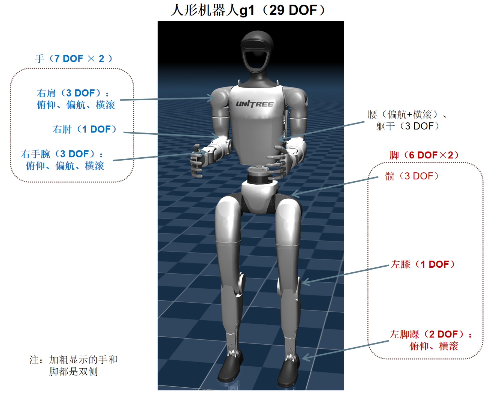

# 人形机器人 G1

该模型 [g1_29dof_rev_1_0.xml](https://github.com/OpenHUTB/hutb/blob/hutb/Unreal/CarlaUE4/Plugins/UnrealRoboticsLab/URLab_Bridge/RoboJuDo/assets/robots/g1/g1_29dof_rev_1_0.xml) 为插件的开发和测试所使用的标准模型，包含 29 个自由度，包括左腿（6 DOF）、右腿（6 DOF）、腰+躯干（3 DOF）、左肩（7 DOF）、右肩（7 DOF）。

包含机器人本地部分的 <default\>、<asset\>、<wordbody\>、29 个关节执行器 <actuator\>、躯干和盆骨的加速度计和陀螺仪 <sensor\> 和场景的 <statistic\>、<visual\>、<asset\>、<worldbody\>。

