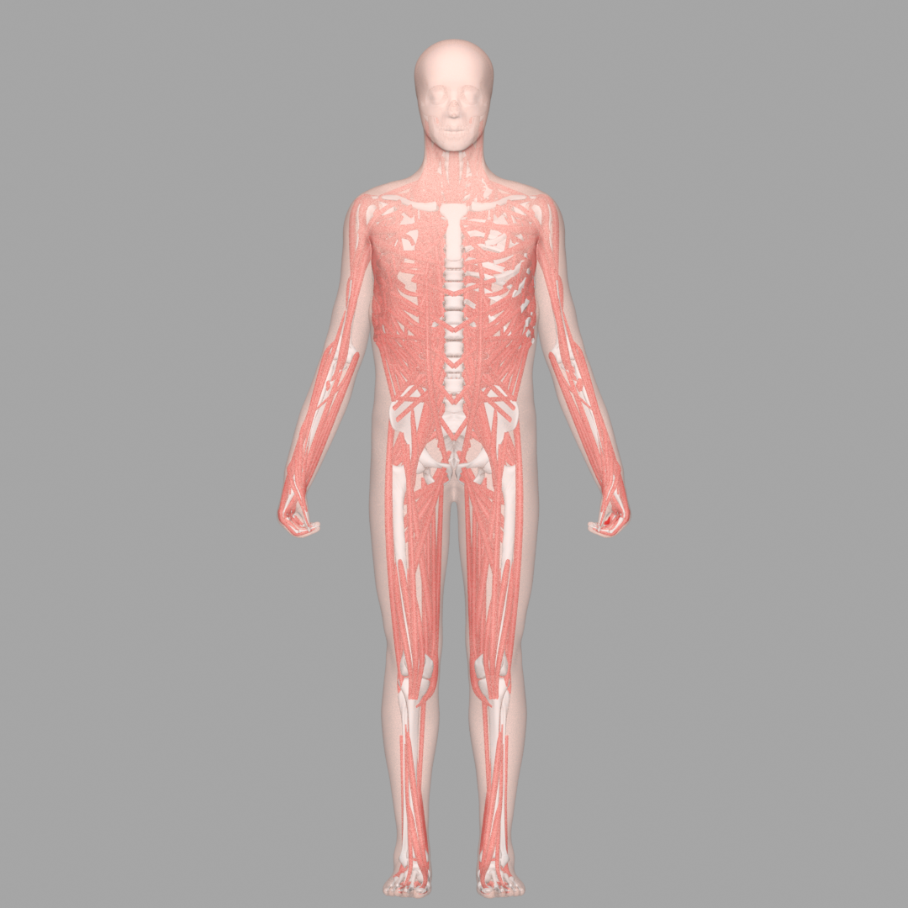
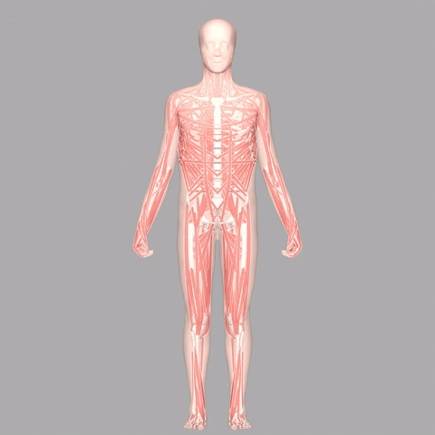
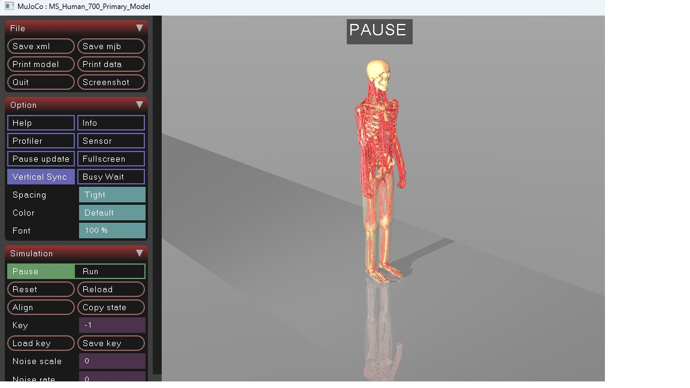
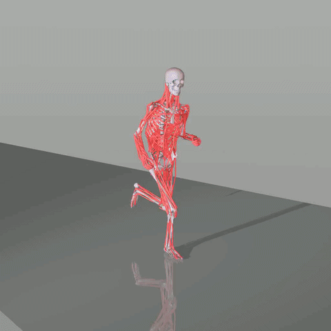
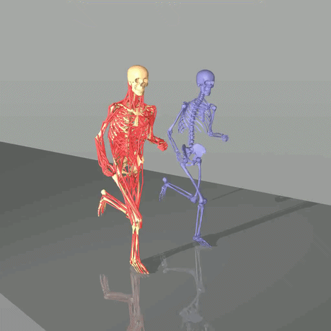
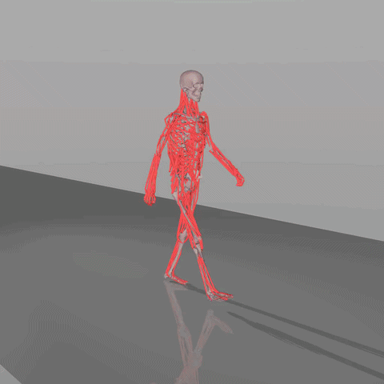
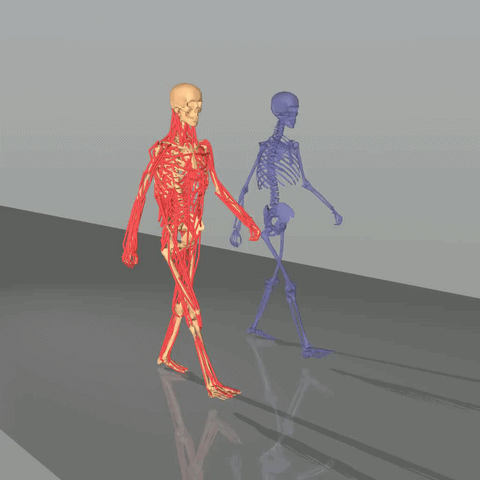

# 全身肌肉骨骼模型 [MS-Human-700](https://lnsgroup.cc/research/MS-Human/)

[MS-Human-700.xml](https://github.com/OpenHUTB/mujoco_plugin/blob/main/src/ms/MS-Human-700/MS-Human-700.xml) 模型代表了人体全身肌肉骨骼系统，其特点包括：

* 90个身体节段
* 206个关节（为保证控制稳定性，数值限制为 85）
* 700个肌腱单元
* 解剖学上合理的参数
* MuJoCo 整合

该模型能够模拟全身动力学以及与各种设备的交互，使其适用于具身智能、机器人和生物力学领域的研究。


渲染效果：


| 前视角 | 环绕视角 |
|:---:|:---:|
|  |  |


### 腿运动模型

**文件：** [MS-Human-700-Locomotion.xml](https://github.com/OpenHUTB/mujoco_plugin/blob/main/src/ms/MS-Human-700/MS-Human-700-Locomotion.xml)

该模型着重研究下肢动力学，将腿部单独用于运动研究，同时简化了上肢和躯干。

* **身体节段：** 80
* **关节：** 36
* **肌肉：** 100

### 单手操作模型

**文件：** [MS-Human-700-Manipulation.xml](https://github.com/OpenHUTB/mujoco_plugin/blob/main/src/ms/MS-Human-700/MS-Human-700-Manipulation.xml)

重点训练右臂和右手细节，专为操作任务而设计。

* **身体节段：** 127
* **关节：** 42
* **肌肉：** 81


## 运行


1.下载并加载模型
```shell
# 克隆模型仓库
git clone https://github.com/LNSGroup/MS-Human-700.git
# 使用mujoco打卡模型
mujoco/bin/simulate.exe  MS-Human-700/MS-Human-700.xml
```



[DynSyn](https://lnsgroup.cc/research/DynSyn) 控制结果:


| 控制全身的移动 | 控制腿的移动 | 抓取 |
|:---:|:---:|:---:|
|  |  |  |


## DynSyn

DynSyn：用于过驱动具身系统高效学习与控制的动态协同表示[@he2024dynsyn]。

1.安装
```shell
git clone https://github.com/OpenHUTB/DynSyn.git
cd DynSyn

conda create -n hutb_3.9 python=3.9
conda activate hutb_3.9
pip install poetry
poetry install
```

2.运行
```shell
# 生成 DynSyn 到 log 文件夹下
python dynsyn/dynsyn.py -f configs/DynSynGen/dynsyn.yaml -e myoLegWalk
# 训练
python dynsyn/sb3_runner/runner.py -f configs/DynSyn/myowalk.json
```
**评估**过程中，dynsyn_weight_amp 的值取决于配置文件中是否设置了该参数。因此，在评估过程中，我们可以设置 dynsyn_weight_amp 以使其与训练设置保持一致。如果在训练过程中已经设置了 dynsyn_weight_amp，则在评估过程中无需再次设置。
```
"load_kwargs": {
    "dynsyn_weight_amp": 0.1
}
```


## [Qflex 控制](https://lnsgroup.cc/research/Qflex/)


Qflex 一种可扩展且高效的在线强化学习（RL）方法[@wei2026scalable]，用于高维动态系统的连续控制。此类系统通常面临诸多挑战，严重阻碍高效学习：

* 高维性：状态-动作空间的大小随维度迅速增长，导致显著的“维度灾难”效应；
* 过度驱动：在执行器数量远大于自由度的情况下，多个动作序列可能产生无法区分的运动学特征，但内部力和成本却可能不同。

```shell
git clone --recurse-submodules https://github.com/LNSGroup/Qflex.git
cd Qflex
conda activate hutb_3.12
# 
python scripts/train.py  --alg qflex --env MS700Locomotion-v1 --seed 100 --total_step 50000000 --num_vec_envs 224 --hidden_dim 1024 --diffusion_hidden_dim 1024 --record_video
# 减少 num_vec_envs 用于调试:
python scripts/train.py --alg qflex --env MS700Locomotion-v1 --seed 100 --total_step 50000000 --num_vec_envs 4 --hidden_dim 1024 --diffusion_hidden_dim 1024 --record_video
```

报错：[No module named 'relax.spinlock'](https://github.com/LNSGroup/Qflex/issues/1)

Windows 下安装`relax-0.1.0`：
```shell
cd Qflex
# windows下需要注释掉 https://github.com/LNSGroup/Qflex/blob/a028cfa76525a62bfb90d76c6f1535f697121383/src/futex.c#L3
pip install -e .
```

[**QFlex**](https://lnsgroup.cc/research/Qflex) 控制结果:

| 跑步 | 跳舞 |
|:---:|:---:|
|  |  |


## 高保真运动跟踪结果: 

利用 MuJoCo Warp 进行大规模并行 **GPU** 仿真，可以快速高效地训练控制策略，从而在各种动态轨迹上实现高精度运动跟踪。


以下演示展示了 MS-Human 模型的这些跟踪功能：

*   **重叠**: 模型和参考轨迹直接渲染，以直观地展示跟踪精度。
*   **分离**: 模型和参考轨迹以一定的偏移量渲染，以突出运动细节。


| 跑步：重叠 | 跑步：分离 |
|:---:|:---:|
|  |  |
| **走路：重叠** | **走路：分离** |
|  |  |


