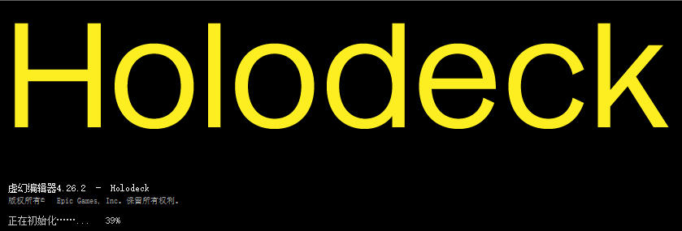
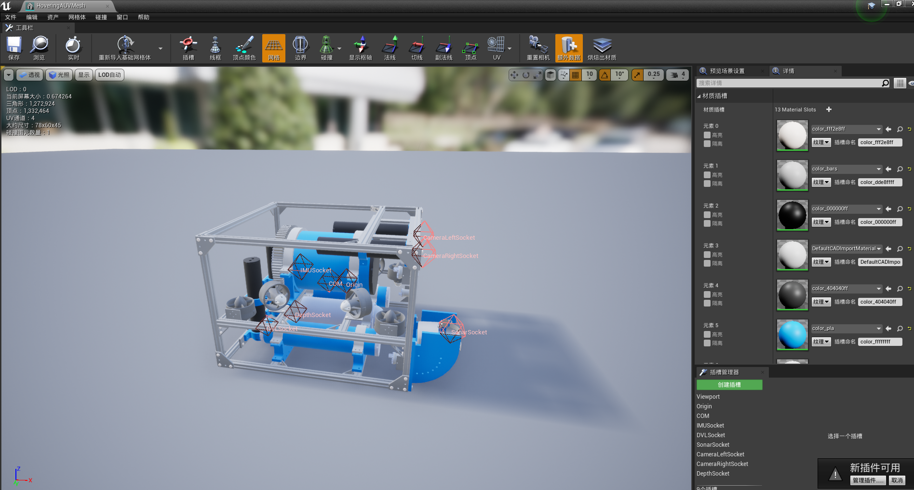

# 水下机器人 HoloOcean

全息海洋（Hologram, LoloOcean）其前身为“全息甲板(Holodeck)”。

详细文档请参看 [HoloOceam](./index.md)（参考文档请查看[UE4.27归档版](https://byu-holoocean.github.io/holoocean-docs/UE4.27_archival_develop/index.html) ，文档的源码位于[27_archival_develop目录](https://github.com/byu-holoocean/holoocean-docs/tree/main/UE4.27_archival_develop)）。

## 运行

* [Windows v1.0.0 下载地址](https://robots.et.byu.edu/holo/Ocean/v1.0.0/Windows.zip)

* [Linux v1.0.0 下载地址](https://robots.et.byu.edu/holo/Ocean/v1.0.0/Linux.zip)

    * [Linux v0.1.0 下载地址](https://robots.et.byu.edu/holo/Ocean/v0.1.0/Linux.zip)


## 编译

把引擎移出，调整引擎的版本为现有引擎版本

* 报错：Missing Engine/Binaries/DotNET/UnrealBuildTool/UnrealBuildTool.exe after build

    解决：

    ```shell
    "D:\hutb\Build\engine\Engine\Build\BatchFiles\GenerateProjectFiles.bat" -project="D:\hutb\Unreal\CarlaUE4\Plugins\Underwater\Holodeck.uproject" -game -progress
    ```


通过VS进行启动，启动画面为：


* 启动到92%报错：“打开地图文件失败。可能是因为该地图使用了较新版本的引擎进行保存。”

    地图为：ExampleLevel.umap

    没有在内容浏览器中显示的资产：Underwater\Content\HolodeckContent\Agents\NavAgent\NavAgentBlueprint.uasset、Underwater\Content\HolodeckContent\Agents\AgentSpectatorPawn.uasset、Underwater\Content\HolodeckContent\Agents\SphereRobot_Blueprint.uasset

    资产 Underwater\Content\HolodeckContent\Agents\AgentFollower.uasset 打开编译报错。


可以打开相关的资产：


下面说明解决资产不兼容的问题。


## 将 UE4.27 的资产降级为 4.26

1.使用 [Asset Downgrader](https://pan.baidu.com/s/1n2fJvWff4pbtMe97GOqtvQ?pwd=hutb)（software/ue/AssetDowngrader.zip）中定制的 UE 5.4 虚幻编辑器打开一个空项目（也可以是需要降级的 5.4 项目，更低的版本项目没试过）。

2.将需要降级的 UE 4.27 的资产复制到空项目的 Content 目录下

3.从 UE 5.4 虚幻编辑器中，选中需要降级的资产，点击右上角菜单中的 `DowngraderSelectedAsset`，在弹出的对话框中，选中`Target Version`为`4.26.2(experimental)`，点击 OK 进行转换。

4.将转换后的Content中的资产拷贝到 4.26 的项目中即可。

使用 hutb 所对应的虚幻编辑器打开 hutb\Unreal\CarlaUE4\Plugins\Underwater\Holodeck.uproject 会不成功，需要按提示打开 VS，点击菜单的`调试`->`开始调试`（这个时候虚幻编辑器会重新编译！）


## 通过 UE 4.27 打开工程

如果出现版本不兼容，选择原地覆盖转换（替换成了 hutb 模拟器所对应的 UE 4.26 打开。）。


## 待合并特性

<!-- https://github.com/byu-holoocean/HoloOcean/tree/develop -->
<!-- HoloOcean 特性 -->
* ROS 2 集成
* 高保真福森（Fossen）载具水动力学
* （待推出）浅水方程生成沿海环境和高保真波浪

<!-- 2.2.2 - 2.3.0 特性 -->
* 水下洋流
* 生物量、盐度和温度 (BST) 传感器
* 潮汐控制
* 水下载具手电筒

<!-- 2.4.0 特性 -->
* 声呐传感器的光线投射和GPU实现
* 快速傅里叶变换波形
* FFT 波的新浮力
* 哈士奇载具（军用极限卡车）


## 参考

* [holoocean-v1.0.0](https://byu-holoocean.github.io/holoocean-docs/v1.0.0)
* [所有版本的文档](https://byu-holoocean.github.io/holoocean-docs/versionList.html)
* [HoloOcean 2 主仓库](https://github.com/byu-holoocean/HoloOcean) - 从 UnrealEngine fork，[develop 分支](https://github.com/byu-holoocean/HoloOcean/commits/develop/)
* [holodeck-engine 源代码](https://github.com/BYU-PCCL/holodeck-engine) - [holodeck 客户端](https://github.com/BYU-PCCL/holodeck)
* [HoloOcean 的 bitbucket 仓库列表](https://bitbucket.org/frostlab/workspace/projects/FROST_CORE)
* [HoloOcean 论文](https://www.cs.cmu.edu/~kaess/pub/Potokar22icra.pdf)
* [构建后缺少 UnrealBuildTool.exe](https://forums.unrealengine.com/t/missing-unrealbuildtool-exe-after-build/2674046/2)
* [UE Asset Downgrader 高版本转低版本-哔哩哔哩](https://b23.tv/EukLZB6)