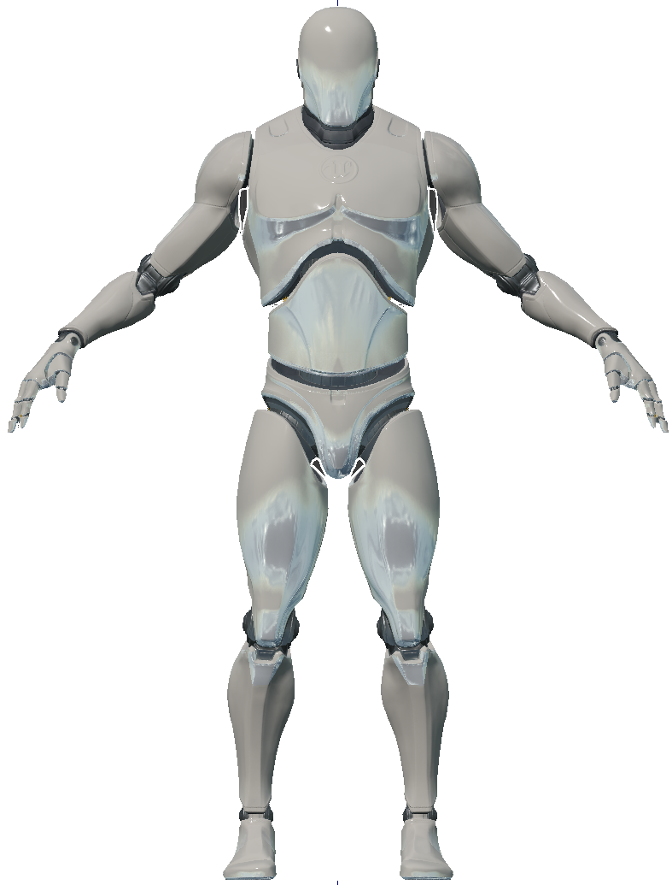
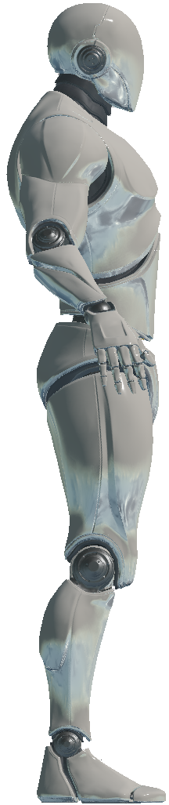

# 机器人代理 AndroidAgent

## 外观

| 前视图 | 侧视图 |
|:---:|:---:|
|  |  |

## 描述

一种可通过施加在其关节上的扭矩来控制的机器人代理。更多详情请参阅机器人代理（[AndroidAgent](https://holodeck.readthedocs.io/en/latest/holodeck/agents.html#holodeck.agents.AndroidAgent)）。

## 控制方案

- **机器人直接扭矩（Android Direct Torques）** (``0``)

  一个 94 维的连续值向量，表示施加在每个关节上的扭矩。有关关节索引的说明，请参阅下文[机器人关节](#android_joints)部分。

- **机器人最大扭矩（Android Max Scaled Torques）** (``1``)

  一个 94 维向量，包含介于 -1 和 1 之间的连续值，表示施加在每个关节上的缩放扭矩。有关关节索引的说明，请参阅下文[机器人关节](#android_joints)部分。

  1 代表最大正向扭矩，-1 代表最大反向扭矩。

## 机器人关节 

Android 和 [JointRotationSensor](https://holodeck.readthedocs.io/en/latest/holodeck/sensors.html#holodeck.sensors.JointRotationSensor) 的控制方案使用一个长度为 94 的向量来表示 48 个关节。

要了解这些关节，请参考下表，或使用 [joint_ind()](https://holodeck.readthedocs.io/en/latest/holodeck/agents.html#holodeck.agents.AndroidAgent.joint_ind) 辅助方法将名称（例如 `spine_02`）转换为索引（6）。

**注意：** 请注意，此处给出的索引是关节的起始索引，有关每个关节在此索引之后有多少个值，请参阅章节标题。例如：`neck_01` 的起始索引为 3，其值包括 `[swing1, swing2, twist]`，因此，长度为 94 的向量中的索引 3 对应于 `swing1`，索引 4 对应于 `swing2`，索引 5 对应于 `neck_01` 的 `twist`。

返回顺序如下：

| **头部、脊柱和手臂关节**  | 每个关节都有 `[swing1, swing2, twist]` |
|-------|--------|
| `0`     | 头 `head`  |
| `3`     | 脖子 `neck_01`  |
| `6`     | 脊柱`spine_02`  |
| `9`     | 脊柱`spine_01`  |
| `12`     | 左上臂膀`upperarm_l`  |
| `15`     | 左前臂 `lowerarm_l`  |
| `18`     | 左手 `hand_l`  |
| `21`     | 右上臂膀 `upperarm_r`  |
| `24`     | 右前臂`lowerarm_r`  |
| `27`     | 右手`hand_r`  |

| **腿部关节**  | 每个关节都有 `[swing1, swing2]` |
|-------|--------|
| `30`     |  左大腿 `thigh_l`  |
| `33`     |  左小腿肚（腓肠） `calf_l`  |
| `36`     |  左脚`foot_l`  |
| `39`     |  左脚趾球 `ball_l`  |
| `42`     |  右大腿 `thigh_r`  |
| `45`     |  左小腿肚 `calf_r`  |
| `48`     |  右脚 `foot_r`  |
| `51`     |  右脚趾球`ball_r`  |

右手图：

| **每根手指的第一关节**  | 只有 `[swing1, swing2]` |
|-------|--------|
| `54`     | 左手拇指 `thumb_01_l`  |
| `56`     | 左手食指 `index_01_l`  |
| `58`     | 左手中指 `middle_01_l`  |
| `60`     | 左手无名指 `ring_01_l`  |
| `62`     | 左手小拇指 `pinky_01_l`  |
| `64`     | 右手拇指 `thumb_01_r`  |
| `66`     | 右手食指 `index_01_r`  |
| `68`     | 右手中指 `middle_01_r`  |
| `70`     | 右手无名指 `ring_01_r`  |
| `72`     | 右手小拇指 `pinky_01_r`  |

| **每根手指的第二关节**  | 只有 `[swing1]` |
|-------|--------|
| `74`     | 左手拇指 `thumb_02_l`  |
| `75`     | 左手食指 `index_02_l`  |
| `76`     | 左手中指 `middle_02_l`  |
| `77`     | 左手无名指 `ring_02_l`  |
| `78`     | 左手小拇指 `pinky_02_l`  |
| `79`     | 右手拇指 `thumb_02_r`  |
| `80`     | 右手食指 `index_02_r`  |
| `81`     | 右手中指 `middle_02_r`  |
| `82`     | 右手无名指 `ring_02_r`  |
| `83`     | 右手小拇指 `pinky_02_r`  |

| **每根手指的第三关节**  | 只有 `[swing1]` |
|-------|--------|
| `84`     | 左手拇指 `thumb_03_l`  |
| `85`     | 左手食指 `index_03_l`  |
| `86`     | 左手中指 `middle_03_l`  |
| `87`     | 左手无名指 `ring_03_l`  |
| `88`     | 左手小拇指 `pinky_03_l`  |
| `89`     | 右手拇指 `thumb_03_r`  |
| `90`     | 右手食指 `index_03_r`  |
| `91`     | 右手中指 `middle_03_r`  |
| `92`     | 右手无名指 `ring_03_r`  |
| `93`     | 右手小拇指 `pinky_03_r`  |

## AndroidAgent 骨骼

[RelativeSkeletalPositionSensor](https://holodeck.readthedocs.io/en/latest/holodeck/sensors.html#holodeck.sensors.RelativeSkeletalPositionSensor) 返回一个数组，其中包含下面列出的每根骨骼的四个条目。

| **索引**  | 骨骼名称 |
|-------|--------|
| `0`     | 骨盆 `pelvis`  |
| `4`     | 脊柱 `spine_01`  |
| `8`     | 脊柱 `spine_02`  |
| `12`     | 脊柱 `spine_03`  |
| `16`     | 左锁骨 `clavicle_l`  |
| `20`     | 左上臂膀 `upperarm_l`  |
| `24`     | 左前臂 `lowerarm_l`  |
| `28`     | 左手 `hand_l`  |
| `32`     | 左手食指 `index_01_l`  |
| `36`     | 左手食指 `index_02_l`  |
| `40`     | 左手食指 `index_03_l`  |
| `44`     | 左手中指 `middle_01_l`  |
| `48`     | 左手中指 `middle_02_l`  |
| `52`     | 左手中指 `middle_03_l`  |
| `56`     | 左手小拇指 `pinky_01_l`  |
| `60`     | 左手小拇指 `pinky_02_l`  |
| `64`     | 左手小拇指 `pinky_03_l`  |
| `68`     | 左手小拇指 `ring_01_l`  |
| `72`     | 左手无名指 `ring_02_l`  |
| `76`     | 左手无名指 `ring_03_l`  |
| `80`     | 左手大拇指 `thumb_01_l`  |
| `84`     | 左手大拇指 `thumb_02_l`  |
| `88`     | 左手大拇指 `thumb_03_l`  |
| `92`     | 左前臂扭转 `lowerarm_twist_01_l`  |
| `96`     | 左上臂扭转 `upperarm_twist_01_l`  |
| `100`     | 右锁骨 `clavicle_r`  |
| `104`     | 右上臂膀 `upperarm_l`  |
| `108`     | 右前臂 `lowerarm_l`  |
| `112`     | 右手 `hand_l`  |
| `116`     | 右手食指 `index_01_l`  |
| `120`     | 右手食指 `index_02_l`  |
| `124`     | 右手食指 `index_03_l`  |
| `128`     | 右手中指 `middle_01_l`  |
| `132`     | 右手中指 `middle_02_l`  |
| `136`     | 右手中指 `middle_03_l`  |
| `140`     | 右手小拇指 `pinky_01_l`  |
| `144`     | 右手小拇指 `pinky_02_l`  |
| `148`     | 右手小拇指 `pinky_03_l`  |
| `152`     | 右手无名指 `ring_01_l`  |
| `156`     | 右手无名指 `ring_02_r`  |
| `160`     | 右手无名指 `ring_03_r`  |
| `164`     | 右手大拇指 `thumb_01_r`  |
| `168`     | 右手大拇指 `thumb_02_r`  |
| `172`     | 右手大拇指 `thumb_03_r`  |
| `176`     | 右前臂扭转 `lowerarm_twist_01_r`  |
| `184`     | 脖子 `neck_01`  |
| `188`     | 头 `head`  |
| `192`     | 右大腿 `thigh_l`  |
| `196`     | 左小腿肚（腓肠） `calf_l`  |
| `200`     | 左小腿扭转 `calf_twist_01_l`  |
| `204`     | 左足 `foot_l`  |
| `208`     | 左脚趾球 `ball_l`  |
| `212`     | 右大腿扭转 `thigh_twist_01_l`  |
| `216`     | 右大腿 `thigh_r`  |
| `220`     | 左小腿肚 `calf_r`  |
| `224`     | 右小腿扭转 `calf_twist_01_r`  |
| `228`     | 右足 `foot_r`  |
| `232`     | 右脚趾球 `ball_r`  |
| `236`     | 右大腿扭转 `thigh_twist_01_r`  |

## 插槽

* 摄像头插槽（`CameraSocket`）位于机器人设备面部中央

* 视窗（`Viewport`）位于设备后方

* 所有关节均可用作插槽。参见[机器人关节](#android_joints)。

