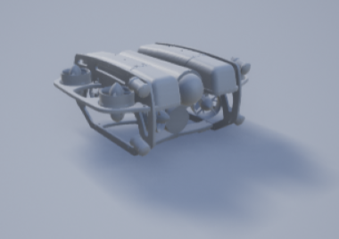
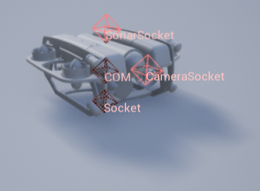
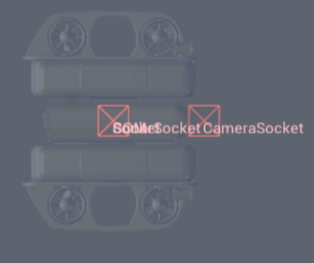
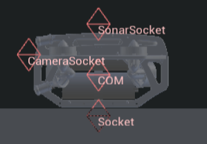
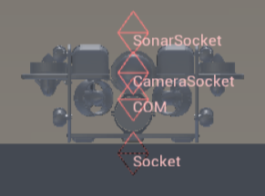

# BlueRov2

## 图片

## 描述

BlueROV2 的一种实现。

请参阅 [BlueROV2](https://byu-holoocean.github.io/holoocean-docs/UE4.27_archival_develop/holoocean/agents.html#holoocean.agents.BlueROV2)。

## 控制方案

* AUV 推进器 (``0``)

    一个包含 8 个浮点数的向量，用于指定每个推进器的控制指令。顺序依次为：右前垂直推进器，随后按逆时针方向排列，最后四个对应侧向推进器。

* PD 控制器 (``1``)

    一个包含 6 个浮点数的向量，表示全局坐标系下的目标位置以及横滚（roll）、俯仰（pitch）和偏航（yaw）角度。系统已实现一个基础 PD 控制器，利用所需的力和力矩将载具移动至该位置和姿态。

* 自定义动力学 (``2``)

    一个包含 6 个浮点数的向量，表示全局坐标系下的线加速度和角加速度。该模式用于实现自定义动力学。除碰撞外，仿真器中禁用了所有其他力和力矩（包括重力、浮力和阻尼），以便为自定义动力学提供一个纯净的运行环境。

## 接口

* `COM`：质心 (Center of mass)

* `SonarSocket`：位于 AUV 顶部的接口。

* `CameraSocket`：摄像机传感器的位置。

* `Socket`：位于 AUV 底部的接口。

