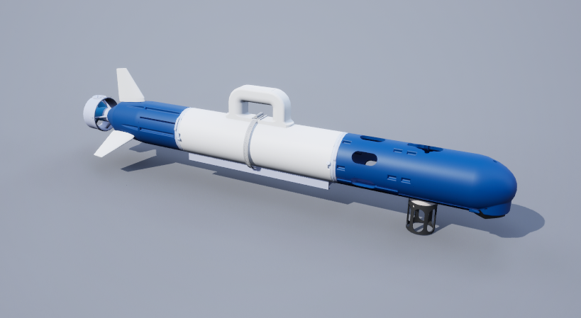
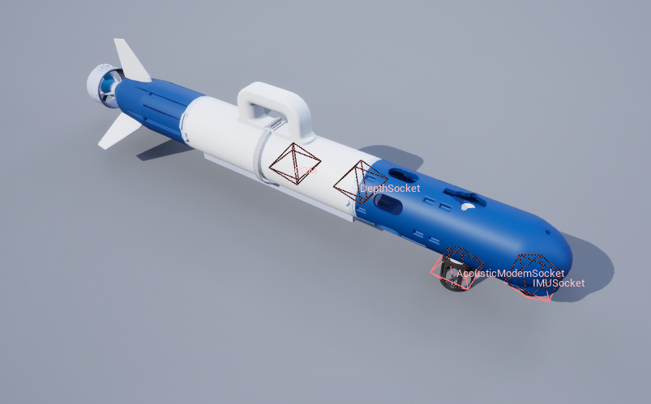
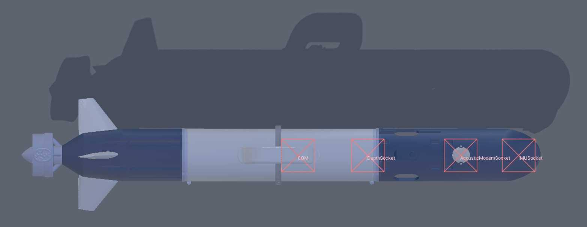
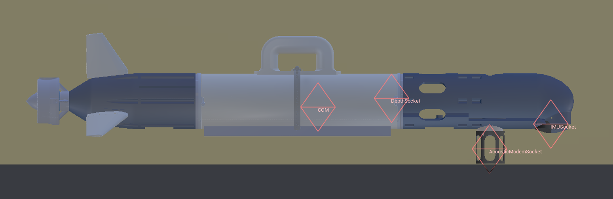
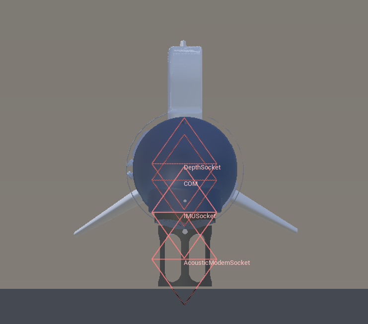
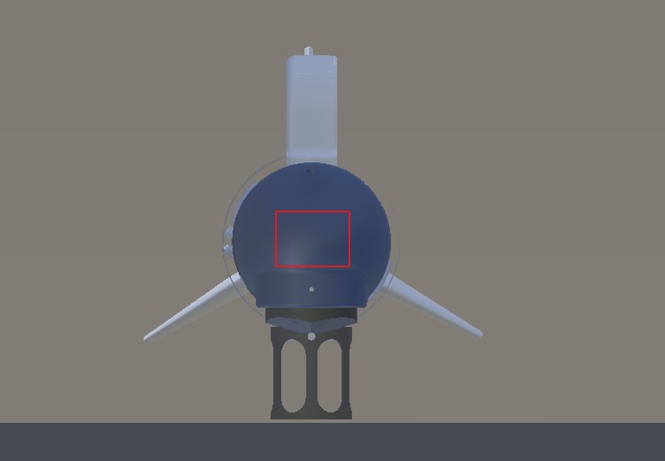

# CougUV

## 描述

小型鱼雷式自主水下航行器 (AUV)。目前它只是鱼雷型 AUV 的一个复制品，只是使用了不同的模型。

该模型有三个鳍片，但控制方案是为四个鳍片设置的。我们尚未修正此问题，因为我们主要将此航行器与[基于福森的动力学模型](./fossen_based_dynamics.md)一起使用。

参见 [CougUV](https://byu-holoocean.github.io/holoocean-docs/v2.3.0/holoocean/agents.html#holoocean.agents.CougUV) 。

## 控制方案

* **AUV 鳍片 (`0`)**
    * 接收一个长度为 5 的向量，包含四个鳍片角度和一个推进器数值。格式为 [右鳍片, 上鳍片, 左鳍片, 下鳍片]。鳍片角度范围为 -45 到 45 度，推进器数值范围为 -100 到 100（最大推力的百分比）。

* **自定义动力学 (`1`)**
    * 一个长度为 6 的浮点向量，包含全局坐标系中的线加速度和角加速度。用于实现自定义动力学。除了碰撞之外，模拟器中所有其他力和扭矩（包括重力、浮力和阻尼）均已禁用，以便为自定义动力学提供全新的起点。

!!! 注意
    CougUV 可以使用托尔·福森的动力学模型，以实现更逼真的仿真。要使用福森动力学模型，请使用自定义动力学控制方案，然后创建 福森载具控制器和 Fossen 动力学管理器。有关详细信息，请参阅[基于福森的动力学](./fossen_based_dynamics.md)。

## 套接字

除非另有说明，所有套接字均以代理的本体坐标系（右手坐标系，x 轴指向前方，y 轴指向左侧，z 轴指向上方）为基准。详情请参阅[传感器放置与接口](../sensors/sensor_config.md#sockets)部分。

### 套接字定义

* `COM`（Center of mass）：质心。

* `DVLSocket`：DVL 的位置。绕 x 轴旋转 180 度（x 轴指向前方，y 轴指向右侧，z 轴指向下方）。

* `IMUSocket`：IMU 的位置。绕 x 轴旋转 180 度（x 轴指向前方，y 轴指向右侧，z 轴指向下方）。位置与 DVL 接口相同。

* `DepthSocket`：深度传感器的位置。

* `AcousticModemSocket`：声学调制解调器的位置。

* `Viewport`：观察机器人的视角。

### 套接字帧

## 手电筒

CougUV 配备一个前置手电筒，安装在载具前部，用于照明。

* 手电筒1：(62, -0.2, 8.5)

有关可用控制命令的信息，请参阅[手电筒相关文档](./flashlight.md)。

## 参考

* 