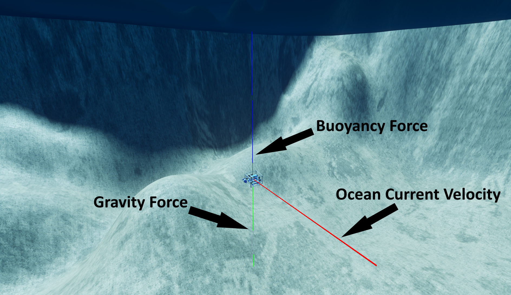
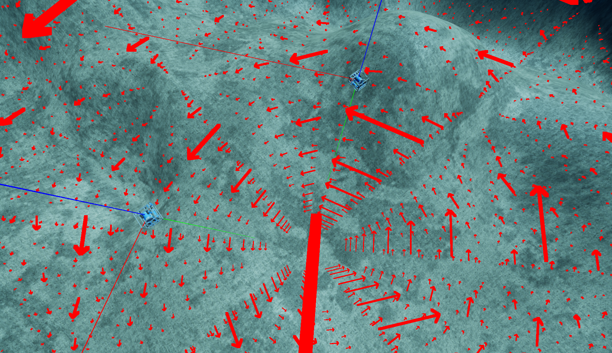

# 洋流控制器

HoloOcean 世界可以模拟真实洋流对载具的动态影响。这使得我们可以测试更严苛的载具导航，或模拟洋流可能给载具完成任务带来的困难。

!!! 注意
    目前，当使用 Fossen Dynamics 作为载具控制器时，洋流功能无法正常工作。

## 配置洋流场景

洋流被定义为作用于载具的速度矢量。

!!! 注意
    此洋流矢量位于全局坐标系中。

洋流始终处于激活状态，并且默认情况下，世界中所有位置的流速均为 [0, 0, 0]。可以通过在最外层添加以下内容来启用可选的调试行：
```json
"current": {
   "vehicle_debugging": True
}
```

启用调试线后，每个载具将生成三条调试线，分别指示**重力**、**浮力**和**洋流速度**，所有测量点均位于载具的质心处。下图对此进行了演示：




## 更改洋流

要在游戏进行中更改洋流，请从环境对象调用 `set_ocean_currents()` 函数，并传入要应用新洋流向量的载具名称以及该向量。
```python
env.set_ocean_current("auv0", [1.5, 1, 0])
```

## 自定义洋流

HoloOcean 为在模拟中创建自定义洋流动力学提供了极大的自由度。如果您希望模拟与位置相关的洋流，可以通过创建一个简单的矢量场函数来实现，该函数接收位置参数并输出该位置处的矢量。然后，通过在您希望应用洋流的每个载具上添加位置传感器，您可以获取每个时间步的载具位置，将其传递给矢量场函数以获得每个位置的洋流速度，并将该速度分别应用于每个载具。以下是一个简短的示例（假设“env”是您的环境对象变量）：

```python
def vector_field(location):
   x, y, z = location
   return [-x, -y, -z]

vehicles = ["auv0", "auv1", "auv2"]

while True:
   tick_info = env.tick()

   for vehicle in vehicles:
      location = tick_info[vehicle]["LocationSensor"]
      ocean_current_velocity = vector_field(location)
      env.set_ocean_currents(vehicle, ocean_current_velocity)
```

如果您想实现随时间变化的洋流，可以创建一个新的矢量场函数，该函数以时间为参数，并输出该时刻的洋流矢量。您还可以尝试将位置信息也考虑进去，以模拟时间和位置的依赖关系。然后，遍历不同的航行器，并将该洋流应用于每个航行器。以下是一个示例：

```python
def vector_field(time):
   x = np.sin(time)
   y = np.cos(time)
   z = -.5
   return [x, y, z]

time = 0
vehicles = ["auv0", "auv1", "auv2"]

while True:
   tick_info = env.tick()
   ocean_current_velocity = vector_field(time)
   time += 1

   for vehicle in vehicles:
      env.set_ocean_currents(vehicle, ocean_current_velocity)
```

## 绘制矢量场



还有一个名为 `draw_debug_vector_field` 的环境命令，它可以渲染一个三维向量矩阵，以便更好地了解当前场的情况。只需确保您的函数接收一个位置向量作为输入，并输出一个当前速度向量即可。此命令的必需参数是一个用于模拟当前流的向量场函数，以及一个用于生成向量场的位置向量。其他可选参数包括生成的向量场的尺寸、向量之间的间距、向量粗细、箭头大小比例以及生成的向量场的持续时间。有关所有函数参数的更多信息，请参阅 API 文档：[draw_debug_vector_field](https://byu-holoocean.github.io/holoocean-docs/v2.3.0/holoocean/environments.html#holoocean.environments.HoloOceanEnvironment.draw_debug_vector_field)。


如果您想查看实际示例，请参阅[洋流](https://byu-holoocean.github.io/holoocean-docs/v2.3.0/examples/examples/ocean-currents.html#ocean-currents-example)示例。


## 参考


* [](https://byu-holoocean.github.io/holoocean-docs/v2.3.0/agents/docs/currents.html)

