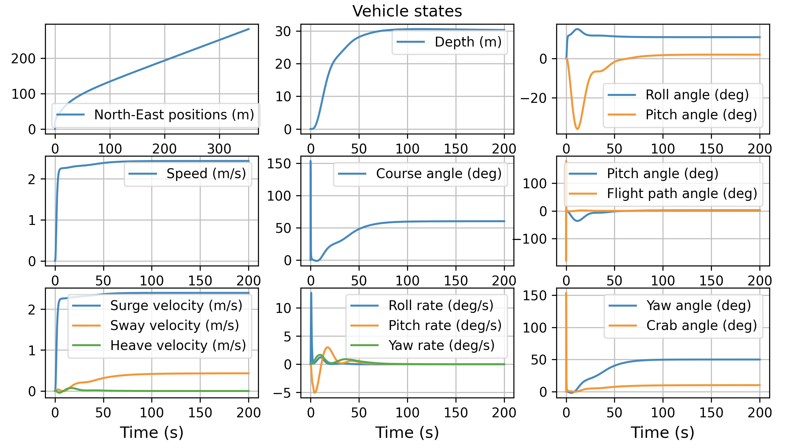

# 基于福森模型的动力学

水下航行器和水面航行器的动力学特性，可以通过挪威科技大学的托尔·福森在其著作[《海洋航行器流体动力学与运动控制手册》（*Handbook of Marine Craft Hydrodynamics and Motion Control*）](https://github.com/cybergalactic/FossenHandbook)中推导出的运动方程进行建模。福森已在其 [GitHub 仓库](https://github.com/cybergalactic/PythonVehicleSimulator)（包含自主水下航行器、无人水面航行器和船舶的模型）中提供了这些动力学模型的便捷实现。我们将福森的部分实现移植到了 HoloOcean 中，以便进行精确的航行器动力学仿真。



在 HoloOcean 中使用基于福森理论的动力学模型，是对“自定义动力学”（Custom Dynamics）控制方案的一种扩展。若要使用内置的福森动力学模型，只需按照几个步骤即可配置这些改进的水下航行器动力学特性。以下是在 HoloOcean 中设置福森动力学模型的步骤概要；后续章节将提供更详细的说明与示例：

**1.**在场景配置的代理（agent）字典中，将 `fossen_model` 键设置为相应的福森动力学类。可用的福森动力学类列在下方的“福森载具类”一节中。

**2.**在代理字典中，将控制方案（`control_scheme`）键设置为该代理所使用的自定义动力学控制方案对应的值（参见[控制方案](./control_schemes.md)）。

**3.**在代理的传感器列表中设置一个动力学传感器（Dynamics Sensor）。该传感器用于读取载具状态并应用动力学模型。

**4.**您还可以选择在代理配置中设置动力学、执行器（actuator）和自动驾驶（autopilot）参数。这些参数定义了载具的动力学特性、控制面以及自动驾驶设置。此功能仅适用于定义了 `configure_from_scenario` 函数的福森动力学模型。

**5.**最后，在您的仿真脚本中创建一个福森接口（`FossenInterface`）管理器对象，并传入代理名称列表及场景配置。该类在 [fossen_interface.py](https://github.com/byu-holoocean/HoloOcean/blob/release/client/src/holoocean/fossen_dynamics/fossen_interface.py) 中实现。


## 福森载具类别

目前，我们已经实现了两类载具的动力学模型：

存在一系列与福森动力学模型相关联的键（keys），这些键在 `FossenInterface` 类中进行了定义。

* Torpedo（鱼雷）（`Torpedo: "torpedo"`）
    该类实现了类鱼雷航行器的动力学方程，包含必要的参数及根据舵面和单螺旋桨控制输入计算加速度的方法。目前，默认的福森航行器参数已进行调整，以近似模拟托尔·福森所描述的 REMUS100 航行器。

    **控制模式：**
    
    * manualControl：手动设定控制面（舵面和螺旋桨）的指令值

    * depthHeadingAutopilot：设定深度、航向及螺旋桨转速（RPM）目标值，由控制器进行控制

* Otter（水獭） (`Otter: "otter"`)
    该类实现了配备双尾部螺旋桨的水面船只的动力学方程。目前尚不支持在场景中配置该载具的参数；默认参数与 Otter 水面船只的规格相匹配。

    **控制模式：**

    * manualControl：手动设定控制面（螺旋桨）的指令值。

    * headingAutopilot：尚未经 HoloOcean 开发人员验证。该模式可能可用，但使用的是 NED 参考坐标系，而非 NWU 坐标系。

!!! 注意

    虚幻引擎中的图形资源并未与福森模型关联。因此，在虚幻引擎中切换子类时，载具上显示的鳍片数量不会发生变化。

    实现福森动力学模型并不会改变该资源，所以在仿真运行期间，鳍片不会产生可见的移动。


!!! 注意

    使用“自定义动力学”（Custom Dynamics）控制方案时，HoloOcean 引擎中设置的质量及其他默认车辆参数将被忽略；福森模型会单独处理这些参数。


## 从 PythonVehicleSimulator 导入模型

如果用户使用托尔·福森的 PythonVehicleSimulator 开发了动力学模型类，并希望在 HoloOcean 中使用它，则必须进行以下更改：

* 将福森模型文件移动到 _client/src/holoocean/fossen_dynamics_ 文件夹中

* 在福森模型文件中：

    * **修改以下导入语句：**将 `python_vehicle_simulator.lib` 改为 `holoocean.fossen_dynamics`；将 `python_vehicle_simulator.lib.gnc` 改为 `holoocean.fossen_dynamics.helper_functions`。

    * 必须修改 dynamics 方法，使其返回 nu（体坐标系加速度），而不是 nu（体坐标系速度）。

    * 添加一个类变量 `config_fnc`，该变量可以设置为 `None`，也可以是一个函数，该函数接受一个场景配置，并根据该配置修改类参数。有关如何实现此函数的示例，请参阅 [torpedo.py](https://github.com/byu-holoocean/HoloOcean/blob/develop/client/src/holoocean/fossen_dynamics/torpedo.py) 中的 [configure_torpedo_from_scenario](https://github.com/byu-holoocean/HoloOcean/blob/12700c4397a37a24d50171cd02e5e974aefcdc45/client/src/holoocean/fossen_dynamics/torpedo.py#L523) 函数。


* 在 [fossen_interface.py](https://github.com/byu-holoocean/HoloOcean/blob/develop/client/src/holoocean/fossen_dynamics/fossen_interface.py) 文件中：

    * 添加导入语句以导入福森模型类

    * 将该类添加到福森模型键值对中

确保所有其他方法和属性都已按照“福森接口（FossenInterface）” 管理器的预期实现。


## 单代理福森动力学示例

在本节中，我们将逐步介绍福森动力学实现的关键要素，并提供一个在 HoloOcean 中使用福森动力学的示例。完整代码位于 [client/example.py](https://github.com/byu-holoocean/HoloOcean/blob/develop/client/example.py) 中。

### 配置

设置使用福森动力学的 HoloOcean 仿真首先需要配置场景。场景配置遵循标准的 HoloOcean 格式，但针对福森动力学有一些关键区别：

* 动力学传感器：

    配置主代理时，必须将 DynamicsSensor 添加到传感器列表中。配置块应包含 `UseRPY: False`（默认值为 `True`；这将强制动力学使用四元数而不是欧拉角）和 `UseCOM: True`（默认值为 `True`）。


* 福森模型：

    必须将 `fossen_model` 键设置为您要使用的福森动力学类的名称。例如，对于鱼雷动力学，请设置 `fossen_model: “torpedo”`。

* 控制方案：

    必须将 `control_scheme` 键的值设置为“自定义动力学”，才能启用福森动力学模型。

* 控制模式（可选）：

    可以将 `control_mode` 键设置为所需的载具控制模式。例如，您可以将其设置为 `depthHeadingAutopilot` 以启用深度和航向自动驾驶，或设置为 `manualControl` 以手动控制鳍和螺旋桨。

* 参数（可选）：

    如果实现了配置功能，则可以将 `dynamics`、`actuator` 和 `autopilot` 参数添加到代理配置中。每个参数都是一个字典，用于覆盖默认的载具参数。支持的载具的每个动力学参数的定义在函数中定义。


```json
scenario = {
    "name": "torpedo_dynamics",
    "package_name": "Ocean",
    "world": "OpenWater",
    "main_agent": 'auv0',
    "agents": [
        {
            "agent_name": 'auv0',
            "agent_type": "CougUV",
            "sensors": [
                {
                    "sensor_type": "DynamicsSensor",
                    "configuration": {
                        "UseCOM": True,
                        "UseRPY": False  # 使用四元数描述动力学
                    }
                },
            ],
            "control_scheme": 1,  # 控制方案 1 展示了如何将自定义动态特性应用于 CougUV 代理
            "location": [0, 20, -280],
            "rotation": [0, 0, 0],
            "fossen_model": "torpedo",  # 要使用的福森动力学模型类
            "control_mode": "depthHeadingAutopilot",  # 初始控制模式
            "dynamics": {
                "rho":          1026,   # 水的密度（单位：千克/立方米）
                # 载具物理参数：
                "mass":         31.03,     # 载具质量（千克）
                "length":       1.6,    # 载具长度（米）
                "diam":         0.19,   # 载具直径（米）
                "r_bg": [0, 0, 0.02],   # 载具重心 (x, y, z) 在车身坐标系中的位置，x 轴向前，y 轴向右，z 轴向下（body gravity）。
                "r_bb": [0, 0, 0],      # 载具浮心坐标 (x, y, z)（body boyancy），其中 x 轴向前，y 轴向右，z 轴向下。
                "area_fraction": 0.7,   # 将车辆有效面积与长度和宽度联系起来。对于椭球体，有效面积为π/4。

                # 低速线性阻尼矩阵参数：
                "T_surge":      20,     # 浪涌（surge）时间常数（秒）
                "T_sway":       20,     # 摆动（sway）时间常数（秒）
                "zeta_roll":    0.3,    # 横滚阻尼比
                "zeta_pitch":   0.8,    # 俯仰阻尼比
                "T_yaw":        1,      # 偏航时间常数（秒）
                "K_nomoto":     0.25,   # Nomoto gain

                # 其他阻尼参数：
                "r44":          0.3,    # 横滚附加转动惯量： A44 = r44 * Ix
                "Cd":           0.42,   # 阻力系数
                "e":            0.7,    # 载具阻力的奥斯瓦尔德效率因子
            },
            "actuator":{
                # 鳍片：
                "fin_count": 4,         # 载具上等距分布的鳍片数量
                "fin_offset_deg": 0,    # 第一个鳍片绕 x 轴的角度偏移量（度），从 y 轴正方向开始，z 轴向下
                                        # 0 度: 端口一侧的鳍片
                                        # 90 度: 底部的鳍片
                "fin_center":   0.1,    # 从鳍片上的压力中心 (COP) 到 YZ 平面内质心 (COM) 的半径 (m)
                "fin_area":     0.00697, # 鳍片一侧的表面积
                "x_fin":       -0.8,    # 机身框架 x 重心到鳍状物压力中心的距离（x 向前）
                "CL_delta":     0.5,    # 鳍片升力系数
                "deltaMax_fin_deg": 15, # 鳍片最大偏转角度（度）
                "T_delta":      0.1,    # 鳍片驱动时间常数（秒）

                # 螺旋桨：
                "nMax":         1525,   # 推进器最大转速
                "T_n":          1.0,    # 推进器执行时间常数（秒）
                "D_prop":       0.14,   # 螺旋桨（Propeller）直径
                "t_prop":       0.1,    # 螺旋桨螺距（Propeller pitch）
                "KT_0":         0.4566, # 零转速时的推力系数
                "KQ_0":         0.0700, # 零转速时的扭矩系数
                "KT_max":       0.1798, # 最大推力系数
                "KQ_max":       0.0312, # 最大扭矩系数
                "w":            0.056,  # 伴流分数（wake fraction number）
                "Ja_max":       0.6632, # 最大前进比
            },
            "autopilot": {
                'depth': {
                    'wn_d_z':   0.12,    # 深度命令低通滤波器的阻尼固有频率
                    'Kp_z':     0.153,    # 深度控制器的比例增益
                    'T_z':      100,    # 深度控制器的时间常数
                    'Kp_theta': 39.78,    # 深度控制器俯仰角比例（Proportional）增益
                    'Kd_theta': 17.1,    # 深度控制器俯仰角的微分（Derivative）增益
                    'Ki_theta': 0.5,    # 深度控制器俯仰角积分（Integral）增益
                    'wn_d_theta': 0.25,    # 深度命令低通滤波器的阻尼固有频率
                    'K_w':      0.0,    # 可选的垂荡速度反馈增益
                    'theta_max_deg': 15, # 俯仰控制器内环最大输出
                    'outer_loop_threshold': 2.91, # 外环切换到浪涌控制的阈值
                    'surge_threshold': 0.6, # 运行深度控制器的浪涌阈值
                },
                'heading': {
                    'wn_d':     0.4,    # 低通滤波器的输入指令的阻尼（Damped）固有频率
                    'zeta_d':   1.0,    # 阻尼（damping）系数
                    'r_max':    0.87,
                    'lam':      0.1,
                    'phi_b':    0.1,
                    'K_d':      0.5,
                    'K_sigma':  0.05,
                }
            }
        }
    ]
}
```

### 仿真设置

仿真设置与其他 [HoloOcean 示例](../getting_started.md)类似。

仿真设置首先是搭建环境。我们创建一个列表，其中包含场景中将由福森动力学控制的代理的名称。该福森代理名称列表和场景配置将传递给福森接口。最后，我们初始化一个长度为 6 的 NumPy 数组，用于存储线性加速度（x、y、z）和角加速度（绕 x、y、z 轴），所有数据均在全局 NWU 坐标系中。

```python
import holoocean
from holoocean.fossen_dynamics import *
import numpy as np

scenario = {...} # 有关场景配置，请参见上文。

env = holoocean.make(scenario_cfg=scenario)

# 初始化代理的福森动力学模型
fossen_agents = ['auv0'] # 使用福森动力学的代理名称列表
fossen_interface = FossenInterface(fossen_agents, scenario)
accel = np.array(np.zeros(6), float)  # 初始化 HoloOcean 加速度输入
```

!!! 注意

    如果您在独立模式下使用虚幻引擎编辑器运行模拟，请务必按照[入门指南](../develop/start.md)中的说明更改其他启动参数。添加启动参数 `-TicksPerSec`，使其与 Python 脚本中的设置一致，以确保计时的一致性。


### 手动控制示例

要使用手动控制方法，请将载具模式通过福森接口配置为“manualControl”模式。也可以使用福森接口设置指令鳍片角度。

`u_control` 数组的长度在动态模型类中定义，它表示指令输入的数量。

* 鳍片角度应以弧度为单位。以下示例展示了如何使用 NumPy 将鳍片角度从度数转换为弧度。

* 正向鳍片偏转可以用右手定则表示，即绕 Z 轴正向旋转。正 Z 轴从车辆中心的 x 轴指向鳍片的 COP（压力中心）。

此手动控制方法可以使用自定义控制器来输入特定的鳍片指令。

```python
fossen_interface.set_control_mode('auv0', 'manualControl')
fins_degrees = np.array([10, 10, -10, -10])  # 鳍片挠度（度）
fin_radians = np.radians(fins_degrees)
thruster_rpm = 800  # 不是百分比：请查看载具动力学数据以确定最高转速
u_control = np.append(fin_radians, thruster_rpm)
```


要更新环境，请调用 `step` 函数并传入一个加速度列表。接下来，使用 FossenInterface 对象上的 `set_u_control` 函数向控制面发送控制命令。无需在每个周期都设置 `u_control`。如果您希望每个周期都改变控制面，请在调用 `update` 函数之前设置控制命令。

`FossenInterface.update` 函数接收 HoloOcean 返回的状态，并解析来自动态传感器的数据。根据车辆状态和控制面输入，它计算 HoloOcean 坐标系 (NWU) 中的加速度输出。

```python
for i in range(1500):
    state = env.step(accel)
    fossen_interface.set_u_control('auv0', u_control)  # 如果需要，您可以在此处更改控制命令。
    accel = fossen_interface.update('auv0', state)  # 计算要施加于 HoloOcean 代理的加速度。
```

### 深度和航向控制示例

水下航行器的常用控制策略是分别控制深度和航向。这可以通过将控制模式设置为“深度航向自动驾驶（`depthHeadingAutopilot `）”，并设置目标深度、航向和推进器转速来实现。

目标深度以米为单位。正深度对应于负 z 坐标，航行器下潜越深，深度越大。

目标航向在全局坐标系中给出。其范围为 -180 度到 180 度，0 度为正北（沿 x 轴正方向），90 度为正西（沿 y 轴正方向）。

目标推进器转速直接以转速 (RPM) 表示，而不是以最大转速的百分比表示。请务必检查福森航行器配置中的最大转速，以确保指令低于最大值。

!!! 警告

    多次切换到自动驾驶控制模式时，自动驾驶系统可能无法将LP初始位置设置为当前位置，从而导致运行异常。这是一个已知问题，将在未来的版本中修复。

```python
depth_goal = 279 # 以米为单位
heading_goal = -10 # 以度为单位
thruster_goal = 1525 # RPM

fossen_interface.set_control_mode('auv0', 'depthHeadingAutopilot')
fossen_interface.set_goal('auv0', depth_goal, heading_goal, thruster_goal)

# 运行模拟
for i in range(1500):
    state = env.step(accel)
    accel = fossen_interface.update('auv0', state)

    # 可选的箭头可视化效果（用于指示航向和深度目标）
    pos = state['DynamicsSensor'][6:9]  # [x, y, z]
    x_end = pos[0] + 3 * np.cos(np.deg2rad(heading_goal))
    y_end = pos[1] + 3 * np.sin(np.deg2rad(heading_goal))

    color = [0, 255, 0] if abs(depth + pos[2]) <= 2.0 else [255, 0, 0]
    env.draw_arrow(pos.tolist(), end=[x_end, y_end, -depth], color=color, thickness=5, lifetime=0.03)
```

## 多代理福森动力学示例

在本节中，我们将逐步演示如何在 HoloOcean 中使用福森动力学模拟多个代理。完整代码位于 [example.py](https://github.com/byu-holoocean/HoloOcean/blob/develop/client/example.py)。此示例与上述示例非常相似，但使用两个代理。

### 配置

有关以下各项配置的具体说明，请参阅上述示例：

* 动力学传感器

* 福森模型

* **控制方案**
    请注意，水面船舶代理使用控制方案 2 来实现自定义动力学。

* 控制模式（可选）

* **参数（可选）**
    请注意，Otter 类场景中的配置尚未实现，因此无法设置任何参数。


```json
scenario = {
"name": "multi_agent_fossen",
"world": "OpenWater",
"package_name": "Ocean",
"main_agent": "auv0",
"agents": [
    {
        "agent_name": "auv0",
        "agent_type": "TorpedoAUV",
        "sensors": [
            {
                "sensor_type": "DynamicsSensor",
                "configuration": {
                    "UseCOM": True,
                    "UseRPY": False  # 使用四元数描述动力学
                }
            },
        ],
        "control_scheme": 1,  # Control scheme 1 is how custom dynamics are applied to TAUV
        "location": [10,0,0],
        "rotation": [0,0,0],
        "fossen_model": "torpedo",
        "control_mode": "manualControl",
        },
        {
        "agent_name": "sv1",
        "agent_type": "SurfaceVessel",
        "sensors": [
            {
                "sensor_type": "DynamicsSensor",
                "configuration": {
                    "UseCOM": True,
                    "UseRPY": False  # 使用四元数描述动力学
                }
            },
        ],
        "control_scheme": 2,  # 控制方案 2 是将自定义动态特性应用于 SV 的方式
        "location": [10, -10, 0],
        "rotation": [0,0,0],
        "fossen_model": "otter",
        "control_mode": "manualControl",
        },
    ]
}
```

### 仿真设置

此设置基于单代理示例。

唯一的区别在于，您需要将水面船舶代理的名称添加到 fossen_agents 列表中。

```python
import holoocean
from holoocean.fossen_dynamics import *
import numpy as np

scenario = {...} # 有关场景配置，请参见上文

env = holoocean.make(scenario_cfg=scenario)
main_agent = 'auv0'
sv_agent = 'sv1'
fossen_agents = [main_agent, sv_agent]
fossen_interface = FossenInterface(fossen_agents, scenario)

accel = np.array(np.zeros(6),float)
```

### 手动控制示例

要使用手动控制方法，请将飞行器模式通过福森接口配置为“manualControl”模式。也可以使用福森接口设置指令翼角度。

`u_control` 数组的长度在动态模型类中定义，它表示指令输入的数量。默认鱼雷有 5 个控制面，而水獭模型有 2 个推进器控制面。


```python
ins_degrees = np.array([10, -10, -10, 10]) # 舵和尾鳍偏转角度（度）
fin_radians = np.radians(fins_degrees)
thruster_rpm = 1000
u_control_torpedo = np.append(fin_radians,thruster_rpm)  # [RudderAngle, SternAngle,Thruster] 以弧度为单位
fossen_interface.set_control_mode(main_agent, 'manualControl')

u_control_otter = np.array([105, 80])
fossen_interface.set_control_mode(sv_agent, 'manualControl')
```

与多代理情况最大的区别在于，向两个代理发送命令时，需要使用 `act` 和 `tick` 函数，而不是 `step` 函数。关于此区别的更多解释请参见[Act、Tick 和 Step](https://byu-holoocean.github.io/holoocean-docs/v2.3.0/usage/environments.html#step)部分。


要使用福森接口为代理设置控制面指令，需要提供车辆名称。

`FossenInterface.update` 函数接收 `tick` 函数返回的两个代理的状态，并计算加速度输出。需要对列表中的每个代理调用此更新函数，然后将其应用于 `act` 函数指定的代理。

```python
states = env.tick() # 获取代理的初始阶段动力学

for i in range(1500):
    fossen_interface.set_u_control(main_agent, u_control_torpedo) # 如果需要，您可以在此处更改控制命令
    fossen_interface.set_u_control(sv_agent, u_control_otter)

    for agent in fossen_agents:
        accel = fossen_interface.update(agent, states) # 计算要施加于 HoloOcean 代理的加速度
        env.act(agent, accel)

    states = env.tick()
```

## 参考

* [Fossen-Based Dynamics](https://byu-holoocean.github.io/holoocean-docs/v2.3.0/agents/docs/fossen-based-dynamics.html)