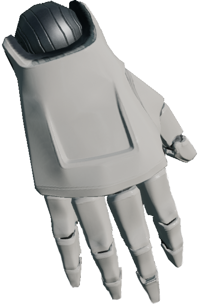

# HandAgent

## 图片

## 描述

一个可以通过对关节施加扭矩来控制，并能在三维空间中移动的漂浮手部代理。

## 控制方案

- **原始关节力矩（Raw Joint Torques）** (``0``)

  23 维的原始转矩向量，用于传入关节，顺序按下面 [HandAgent](#hand_joints) 关节列出的顺序

- **缩放关节扭矩（Scaled Joint Torques）** (``1``)

  23 长度的缩放扭矩向量，范围在 `-1` 到 `1` 之间。每个关节的手指力量根据骨骼的重量以及是否是手指来缩放。`1` 代表前向的最大力量

- **缩放关节扭矩 + 浮动** (``2``)

  和上面一样，但向量长度为 26，最后三个值表示`[x, y, z]`方向的移动量（见坐标系），最大自由度为 `0.5` 米。

  最后几个坐标允许 HandAgent 四处漂浮。

## HandAgent 关节 

HandAgent 和 [JointRotationSensor](https://holodeck.readthedocs.io/en/latest/holodeck/sensors.html#holodeck.sensors.JointRotationSensor) 的控制方案使用一个长度为 94 的向量来表示 48 个关节。

要深入了解这些关节，请参考下表。

**注意：** 请注意，此处给出的索引是关节的起始索引，有关每个关节在此索引之后有多少个值，请参阅章节标题。示例：`hand_r` 的起始索引为 0，其值包括 `[swing1, swing2, twist]`，因此向量中的索引 0 对应于 `swing1`，1 对应于 `swing2`，2 对应于 `twist`。

返回顺序如下：

| **手臂关节**  | 每个动作都有 `[swing1, swing2, twist]` |
|-------|--------|
| `0`     | `hand_r`  |

| **每根手指的第一关节**  | 只有 `[swing1, swing2]` |
|-------|--------|
| `64`     | 右手拇指 `thumb_01_r`  |
| `66`     | 右手食指 `index_01_r`  |
| `68`     | 右手中指 `middle_01_r`  |
| `70`     | 右手无名指 `ring_01_r`  |
| `72`     | 右手小拇指 `pinky_01_r`  |

| **每根手指的第二关节**  | 只有 `[swing1]` |
|-------|--------|
| `79`     | 右手拇指 `thumb_02_r`  |
| `80`     | 右手食指 `index_02_r`  |
| `81`     | 右手中指 `middle_02_r`  |
| `82`     | 右手无名指 `ring_02_r`  |
| `83`     | 右手小拇指 `pinky_02_r`  |

| **每根手指的第三关节**  | 只有 `[swing1]` |
|-------|--------|
| `89`     | 右手拇指 `thumb_03_r`  |
| `90`     | 右手食指 `index_03_r`  |
| `91`     | 右手中指 `middle_03_r`  |
| `92`     | 右手无名指 `ring_03_r`  |
| `93`     | 右手小拇指 `pinky_03_r`  |

## HandAgent 骨骼

[RelativeSkeletalPositionSensor](https://holodeck.readthedocs.io/en/latest/holodeck/sensors.html#holodeck.sensors.RelativeSkeletalPositionSensor) 返回一个数组，其中包含四个条目，分别对应下面列出的 17 块骨骼。

| **索引**  | 骨骼名称 |
|-------|--------|
| `0`     | `lowerarm_r`  |
| `4`     | `hand_r`  |
| `8`     | `index_01_r`  |
| `16`     | `index_03_r`  |
| `20`     | `middle_01_r`  |
| `24`     | `middle_02_r`  |
| `28`     | `middle_03_r`  |
| `32`     | `pinky_01_r`  |
| `36`     | `pinky_02_r`  |
| `40`     | `pinky_03_r`  |
| `44`     | `ring_01_r`  |
| `48`     | `ring_02_r`  |
| `52`     | `ring_03_r`  |
| `56`     | `thumb_01_r`  |
| `60`     | `thumb_02_r`  |
| `64`     | `thumb_03_r`  |

## 插槽

* 摄像头插槽（`CameraSocket`）位于手腕后上方

* 视窗（`Viewport`）位于侧面，用于观察角色

* 所有关节均可用作插槽。参见[HandAgent 关节](#hand_joints)。

