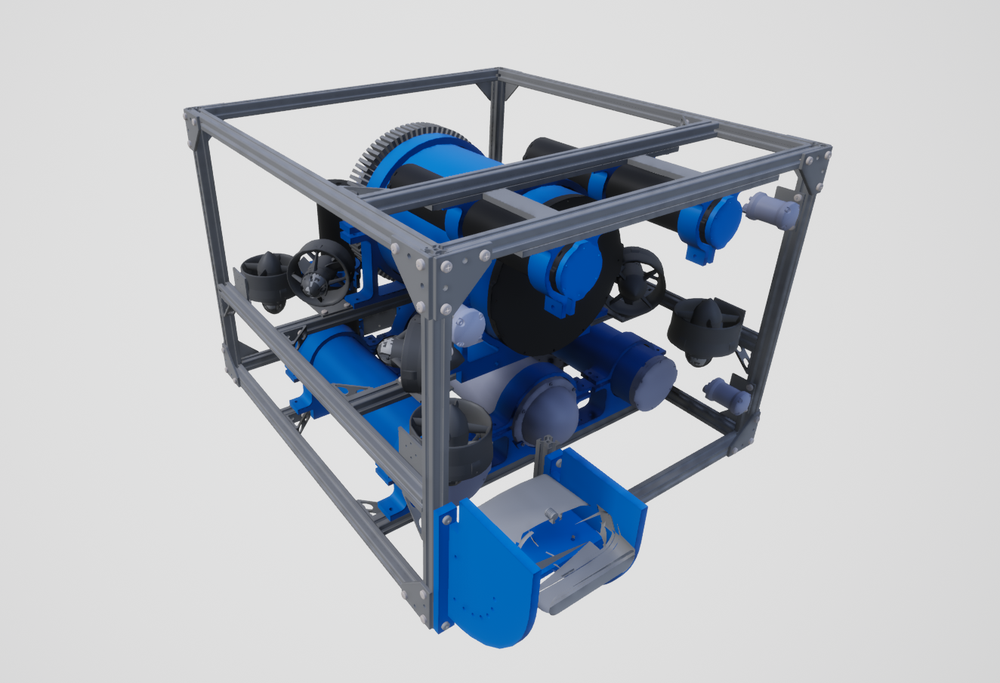
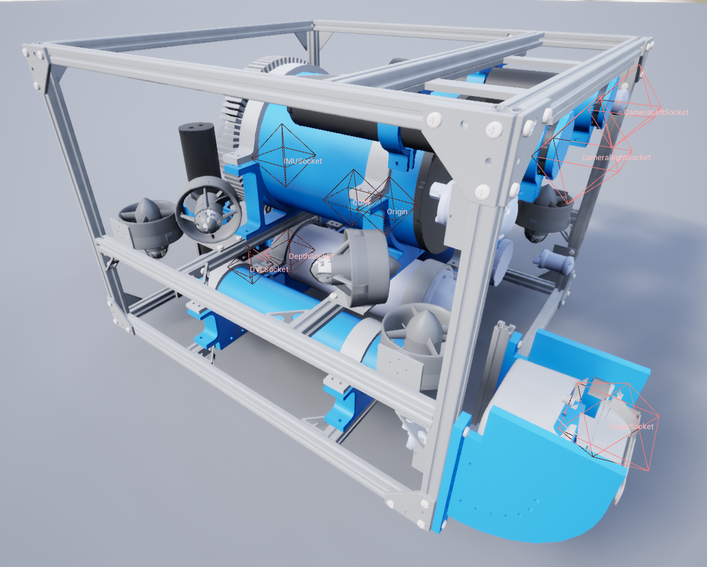
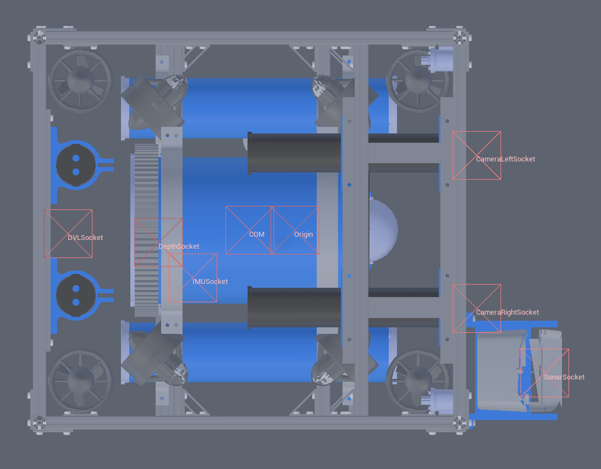
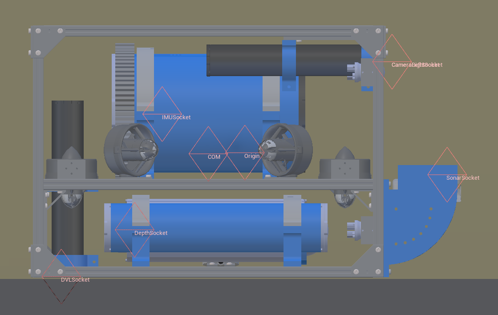
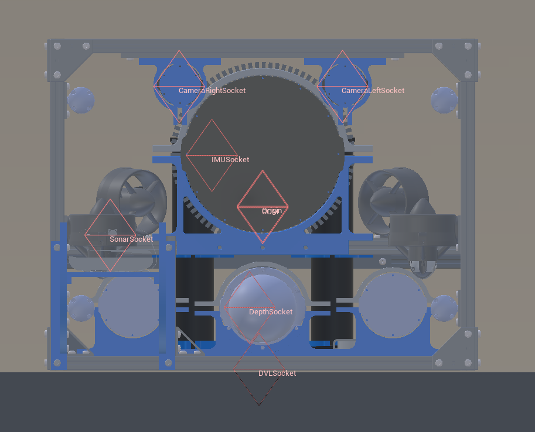

# 悬停式自主水下航行器 (HoveringAUV)

## 图片

## 描述

请参阅悬停式水下自主航行器 ([HoveringAUV](https://byu-holoocean.github.io/holoocean-docs/UE4.27_archival_develop/holoocean/agents.html#holoocean.agents.HoveringAUV))。

## 控制方案

* AUV推进器（``0``）

    一个长度为8的浮点向量，用于指定每个推进器的控制方式。控制方式从右前方的垂直推进器开始，然后逆时针方向依次控制，最后四个推进器为侧向推进器。

* PD控制器（``1``）

    一个长度为6的浮点向量，表示全局坐标系中的期望位置以及横滚、俯仰和偏航角。已实现一个基本的PD控制器，利用所需的力和力矩将AUV移动到该位置和姿态。

* 自定义动力学（``2``）

    一个长度为6的浮点向量，表示全局坐标系中的线加速度和角加速度。用于实现自定义动力学。除了碰撞之外，模拟器中所有其他力和力矩（包括重力、浮力和阻尼）均已禁用，以便为自定义动力学提供一个干净的环境。

## 接口

* `COM`：质心（Center of mass）

* `DVLSocket`：DVL 位置

* `IMUSocket`：IMU 位置。绕 x 轴旋转 180 度，即在 NED 坐标系而非 NWU 坐标系中。

* `DepthSocket`：深度传感器位置。

* `SonarSocket`：声呐传感器位置。

* `CameraRightSocket`：右侧摄像头位置（当朝向与 AUV 朝向相同时）。

* `CameraLeftSocket`：左侧摄像头位置（当朝向与 AUV 朝向相同时）。

* `Origin`：机器人真实中心

* `Viewport`：机器人观察视角。

