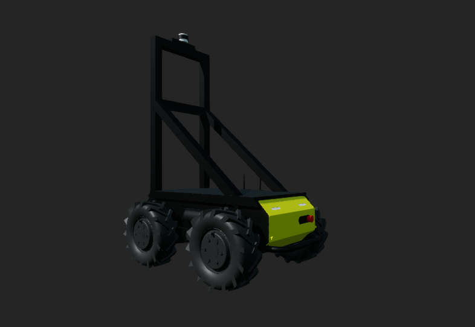
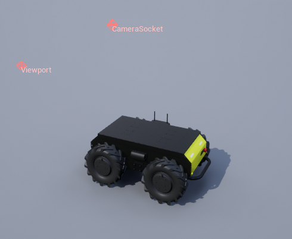

# 哈士奇载具

## 描述

一款类似哈士奇的简易四轮**地面载具**。哈士奇载具旨在作为一款用于测试和开发的简易地面代理。

参见[哈士奇载具](https://byu-holoocean.github.io/holoocean-docs/develop/holoocean/agents.html#holoocean.agents.HuskyVehicle)。

## 控制方案

* 车轮（`0`）
    * 一个长度为 3 的浮点向量，用于指定每个前轮的受力以及复位触发值。向量格式为 [左前轮，右前轮，翻转复位触发值]。翻转复位触发值是一个二进制值，其中 0 表示不复位，1 表示如果载具翻转则复位。

!!! 注意
    如果载具出现异常摇晃，请尝试减小施加在车轮上的力。大多数情况下，700-800 的值应该可以正常工作。

## 套接字

除非另有说明，所有接口均以代理本体坐标系（右手NWU坐标系，x轴指向前方，y轴指向左侧，z轴指向上方）为基准。详情请参阅[传感器放置与接口](../sensors/sensor_config.md#sockets)部分。

### 套接字定义

| 套接字名称  | 位置 | 位置 |
|-------|--------|-------|
| `CameraSocket`     | (-37, 0, 122.5)  | 位于传感器平台的顶部。  |
| `Viewport`     | (-147, 0, 71)  | 从哪里观察机器人。  |

### 套接字帧

