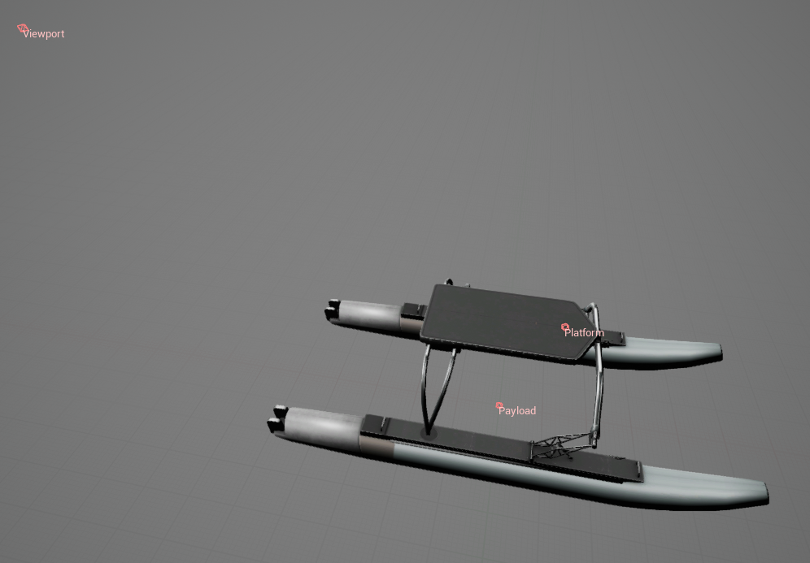

# 水面航行器 (SurfaceVessel)

## 图片

## 描述

一种结构简单的水面航行器，配备两个推进器。

参见[水面航行器](https://byu-holoocean.github.io/holoocean-docs/UE4.27_archival_develop/holoocean/agents.html#holoocean.agents.SurfaceVessel)。

## 控制方案

* 推进器（``0``）

    一个长度为 2 的浮点向量，用于指定每个推进器的控制方式。第一个向量控制左侧推进器，第二个向量控制右侧推进器。

* PD 控制器（``1``）

    一个长度为 2 的浮点向量，表示全局坐标系中期望的 x 和 y 位置。已实现一个基本的 PD 控制器，用于使用正确的推进器力将飞行器移动到该位置。

* 自定义动力学（``2``）

    一个长度为 6 的浮点向量，表示全局坐标系中的线加速度和角加速度。用于实现自定义动力学。除了碰撞之外，模拟器中所有其他力和力矩（包括重力、浮力和阻尼）均已禁用，以便为自定义动力学提供一个干净的环境。

## 接口

* 有效载荷（`Payload`）（含传感器）放置于水中的位置，向下指向。

* 平台（`Platform`）传感器放置于平台上。

* 视窗（`Viewport`）（用于观察机器人）。

