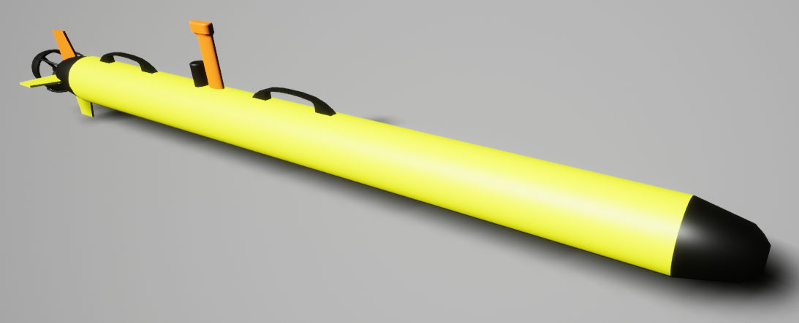
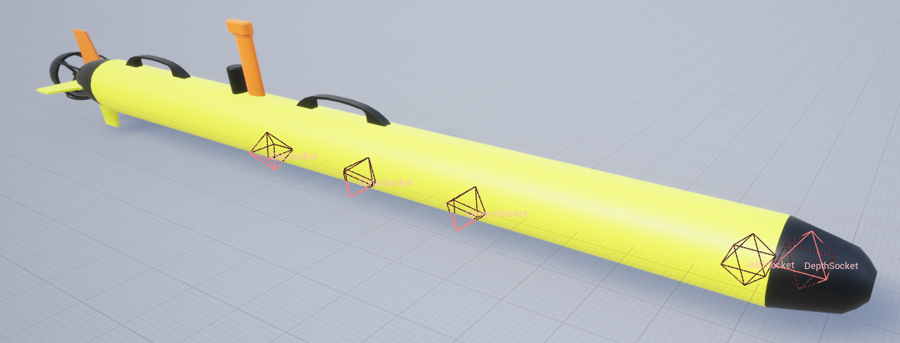
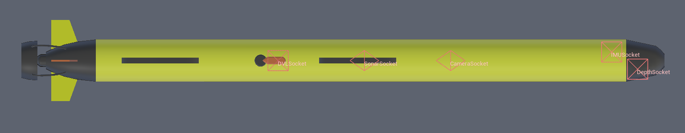
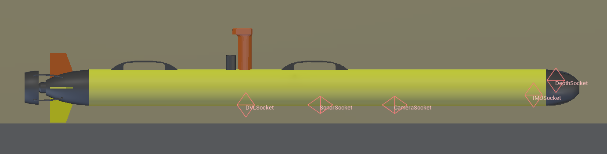

# 鱼雷式自主水下航行器 (TorpedoAUV）

## 图像

## 描述

一种通用型自主水下航行器（AUV）。

参见 [TorpedoAUV](https://byu-holoocean.github.io/holoocean-docs/UE4.27_archival_develop/holoocean/agents.html#holoocean.agents.TorpedoAUV)。

## 控制方案

* AUV 鳍片 (``0``)

    接收一个长度为 5 的向量。第一个元素是右侧鳍片的角度（范围：-45 到 45 度），随后依次是顶部、左侧和底部鳍片的角度。最后一个元素是“推进器”控制值（范围：-100 到 100）。

* 自定义动力学 (``1``)

    一个包含全局坐标系下线加速度和角加速度的 6 元素浮点数向量。该方案用于实现自定义动力学模型。除碰撞外，仿真器中禁用了所有其他力与力矩（包括重力、浮力和阻尼），以便在“白板”状态下实现自定义动力学。

## 接口

* `COM`（Center of mass）：质心位置

* `DVLSocket`：DVL（多普勒速度计）位置

* `IMUSocket`：IMU（惯性测量单元）位置

* `DepthSocket`：深度传感器位置

* `SonarSocket`：声纳传感器位置

* `Viewport`：机器人观察视角

