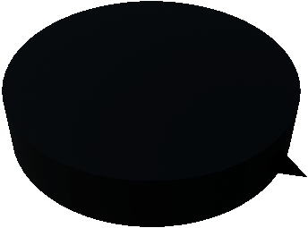
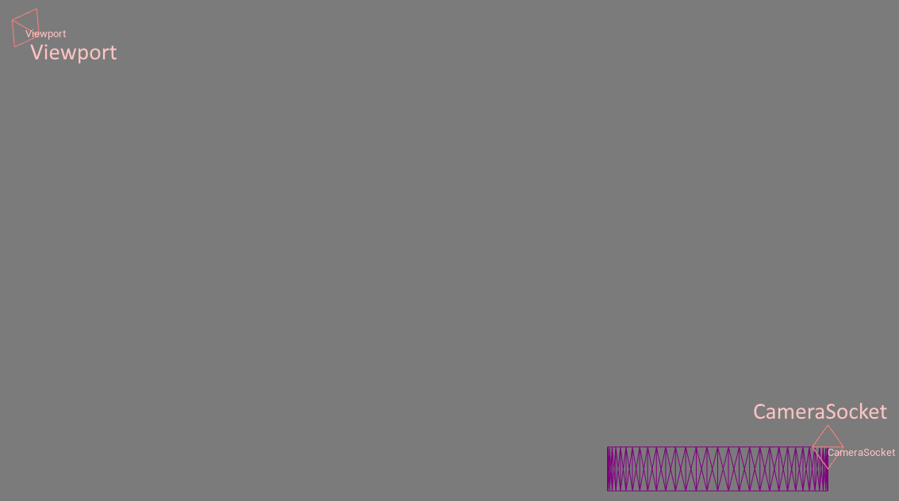

# 海龟代理 (TurtleAgent)

## 描述

这是一个带有向前指向箭头的简单 TurtleBot 智能体。其半径约为 25 厘米，高度约为 10 厘米。

TurtleAgent 在受力时会发生移动——这意味着它具有动量和质量，这与通过瞬移移动的球体智能体（sphere-agent）形成了对比。TurtleAgent 受重力影响，能够攀爬坡道和斜坡。

更多详情请参阅 [TurtleAgent](https://byu-holoocean.github.io/holoocean-docs/UE4.27_archival_develop/holoocean/agents.html#holoocean.agents.TurtleAgent)。

## 控制方案

* 球体连续控制 (`1`)

    一个长度为 2 的浮点向量，用于指定智能体的前向推力（索引 0）和旋转力（索引 1）。

## 接口（Socket）

* `CameraSocket`（位于机身前方）

* `Viewport`（位于代理后方）

