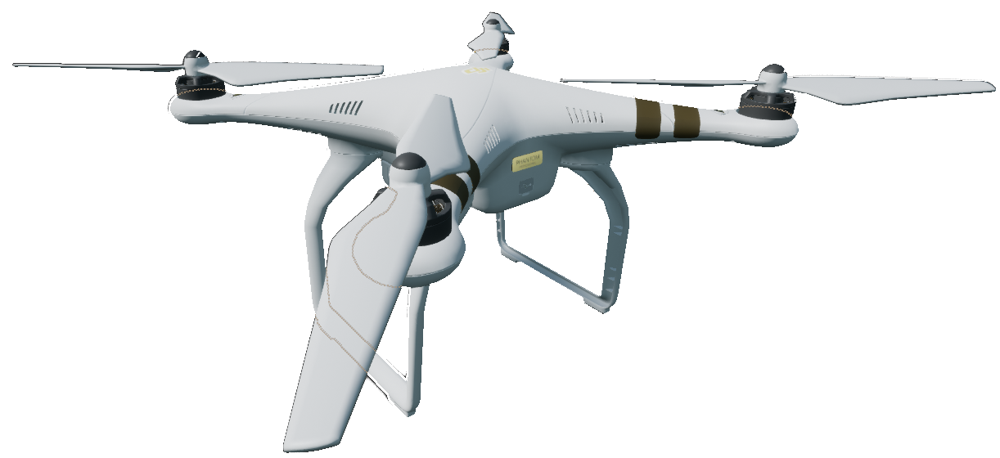
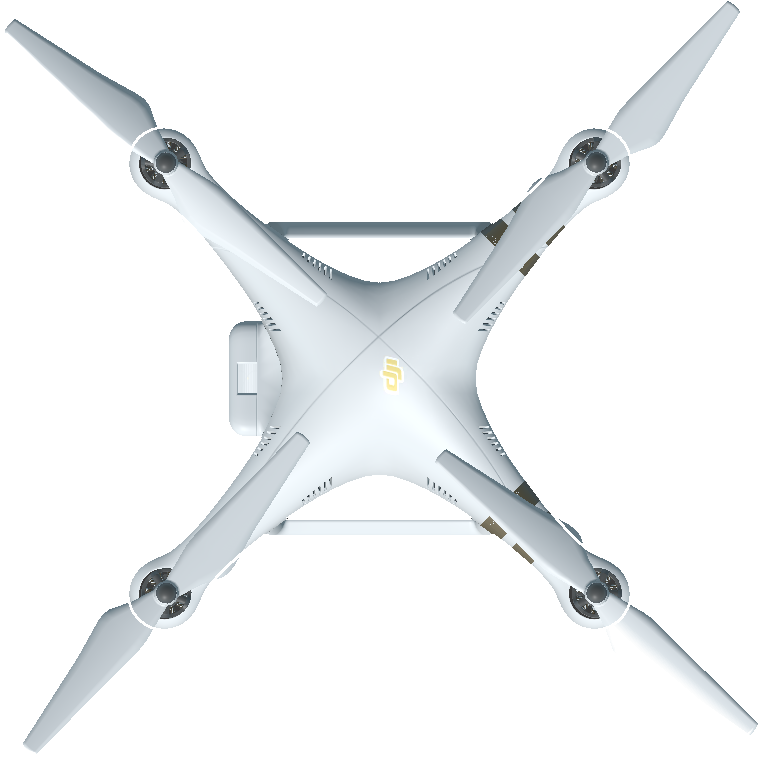
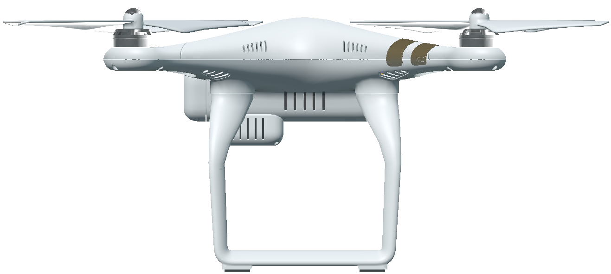
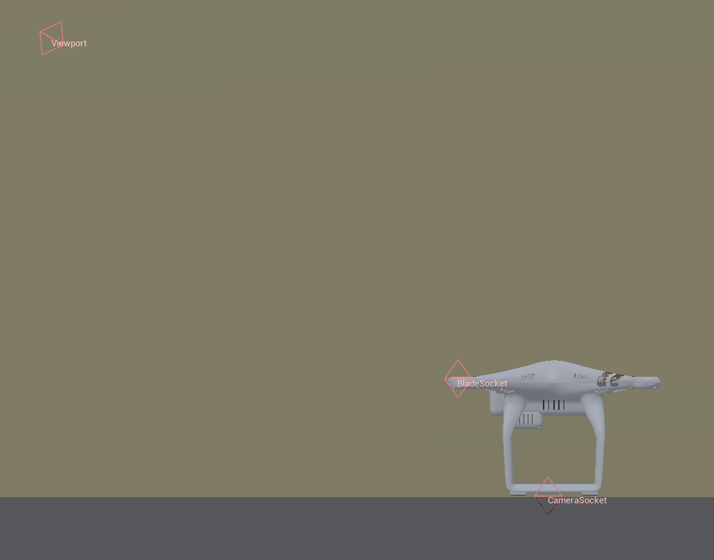

# 无人机代理 (UAVAgent)

## 图像

## 描述

四旋翼无人机代理。

请参阅 [UavAgent](https://byu-holoocean.github.io/holoocean-docs/UE4.27_archival_develop/holoocean/agents.html#holoocean.agents.UavAgent) 类。

## 控制方案

* UAV 力矩 (``0``)
    
    一个长度为 4 的浮点数向量，用于指定俯仰力矩、横滚力矩、偏航力矩和推力，索引分别为 0、1、2 和 3。

* UAV 横滚/俯仰/偏航目标 (``1``)
    
    一个长度为 4 的浮点数向量，用于指定俯仰、横滚、偏航和高度目标。各值分别对应索引 0、1、2 和 3。

## 接口 (Sockets)

* 位于无人机机身下方的 `CameraSocket`（摄像机接口）

* 位于代理后方的视窗 (Viewport)

