# 创建自定义关卡

要在 HoloOcean 中创建自定义关卡，您必须使用虚幻引擎 (Unreal Engine) 来制作关卡。有关保存和创建新关卡的更多信息，请参阅[引擎文档](https://openhutb.github.io/engine_doc/zh-CN/BuildingWorlds/LDQuickStart/index.html)。

HoloOcean 关卡主要包含两个方面：地形和水体。

## 地形

如需创建自定义地形方面的帮助，请参阅[虚幻引擎的地形文档](https://openhutb.github.io/engine_doc/zh-CN/BuildingWorlds/Landscape/index.html)。该文档解释了如何在编辑器中使用地形模式，以及如何应用和创建地形材质。

!!! 注意
    创建地形时，请注意水面位于 z=0 处。为了确保水下代理正常工作，水下地形必须低于 z=0。

要获取地形所需的材质或素材，您可以在 [Fab](https://www.fab.com/) 上购买或找到一些免费素材。[Quixel](https://www.fab.com/sellers/Quixel) 提供许多免费素材和材质。

如果您希望封闭环境的四周，可以放置墙壁等素材，或者雕刻地形边缘使其更高。您可以在 SimpleUnderwater 环境中查看这两种示例。

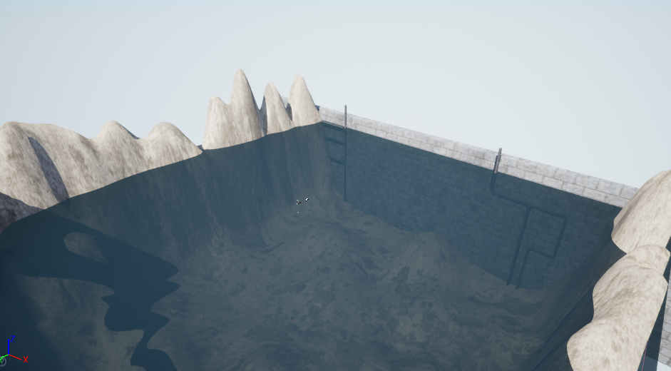

## 水体

**虚幻引擎的水体插件与 HoloOcean 不兼容，无法正常工作**。要实现水下效果，您需要在环境中放置一个水面和两个 PostProcessVolume。请注意，以下设置仅供参考，您可能需要根据关卡情况进行调整。

### 水面

要创建水面，请在 z=0 处放置一个平面 Actor。将其材质更改为任何类似水的材质。您还需要更改碰撞设置，以便载具可以穿过该平面。在“详细信息”面板中，搜索“collision(碰撞)”，并将自定义碰撞预设设置为忽略所有选项。

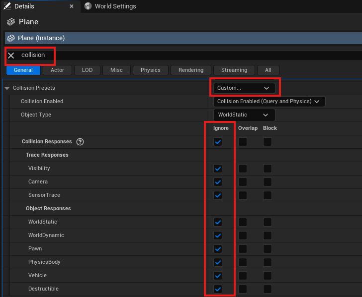

为了确保您的水平面与我们的潮汐系统兼容，请将水平面标记为“水面(WaterSurface)”，并使该平面可移动。

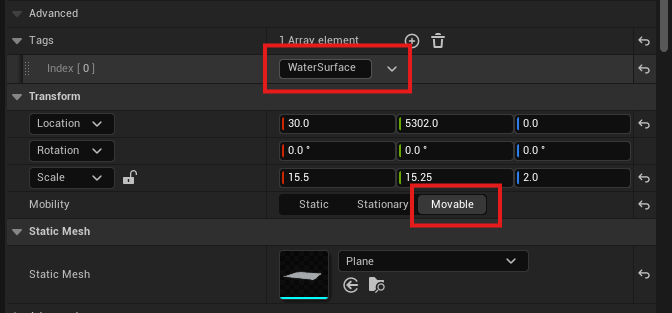

### 水色（后期处理体积 PostProcessVolume 1）

要添加后期处理体积，请前往“放置 Actor”➡“体积”➡“后期处理体积”，然后将其拖入关卡。调整体积的大小以适应整个水下区域。要调整体积的颜色，请前往“详细信息”面板➡“颜色分级”➡“其他”➡“场景颜色色调”。蓝色到绿色是最佳选择，大坝环境的“场景颜色色调”设置为十六进制 sRGB AAD9C8FF。

如大坝环境所示，水面是一个位于 z=0 的独立平面。环绕环境的红色轮廓框即为后期处理体积。

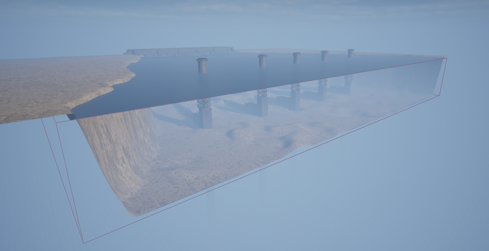

请务必将 PostProcessVolume 标记为 WaterPPV，以便“水雾命令”和“潮汐命令”能够正常工作。

### 水雾（后期处理体积 PostProcessVolume 2）

要模拟水下雾气并降低能见度，请添加第二个与第一个 PostProcessVolume 大小相同的 PostProcessVolume（您可以直接复制现有体积），并为其指定 `MM_Fog_Water_Simple` 材质。在“详细信息”面板中，导航至“渲染功能”➡“后期处理材质”，向数组中添加一个元素，将其设置为“资源引用”，然后选择 `MM_Fog_Water_Simple`。或者，您可以直接从“Content/WeatherContent/Fog/MM_Fog_Water_Simple”拖动该材质。

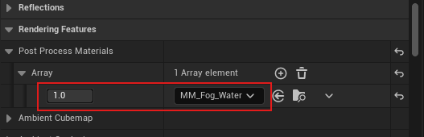

应用材质后，您可以调整其参数以获得所需的水下效果。最相关的参数包括：

* **Fog_Depth** – 控制雾气的扩散范围。

* **Fog_Opacity** – 控制雾气的密度。

* **Fog_Color** – 定义雾气的颜色（归一化 RGB，`0.0 – 1.0`）。

虽然也可以修改 `Fog_Transition` 参数，但通常建议将其保留为默认值` 0.1`，并先调整其他参数。只有当您需要更精细地控制雾气与场景的融合方式时，才需要修改 Fog_Transition 参数。

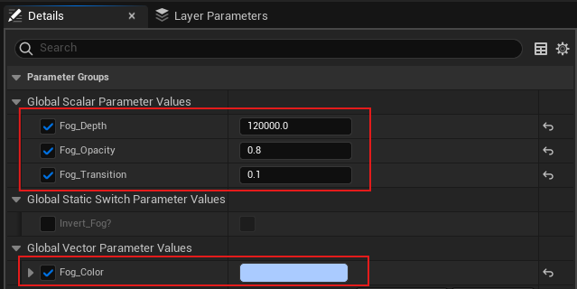

请务必将 PostProcessVolume 标记为 `WaterPPV`，以便 Water Fog 命令和 Tides 命令能够正常工作。

如果需要，您也可以使用 `MM_Fog_Water_Simple` 材质的副本执行上述步骤，然后根据需要进行修改并另存为新的材质名称。这样可以保留原始材质的设置以供将来使用。

## 光照

如果您创建的是基础关卡，光照应该已经自动生效。否则，请前往“窗口”➡“环境光混合器”。然后，请确保创建所有可用的光照选项。

快速检查一下，确保您的关卡包含以下元素：定向光、指数高度雾、天空大气、天空光和体积云。

为了确保指数高度雾与我们的昼夜循环设置兼容，请将“雾散射颜色”和“定向散射颜色”设置为黑色。“雾密度”和“雾高度衰减”可以根据您的需要进行调整。

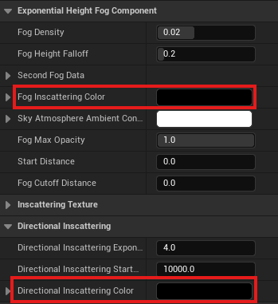

## 添加对象

### 获取资源

要为您的关卡添加资源，您需要导入自己的资源或在 [Fab](https://www.fab.com/) 上查找资源。

为了复刻类似 HoloOcean 的关卡，我们使用以下资源包：

* [Dam](https://byu-holoocean.github.io/holoocean-docs/v2.3.0/packages/Ocean/Dam/dam.html#dam)：

    * [海底环境](https://www.fab.com/listings/0c40a773-c71b-4c51-9286-721126fd9b0f)

* [OpenWater](https://byu-holoocean.github.io/holoocean-docs/v2.3.0/packages/Ocean/OpenWater/openwater.html#openwater)：

    * [模块化水坝环境](https://www.fab.com/listings/f6ff3c58-7fcd-43b8-bc0a-55ab6c405e1b)

* [PierHarbor](https://byu-holoocean.github.io/holoocean-docs/v2.3.0/packages/Ocean/PierHarbor/pierharbor.html#pierharbor)：

    * [集装箱船](https://www.fab.com/listings/d15bb4d9-e292-4bc0-a058-14aee645f69e)

    * [Boat Pack Vol_1](https://www.fab.com/listings/7e671469-af0a-4516-88a4-dfffefdbc640)

    * [码头集合](https://www.fab.com/listings/4a89aaec-7b13-46b6-957e-667262149c12) - 和 Town10 的码头类似

    * [模块化港口建筑套件](https://www.fab.com/listings/aeed2616-24b1-4bb9-8fde-cd268602dfcc)

## 导入资产

如果您已从 Fab 购买或获取了免费资源，可以在 Epic Games 启动器的“虚幻引擎库”选项卡下查看。在“Fab 库”部分，您可以点击“添加到项目”，然后选择您的项目以添加资源。

如果您要导入自己的模型，最好将其保存为 FBX 文件。之后，您可以在虚幻引擎编辑器中点击“导入”按钮并选择您的 FBX 文件。有关导入资源的更多帮助，请参阅[虚幻引擎文档](https://openhutb.github.io/engine_doc/zh-CN/WorkingWithContent/Importing/index.html)。

## 放置资产

您可以从内容抽屉(Content Drawer)中将资源拖放到自定义关卡中。或者，您可以选择带有绿色加号的立方体图标，快速将基本形状等 Actor 添加到关卡中。

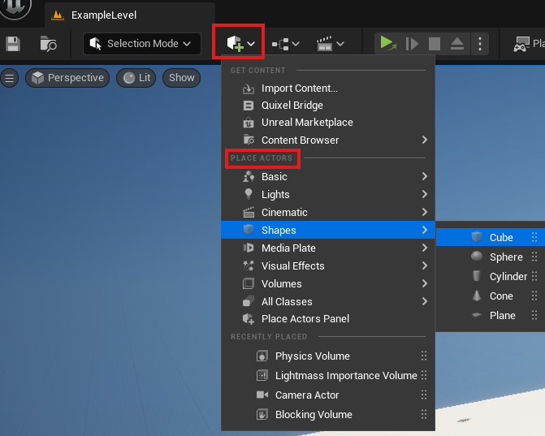

在关卡中移动、旋转和缩放对象非常简单。您可以直接在“详细信息”面板中编辑这些值，也可以使用键盘快捷键。

| 键       | 动作   |
|------------------------|---------|
| `W`      | 选择移动工  |
| `E`      | 选择旋转工具  |
| `R`      | 选择缩放工具  |

更多信息请参阅引擎的[变换Actor](https://openhutb.github.io/engine_doc/zh-CN/Basics/Actors/Transform/index.html)文档。

## 启用语义标签

HoloOcean 允许为世界资源分配标签。诸如语义分割相机之类的传感器使用这些标签向代理返回语义信息，以执行图像分割等任务。

要设置语义标注，请参考我们的教程：[添加自定义语义标签](https://byu-holoocean.github.io/holoocean-docs/v2.3.0/develop/env-docs/custom-semantics.html#semantic-segmentation)。

## 启用深度相机

HoloOcean 包含一个深度相机传感器，可以为代理提供深度信息。要启用这个传感器，你需要在环境中以及希望被深度相机检测到的每个资产上更改设置。在 Unreal 编辑器的 Details 面板中，导航到你希望深度相机可见的每个资产。对于每个资产，搜索“depth”，然后启用“Render CustomDepth Pass”。地形也需要这样设置。

如果你已经为语义标记设置了世界，那么深度相机所需的步骤你可能已经完成了。

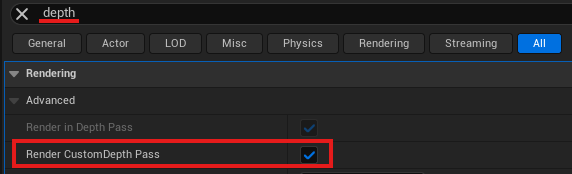

!!! 注意
    按照步骤在你的世界中设置语义标签，将会为接收到语义标签的资源启用“渲染自定义深度通道（Render CustomDepth Pass）”。记得对世界中所有剩余没有语义标签的资源重复上述过程，包括地形。

## 关于物体和声呐碰撞设置的说明

声呐模拟在生成八叉树时依赖物体的碰撞网格。

首先，确保设置环境边界的最小值和最大值。在通过虚幻引擎独立运行时，可以通过设置额外的启动参数来完成，如这里所示：实时启动游戏。如果你已经打包了你的世界，这个设置需要在配置文件中进行。

!!! 警告
    每当一个对象被更改或移动时，必须重新生成关卡的八叉树。要重新生成八叉树，请删除八叉树文件夹并重新运行你的模拟。关于八叉树的位置，请参阅[八叉树生成](https://byu-holoocean.github.io/holoocean-docs/v2.3.0/sensors/docs/octree.html#octree)。

如果对象的碰撞网格比视觉网格粗糙，那么该对象在声纳图像中的表现将不准确。可以通过使用虚幻引擎编辑器并在静态网格编辑器的细节部分将“碰撞复杂度（Collision Complexity）”选项设置为“使用复杂碰撞作为简单碰撞（use complex collision as simple）”来解决这个问题。

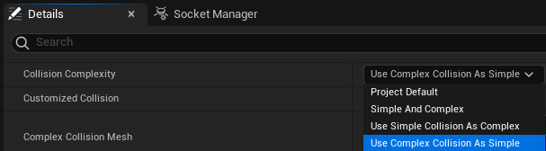

如果你的碰撞网格仍然有问题，通常在静态网格编辑器的细节面板中启用“双面几何（Double Sided Geometry）”会很有帮助。

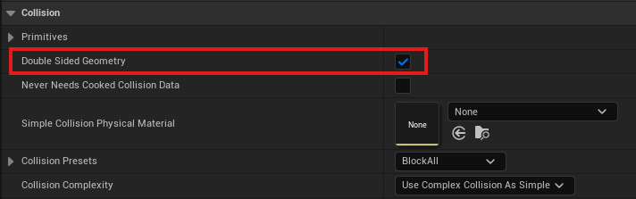

最后，在关卡中，点击对象并进入详细信息面板。找到碰撞部分，然后启用“模拟生成碰撞事件（Simulation Generates Hit Events）”。

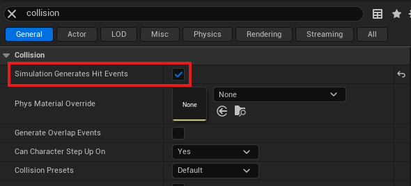

你可以通过在关卡或静态网格编辑器中将视图模式更改为“玩家碰撞（Player Collision）”来验证碰撞网格的形状。

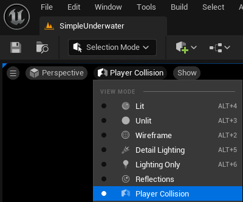

## 物体的额外潮汐设置

为了创建可以随潮水移动的兼容非代理漂浮物，你必须在角色标签中添加关键字 Float，然后进入静态网格的碰撞设置，确保勾选了自定义碰撞。

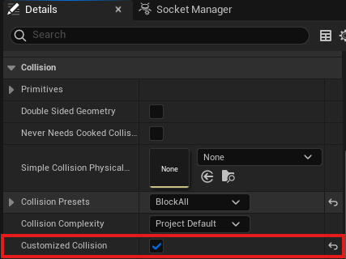

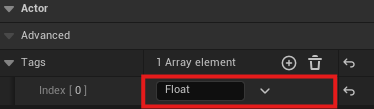

## 天气

要在你的自定义关卡中添加天气功能，你首先需要将天气管理器（Weather Manager）蓝图添加到你的游戏世界中。操作方法是：进入内容浏览器 ➡ 天气内容，然后将 BP_Weather_Manager 拖到你的关卡里。

接下来，你需要添加两种不同的体积云（Volumetric Cloud）演员。进入放置参与者 ➡ 视觉效果 ➡ 体积云，然后把它拖到关卡中两次。

在放置好两个参与者之后，为它们分配云材质并添加标签：

1.选择第一个体积云参与者。

2.在详情面板中，找到 Cloud Material ➡ Material，然后分配位于 Weather Content 文件夹中的材质m_SimpleVolumetricCloud_Inst_Sunny。你也可以直接把材质从文件夹拖到材质栏里。

3.给参与者添加标签：进入 Actor ➡ Advanced ➡ Tags，点击  添加一个元素，然后把标签命名为 Sunny。

对第二个体积云参与者重复相同的操作，不过这次使用 m_SimpleVolumetricCloud_Inst_Cloudy 材质，并将标签命名为 Cloudy。

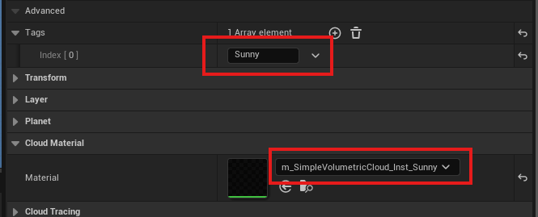

最后，你也应该把你创建的水面标记为“WaterSurface”。

## 空气雾

如果你想在水面以上的模拟中加入空气雾或雾气，你可以添加一个覆盖目标区域的后处理体积（PostProcessVolume），并为它分配 `MM_Fog_Air` 材质。在**详情**面板中，导航到*渲染功能 ➡ 后处理材质*，向数组中添加一个元素，设置为**资产引用（Asset Reference）**，然后选择 `MM_Fog_Air`。或者，你也可以直接从 `Content/WeatherContent/Fog/MM_Fog_Air` 拖动材质过来。

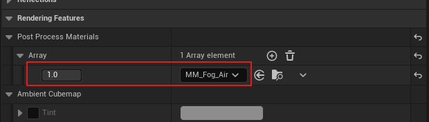

应用后，你可以调整材质参数来实现所需的氛围效果。最相关的参数有：

* **Fog_Depth** – 控制雾的扩展距离。

* **Fog_Opacity** – 控制雾的浓度。

* **Fog_Color** – 定义雾的颜色（归一化RGB，`0.0 – 1.0`）。

虽然 **Fog_Transition** 参数也可以修改，但通常建议保持默认值`0.1`，先调整其他参数。只有在需要更精细地控制雾与场景的融合时才修改它。

确保将 PostProcessVolume 标记为 `AirPPV`，这样 Air Fog Command 和 Tides Command 才能正常工作。

## 关于手电筒 Flashlights

为了让载具车辆的手电筒正常工作，你的关卡必须包含 `FlashlightManager`。你可以通过将 `Content/HolodeckContent/Agents/FlashlightManager` 中的管理器拖到你的世界中来添加它。

`FlashlightManager` 不会改变环境的外观或物理效果——它只是启用手电筒功能。

## 测试你的自定义关卡

为了快速测试你的关卡，通常最简单的方法是以独立模式运行。这样你可以快速验证碰撞设置或视觉效果，而不用打包关卡。请参考“从 Unreal 引擎编辑器启动游戏”来[直接运行你的关卡](https://byu-holoocean.github.io/holoocean-docs/v2.3.0/develop/start.html#live-game)。

否则，每次修改后你都需要重新打包关卡。请参考[打包环境](https://byu-holoocean.github.io/holoocean-docs/v2.3.0/develop/env-docs/package-env.html#packaging-environments)获取更多信息。

## 参考

* [Creating a Custom Level](https://byu-holoocean.github.io/holoocean-docs/v2.3.0/develop/env-docs/create-env.html)