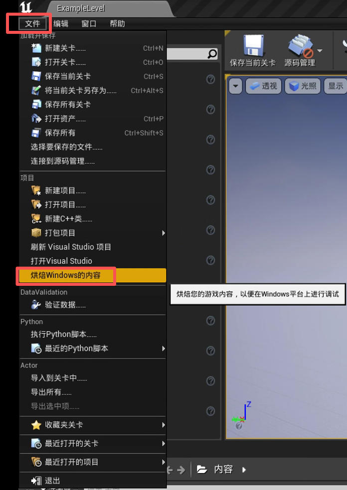
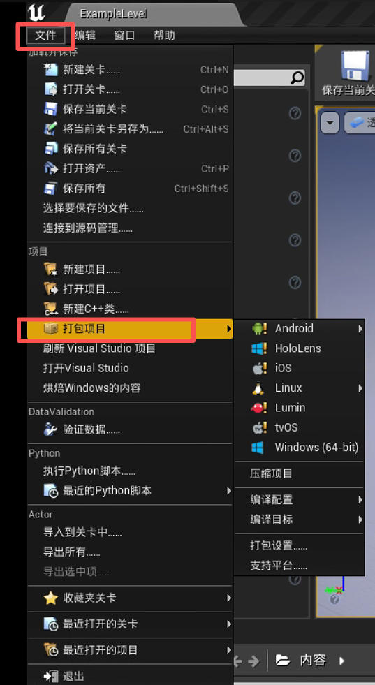
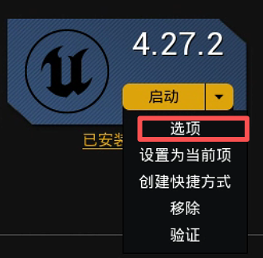
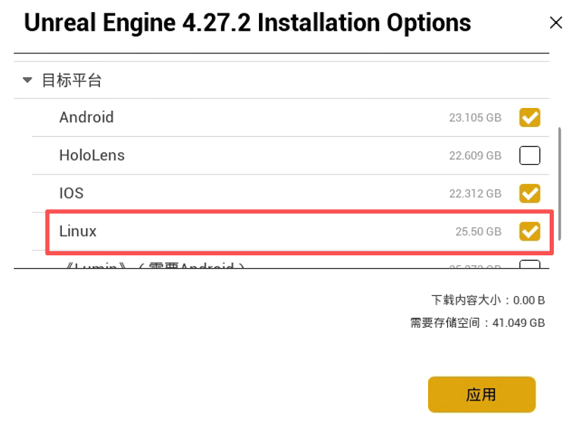
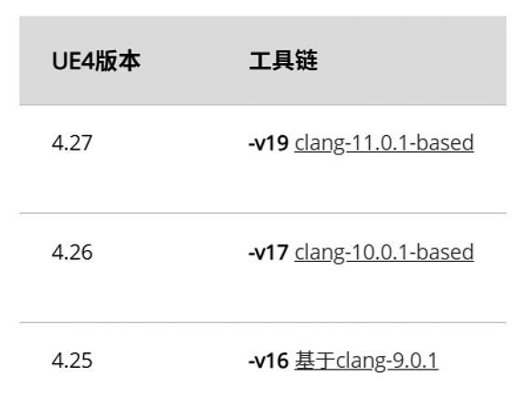
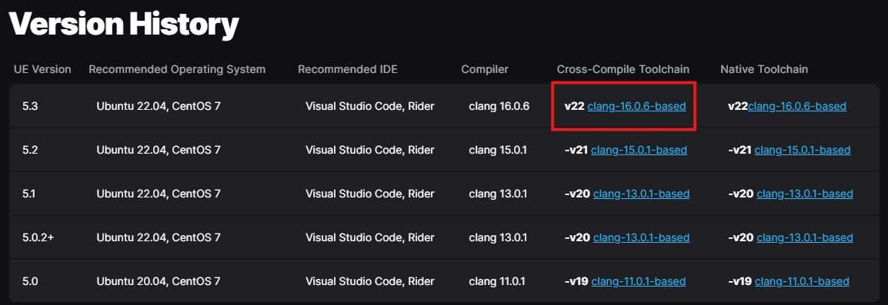
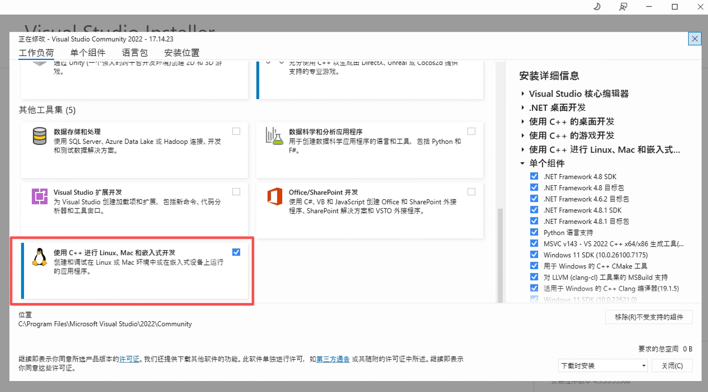

# 开发环境

本文部分内容参考了[此处](https://github.com/BYU-PCCL/holodeck/wiki/Packaging-Project)的资料。

虚幻引擎项目在分发前需要进行打包。此过程会生成引擎可执行文件，并将客户端启动引擎所需的所有资源打包在一起，无需通过编辑器或 Visual Studio 启动。

此过程会将 Holodeck 的 C++ 代码编译，并将 `.uasset` 文件（包括蓝图！）打包成一个大的 `.pak` 文件，并创建所需的目录结构。


## 添加 Underwater 世界  <span id="adding_underwater_worlds"></span>

最终的软件包将仅包含已添加到项目中的世界（在编辑器中称为“关卡”）。`holoOcean` 代码库中仅包含示例关卡。您只需在虚幻引擎编辑器中[创建新关卡](./custom_level.md)即可创建新的世界。更多信息请参阅[虚幻引擎文档](https://openhutb.github.io/engine_doc/zh-CN/Basics/Levels/HowTo/WorkWithLevelAssets/index.html)。

!!! 注意
    由于 HoloOcean 附带的其他打包世界包含付费资源，因此仅供 BYU FRoStLab 的正式成员使用。其他用户需要在 holoocean 代码库中自行开发世界。


## 内容烘焙  <span id="cooking_content"></span>

当您在 Visual Studio 中运行 `holodeck-engine` 时，可能需要烘焙内容以“刷新”`holodeck-engine` 读取的资源、关卡和蓝图。

**从虚幻编辑器：**

文件 ➡ 烹饪 Windows/Linux 的内容




## 打包 Underwater <span id="packing_underwater"></span>

**从虚幻编辑器：**

1.文件 ➡ 打包项目 ➡ Windows x64/Linux

   


2.选择输出目录
    
   我通常选择 `holodeck-engine` 仓库根目录下的“dist”目录。

!!! 注意
    双击执行输出目录中的`WindowsNoEditor/Holodeck.exe`并不能看到默认的场景，执行`WindowsNoEditor\Holodeck\Binaries\Win64\Holodeck.exe`才能看到默认的场景。想要看到水下机器人需要通过运行 [Python 脚本](https://github.com/OpenHUTB/mujoco_plugin/tree/main/src/underwater/holo_ocean)。

### 附：从 Windows 交叉编译到 Linux 

**1.** 在 Epic Games 启动器中找到您的虚幻引擎版本。右键单击“启动”按钮旁边的箭头，然后选择“选项”。



**2.** 在“目标平台”下，选择 Linux 并进行安装。



**3.** UE 4.26 下载交叉编译工具链 -v17（请参阅[虚幻引擎的交叉编译文档](https://openhutb.github.io/engine_doc/zh-CN/SharingAndReleasing/Linux/AdvancedLinuxDeveloper/LinuxCrossCompileLegacy/index.html)，UE 4.27 下载 -v19）。


UE 5.3 下载交叉编译工具链 v22（请参阅[虚幻引擎的交叉编译文档](https://dev.epicgames.com/documentation/en-us/unreal-engine/linux-development-requirements-for-unreal-engine?application_version=5.3)）。


**3.1**. 

运行`D:\UnrealToolchains\v18_clang-11.0.1-centos7\x86_64-unknown-linux-gnu\bin\clang++ -v`，验证是否安装成功（注意：需使用绝对路径，`%LINUX_MULTIARCH_ROOT%x86_64-unknown-linux-gnu\bin\clang++ -v`会提示命令找不到）


**4.** 修改 Visual Studio 2022 的安装，使其包含“使用 C++ 进行 Linux 和嵌入式开发”组件。



经过这些更改，您应该能够从 Windows 编译 Linux 版本。

该步骤参考[UnrealEngine交叉编译](https://zhuanlan.zhihu.com/p/616964048)。

## 将文件放置在安装目录中 <span id="place_in_install_directory"></span>

为了能够调用 `holodeck.make()`，您需要将打包好的引擎放置在[软件包安装位置](../packages/installation.md)。

请确保路径中的版本号与 `holodeck.util.get_holodeck_version` 命令的输出结果一致。

1.将 `dist` 文件夹的内容复制到上面指定的软件包路径中。
```json
+ worlds
|--+ PackageName
    |-- config.json
    |-- WorldName-ScenarioName.json
    |--+ LinuxNoEditor (发行目录的输出)
        | UE4 build output
```

2.请按照上述文件结构从 holodeck-configs 复制配置。

!!! 重要提示
    config.json 文件是为 Linux 编写的，必须进行编辑才能在 Windows 系统下正常工作。请将 platform 和 path 字段修改为以下内容：
    `"platform": "windows"`、
    `"path": "WindowsNoEditor/Holodeck/Binaries/Win64/Holodeck.exe"`


## 关于创建环境对象和声呐的说明 <span id="note_on_creating_environment_objects_and_sonar"></span>


声呐模拟在生成八叉树时依赖于对象的碰撞网格。如果对象的碰撞网格比视觉网格粗糙，则该对象在声呐图像中的表示将不准确。可以通过在虚幻引擎编辑器中，将静态网格编辑器详细信息部分的“碰撞复杂度”选项设置为“使用复杂碰撞作为简单碰撞”来解决此问题。