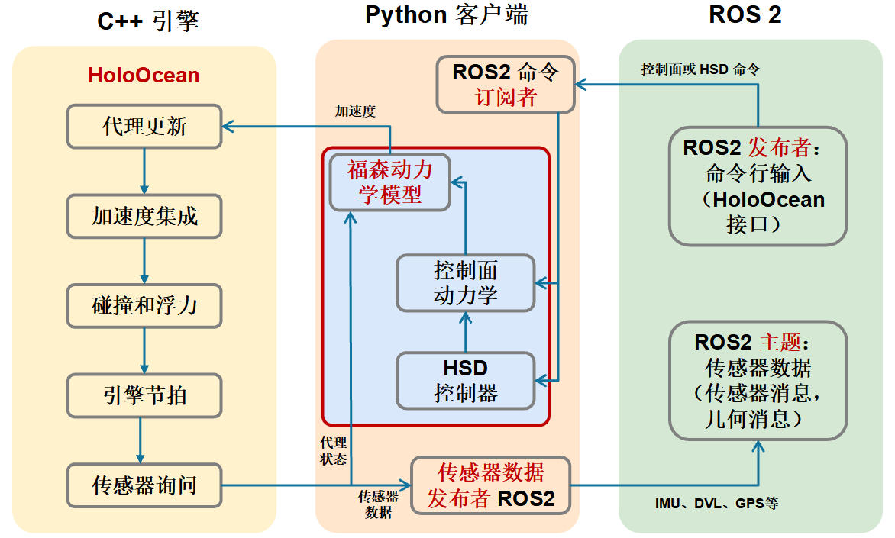

# ROS2 桥接器

HoloOcean 的初始版本通过 LCM 支持外部系统集成，选择 LCM 的原因在于其轻量级特性。HoloOcean 2.0 在此基础上增加了对 ROS2 的支持，ROS2 提供了更多功能和更大的活跃用户群。HoloOcean 用户现在可以使用自定义 ROS2 网桥将传感器数据发布到外部网络，并将命令从 HoloOcean 发送到外部网络。HoloOcean 的文档中包含多个 ROS2 Python 节点示例，演示用户如何根据自身场景创建自定义 ROS2 接口。

下面流程图展示了 HoloOcean、福森动力学和 ROS2 桥接器之间的信息流。在仿真过程中，来自代理的传感器数据由 HoloOcean 的 Python 客户端接收，并转换为 ROS2 消息格式（传感器消息、几何消息和自定义 HoloOcean 消息），然后这些消息可以与 HoloOcean 外部的其他代理进行交互。

ROS2 桥接器经过专门配置，可与上述福森动力学实现配合使用。载具指令（例如执行器位置、速度、深度和航向等控制器设定值）可通过福森动力学管理器发送到由福森控制的代理。

# 参考

* [A Preview of HoloOcean 2.0](https://arxiv.org/html/2510.06160v1)
