# 通信协议

本文摘自[此处](https://github.com/BYU-PCCL/holodeck/wiki/Holodeck-Communication-Protocol)，仅作存档之用。

在本维基页面中，我将解释 holoocean 的两个部分（客户端和引擎）如何通信。

## 预备阅读材料 <span id="prerequisite_reading"></span>

复习一下[信号量](https://en.wikipedia.org/wiki/Semaphore_(programming))和[共享内存](https://en.wikipedia.org/wiki/Shared_memory)。


## holoocean 的两个部分 <span id="the_two_halves_of_holoocean"></span>

我们所说的“holoocean”实际上是两个独立的模块。

### [holoocean](https://github.com/OpenHUTB/Underwater/tree/master/client) <span id="holoocean"></span>

* 也称为：- “Python 端” - “客户端” - 但负责初始化“服务器”

* 是一个可通过 pip 安装的 Python 包

* 用户仅与此包交互

* 主要负责与引擎进行数据交换

* 负责初始化引擎和训练场景

### [Underwater](https://github.com/OpenHUTB/Underwater)

* 别称： - “C++ 部分” - “引擎”

* 虚幻引擎项目 ([.uproject](https://github.com/OpenHUTB/Underwater/blob/master/Holodeck.uproject))

* 编译后的二进制文件由 holoocean 软件包下载并安装

* 需要安装[虚幻编辑器](https://github.com/OpenHUTB/engine)并进行构建/打包


## 简单使用示例  <span id="simple_usage_example"></span>

在本示例中，我们将解释 `holoocean` 和 `Underwater` 之间需要进行哪些通信才能使此示例正常运行：
```python
import holoocean

# (1). 启动引擎
env = holoocean.make("SimpleUnderwater-Hovering")

for i in range(10):
  # 初始化关卡及其内部的主代理
  env.reset()

  # 准备一条要发送给主代理的命令
  command = [0, 0, 2, 1000]
  for _ in range(1000):
    # (2). 向代理发送命令，执行模拟，并返回来自引擎的信息
    state = env.step(command)
```

## 第 1 部分：holoocean.make()  <span id="simple_usage_example"></span>

`holoocean.make()` 函数主要是一个辅助函数，用于实例化 `HoloOceanEnvironment` 对象。`.make()` 会加载一个配置文件，并将相应的参数传递给 `HoloOceanEnvironment` 的 `__init__()` 函数。

`__init__()` 函数主要执行以下三项操作：

1.启动 `holoocean-engine` 进程，并告知其所需的最小加载量

2.创建 HoloOceanClient 实例

* 创建同步信号量

* 提供 `malloc()` 函数，用于在客户端分配共享内存

* 传感器、代理等使用此函数

3.实例化代理和传感器，它们使用 `malloc()` 函数分配缓冲区


### 创建加载信号量

“加载信号量”由客户端创建，并由引擎发出信号。

服务器进程启动后，客户端会等待服务器发出信号，以便确认服务器已初始化完成。

<!-- 
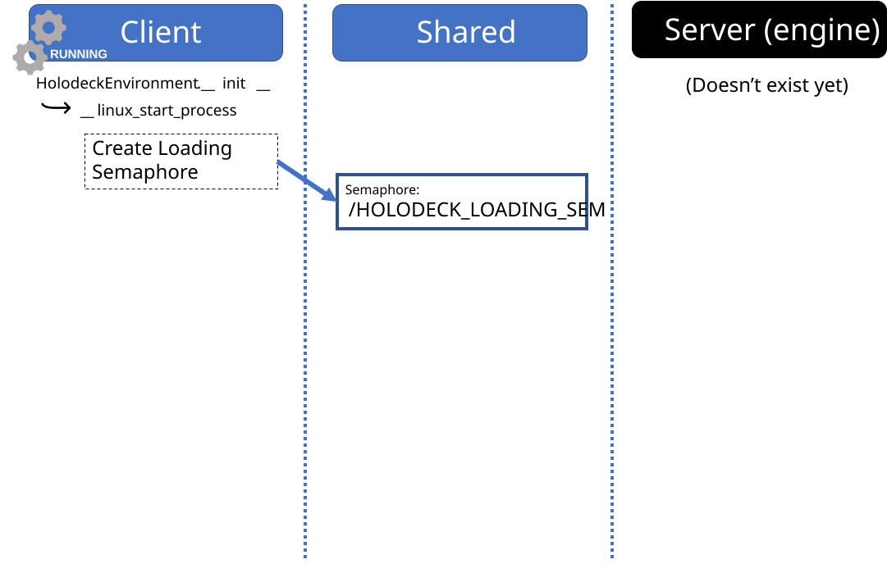
-->
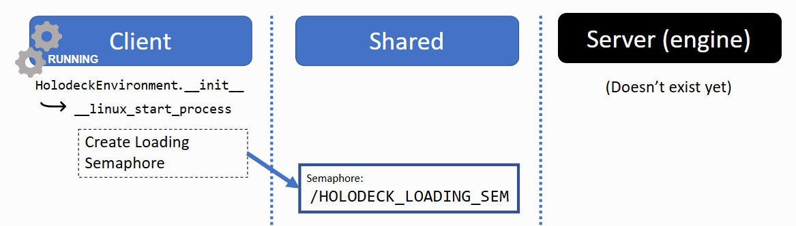

### 启动子进程

接下来，客户端将创建引擎子进程。它会在引擎的命令行中传入一个 UUID，该 UUID 将用于生成唯一的信号量名称。


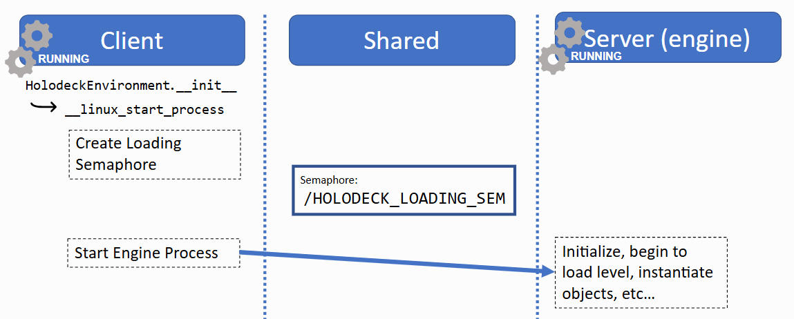


**关于 UUID 的说明**

信号量（semaphore）和共享内存的名称（例如 `/HOLODECK_LOADING_SEM`）在整个操作系统内的所有进程间是全局可见的。

为了避免不同 Holodeck 实例之间发生命名冲突，`holoocean.make()` 会为创建的每个环境生成一个 UUID，并将其作为命令行参数传递给引擎，例如：
```shell
holodeck.exe --HolodeckUUID=8ac7059c-fb71-48fb-a0b1-a1ea8a4c6c10
```

该 UUID 会被附加到信号量或共享内存的名称后面，从而支持多个实例同时运行，例如：

`/HOLODECK_LOADING_SEM8ac7059c-fb71-48fb-a0b1-a1ea8a4c6c10`

如果未提供 `--HolodeckUUID` 参数，则默认值为空字符串（""）。这在调试时非常有用。

### 等待引擎加载

引擎正在初始化，客户端等待 /HOLODECK_LOADING_SEM 完成。

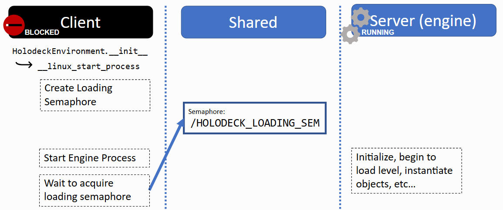


### 引擎加载完成

引擎加载完成后，将等待另一个信号量，同时客户端执行其他操作。

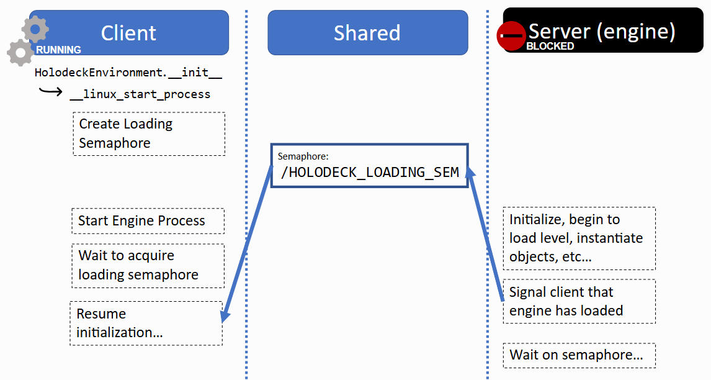

此时，客户端通过发送一系列命令来生成代理、传感器和任务。

本页未详细介绍这一点，但就我们的目的而言，重要的是每个代理和传感器都会分配共享内存缓冲区，以实现引擎和客户端之间的通信。


### 主同步信号量

在 `HoloOceanEnvironment` 的 `__init__()` 方法中，它会创建一个 `HolodeckClient` 对象，该对象会生成两个重要的同步信号量。这些信号量使得引擎和客户端能够同步运行，并交替执行（参见 [HolodeckServer.cpp](https://github.com/OpenHUTB/Underwater/tree/master/Source/Holodeck/HolodeckCore/Private/HolodeckServer.cpp) / [holooceanclient.py](https://github.com/OpenHUTB/Underwater/blob/master/client/src/holoocean/holooceanclient.py)）。


**`/HOLODECK_SEMAPHORE_SERVER`**

* 被称为信号量

    * 这名字是谁起的？

* **引擎**在**客户端**执行任何操作时都会等待这个信号量。

* 这会**阻塞游戏主循环！**

    * 引擎窗口在等待信号量时会显示为锁定状态。

    * 您无法关闭、调整大小或移动窗口。

    * https://github.com/BYU-PCCL/holodeck/issues/18


**`/HOLODECK_SEMAPHORE_CLIENT`**

* 称为信号量2（semaphore2）

* **客户端**会等待此信号量，同时**引擎**会模拟一个时钟周期。

* 当**客户端**准备好让**引擎**模拟下一个时钟周期时，**客户端**会向 `/HOLODECK_SEMAPHORE_SERVER` 发送信号。

我们将在下文中看到这些信号量的使用方法。


### 共享内存缓冲区

共享内存缓冲区在 Holoocean 中用途广泛。

1.用于来回发送命令

* 例如：生成代理、移动视窗等

2.代理

* 动作缓冲区（`uuid` + 代理名称）

    * 告知代理客户端在每个游戏刻提供的输入

* 传送标志（`_teleport_flag`）、传送缓冲区（`_teleport_command`）

    * 指示代理是否以及应该传送到哪里

* 控制方案（`_control_scheme`）

    * 告知引擎代理正在使用的控制方案（如何解释动作缓冲区）

3.传感器

* 传感器数据缓冲区（代理名称 `_` + 传感器名称）

## 第 2 部分：`.step()`  <span id="part_2_step"></span>

现在我们已经有了一个运行环境，那么如何实现数据之间的双向传输呢？

我们将分析以下代码的执行过程：
```python
state = env.step([0, 0, 2, 1000])
```

### 1.代理的操作

首先，我们将提供的动作（`[0, 0, 2, 1000]`）复制到代理的操作缓冲区中：

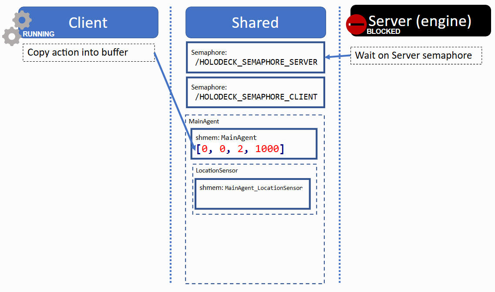


### 2.信号服务器

接下来，客户端向 信号量服务`/HOLODECK_SEMAPHORE_SERVER` 发送信号，唤醒服务器。

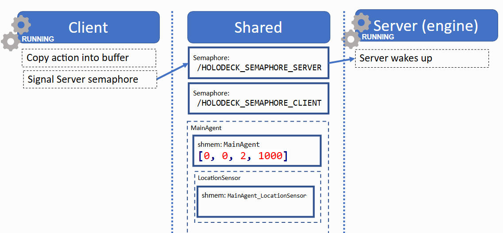

### 3.客户端等待，服务器处理

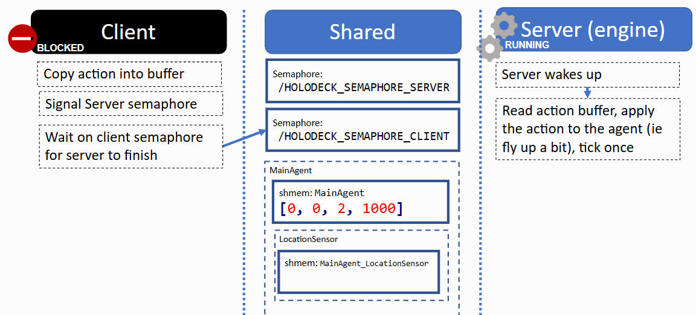


### 4.服务器对传感器数据进行采样，并将其复制到缓冲区

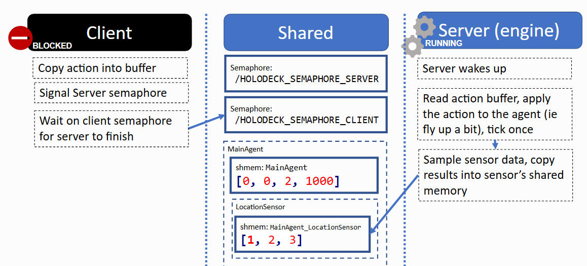

### 5.唤醒客户端

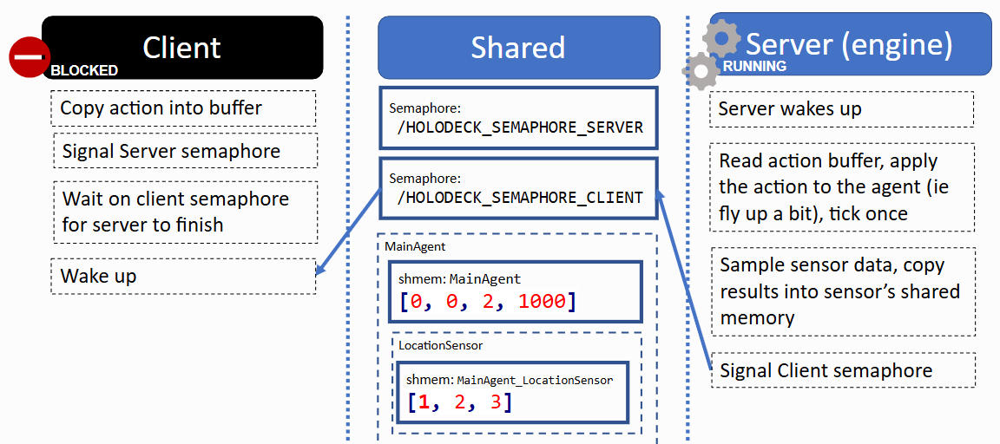

### 6.服务器阻塞并等待客户端再次发出信号

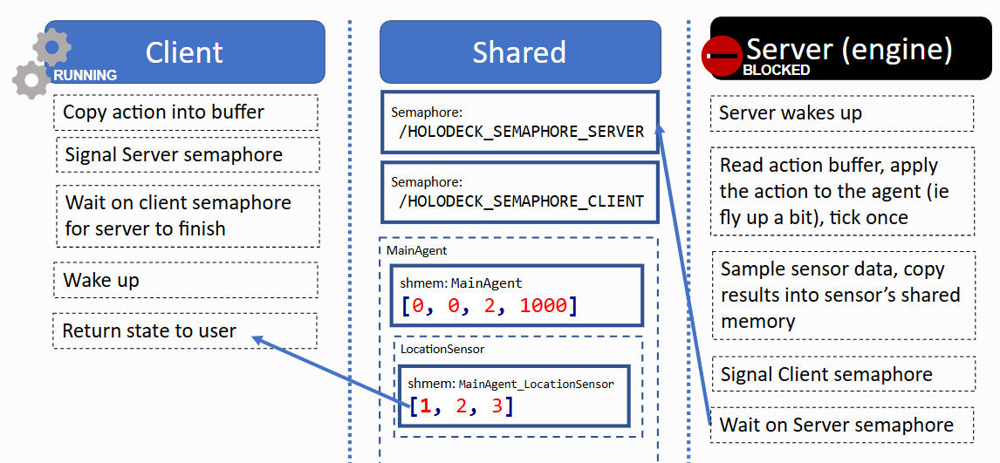


## 备注  <span id="remarks"></span>


一些值得注意的事项。

1.复制到共享缓冲区的数据会持续存在。如果写入了一个操作，该操作将一直执行，直到写入另一个操作为止。传感器数据也是如此。

2.引擎的默认 UUID 为空字符串`""`。这意味着，如果您从编辑器或 Visual Studio 启动引擎，并且在创建 `HoloOceanEnvironment` 对象时指定 UUID 为空字符串`""`，则可以使用 Python 客户端连接到该引擎。
