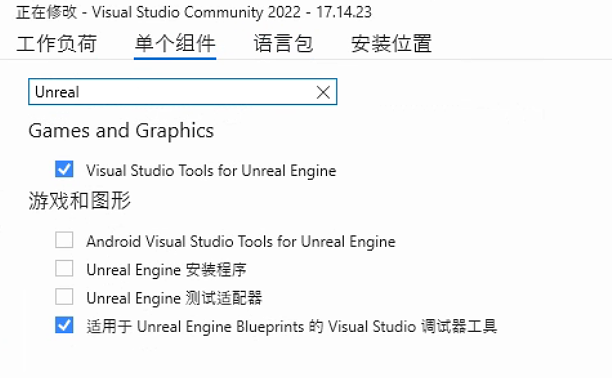

# 疑难解答
本页面包含在开发 HoloOcean 过程中可能出现的常见问题及其解答。

## 我无法在 Windows 上的 Unreal Engine 中打开 HoloOcean

通常，问题出在 Visual Studio 的设置上。请打开 Visual Studio 安装程序并修改你的 Visual Studio 设置。请确认你已经下载了所有 Unreal Engine 所需的组件。

请再次尝试点击 `holodeck.uproject` 文件，如果提示重建，请选择“是”。

如果仍然出现错误，您需要在 Visual Studio 中手动构建该项目。右键单击 `holodeck.uproject` 文件，然后选择“生成 Visual Studio 项目文件”。如果在 Visual Studio 中打开项目时遇到问题，请参阅[编译](./start.md#compiling)部分。

Unreal Engine 源代码中也存在一些可能导致问题的错误。这些文件可以更改而不影响 HoloOcean。

## 当我运行 HoloOcean 时，我对代码的任何更改都没有显示。

如果您更改了任何 C 语言文件，您必须通过 Unreal Engine 编辑器或 Visual Studio 编译 HoloOcean。请参阅[编译](./start.md#compiling)指南。

如果您更改了任何 Python 文件，您必须进入 [PythonAPI/carla/](https://github.com/OpenHUTB/hutb/tree/hutb/PythonAPI/carla) 目录并运行 `pip install -e .`。

## 我在关卡中添加了新对象，但它们在声呐上没有显示

首先，请确保已启用正确的碰撞设置。请参阅[有关对象和声呐的碰撞设置说明](./custom_level.md#object_collision)。

还请确保删除之前为关卡生成的任何八叉树。每当向环境中添加新对象时，都需要重新生成八叉树。

