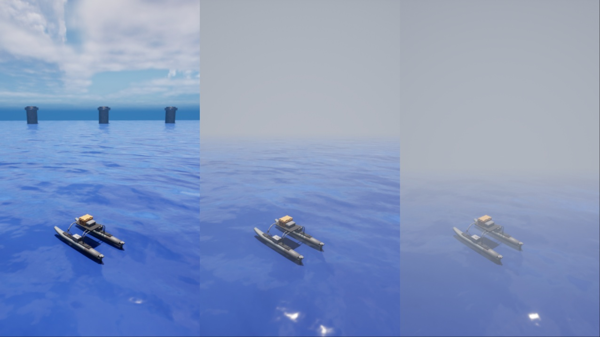

# Air Fog（空气雾）指令

Air Fog 指令允许您调整环境中的雾效，从而改变水面上物体的可见距离与清晰度。该指令可用于模拟不同的空气能见度条件。



## 使用方法
您可以配置以下参数：

* **fogDensity**：控制雾气的整体浓度。范围：`0.0 – 10.0`

* **fogDepth**：雾效开始出现的距离（相对于摄像机）。范围：`0.0 – 10.0`（默认值 = 3.0）

* **color_R**：雾气颜色的红色通道值。范围：`0.0 – 1.0`（默认值 = 0.45）

* **color_G**：雾气颜色的绿色通道值。范围：`0.0 – 1.0`（默认值 = 0.5）

* **color_B**：雾气颜色的蓝色通道值。范围：`0.0 – 1.0`（默认值 = 0.6）

### 通过代码实现
以下示例展示了如何使用空气雾（air fog）命令来实现上图中所示的能见度效果：
```python
with holoocean.make("...") as env:
      while True:
            env.air_fog(1) # 将雾浓度设置为 1
```
此外，您还可以修改雾的深度和颜色。
```python
with holoocean.make("...") as env:
      while True:
            env.air_fog(
                  0.8,
                  fogDepth=5.0,
                  color_R=0.5,
                  color_G=0.5,
                  color_B=0.6
            )
            env.tick()
```

!!! 注意
    有关如何使用此命令的更多信息，请参阅 API 文档：[AirFogCommand](https://byu-holoocean.github.io/holoocean-docs/v2.3.0/holoocean/commands.html#holoocean.command.AirFogCommand)。

!!! 注意
    若要修改水下雾效，请改用专用命令。请参阅 [Water Fog Command](https://byu-holoocean.github.io/holoocean-docs/v2.3.0/env_appearance/water_appearance/water_appearance.html#water-fog-command)。

    水下雾效（Underwater Fog）是一种渲染技术，用来模拟光线在水中传播时被吸收和散射的视觉效果。它通过深度（你离水面或物体的距离）来计算雾的浓度。你潜得越深，或者看远处的水下物体时，它就显得越模糊、颜色越偏蓝绿。
