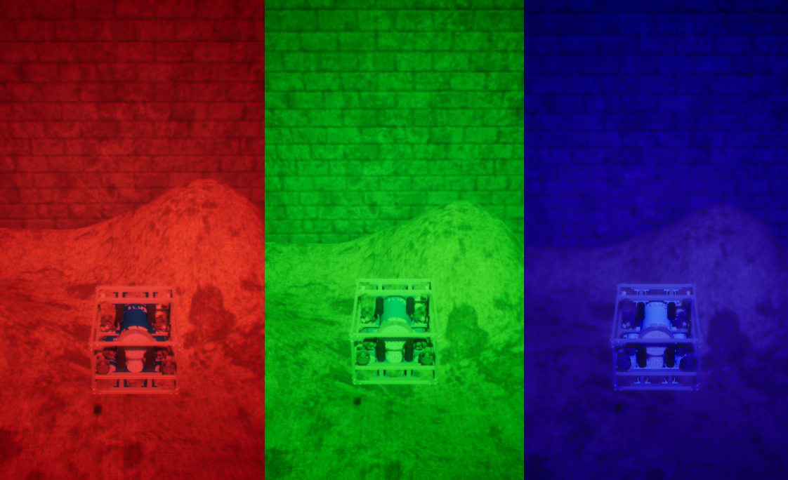
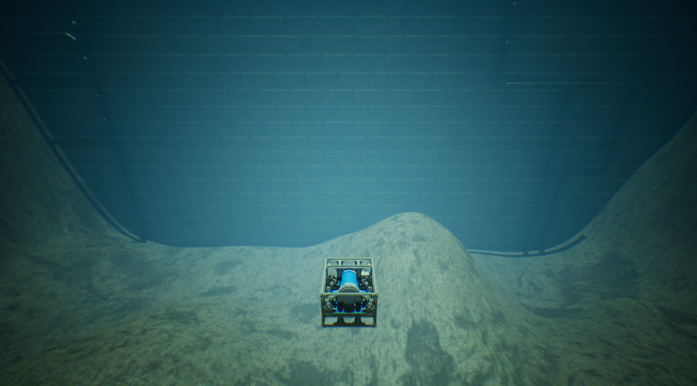
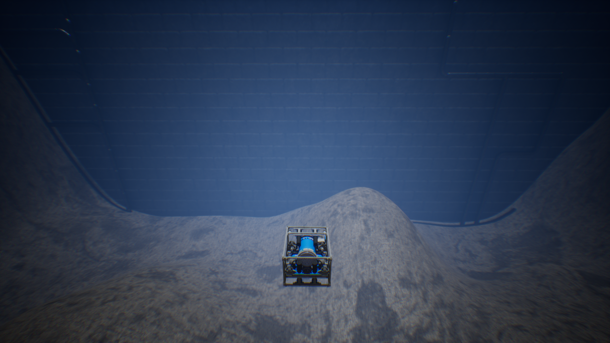
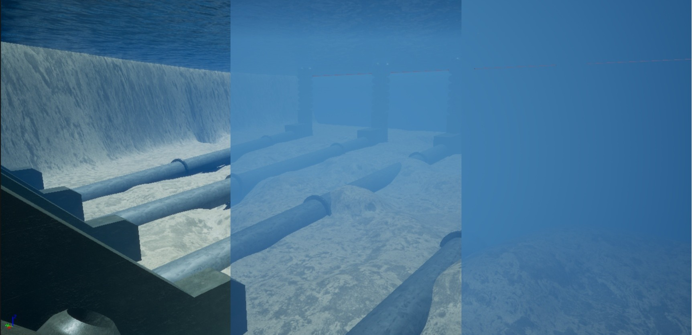

# 水体外观命令

HoloOcean 世界提供了一个水体颜色命令，您可以调用该命令来调整水体颜色，以满足您的各种需求。

## 水体颜色命令

您可以在模拟运行时使用水体颜色命令，以全 RGB 范围更改水体颜色。



以下是一些可以配置的水彩颜色示例：


<div class="div" style="text-align: center">
<i>颜色配置 = `(0.3, 0.75, 0.6)`</i></div>
<br>

<style>
.div {
    height: 10px;
    line-height: 1px;
}
</style>


<div class="div" style="text-align: center">
<i>颜色配置 = `(0.3, 0.4, 0.5)`</i></div>
<br>

<style>
.div {
    height: 10px;
    line-height: 1px;
}
</style>

## 通过编程方式

以下示例演示如何使用水色命令将水的颜色更改为红色、绿色或蓝色：
```python
with holoocean.make("...") as env:
      while True:
            if 'r' in pressed_keys:
                  env.water_color(1, 0, 0)
            if 'g' in pressed_keys:
                  env.water_color(0, 1, 0)
            if 'b' in pressed_keys:
                  env.water_color(0, 0, 1)
```
以下是设置上述两张图片中所示自定义颜色的另一个示例：
```python
with holoocean.make("...") as env:
      while True:
            if 'u' in pressed_keys:
                  env.water_color(0.3, 0.75, 0.6) # 第一张图片

            if 'i' in pressed_keys:
                  env.water_color(0.3, 0.4, 0.5) # 第二张图片
```

## 水雾控制指令

水雾控制指令通过调节雾的浓度、深度和颜色来控制水下能见度。


您可以配置以下参数：

* `fogDensity`：控制雾的整体厚度。范围：`0.0 – 10.0`

* `fogDepth`：雾效开始出现的距离摄像机的距离。范围：`0.0 – 10.0`（默认值 = 3.0）

* `color_R`：雾的红色通道。范围：`0.0 – 1.0`（默认值 = 0.4）

* `color_G`：雾的绿色通道。范围：`0.0 – 1.0`（默认值 = 0.6）

* `color_B`：雾的蓝色通道。范围：`0.0 – 1.0`（默认值 = 1.0）

## 通过编程方式

以下示例展示了如何使用水雾命令实现上图中间所示的可见度级别：

```python
with holoocean.make("...") as env:
      while True:
            env.water_fog(0.8) # 将雾浓度设置为 0.8
```

此外，您还可以修改雾的深度和颜色。

!!! 注意
    有关如何使用这些命令的更多信息，请参阅 API 文档：[WaterColorCommand](https://byu-holoocean.github.io/holoocean-docs/v2.3.0/holoocean/commands.html#holoocean.command.WaterColorCommand) 和 [WaterFogCommand](https://byu-holoocean.github.io/holoocean-docs/v2.3.0/holoocean/commands.html#holoocean.command.WaterFogCommand)。

