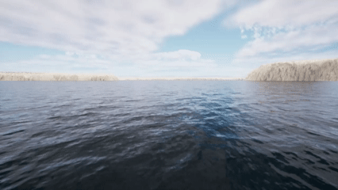

# FFT 水波控制器

HoloOcean 世界拥有可配置的 FFT 波设置，既可通过​​场景进行配置，也可通过命令实时配置。FFT 波会影响水面舰艇的浮力以及水下航行器在水面附近的运动。


<div class="div" style="text-align">
<i>码头港口地图显示海况等级为1级。</i></div>
<style>
.div {
    height: 20px;
    line-height: 1px;
}
</style>


<div class="div" style="text-align">
<i>码头港口地图显示海况等级为4级。</i></div>
<style>
.div {
    height: 20px;
    line-height: 1px;
}
</style>


<div class="div" style="text-align">
<i>码头港口地图显示海况等级为9级。</i></div>
<style>
.div {
    height: 20px;
    line-height: 1px;
}
</style>


## 配置 FFT 波

Holoocean 世界包含 FFT 波配置和命令。这允许您在运行模拟之前定义 FFT 波，或在模拟过程中进行更精确的更改。如果您希望在世界中使用 FFT 波，则必须包含 `fft_waves` 配置，否则它们将不会生成。

### 在场景中

要在配置文件中设置 FFT 波，您可以定义海况或定义各种波浪参数。

#### 海况配置：

此配置将 FFT 波引入世界，然后可以在模拟过程中使用命令对其进行修改。

```json
config = {
    "name": "waves",
    "world": "OpenWater",
    "main_agent": "sv0",
    "fft_waves": {"sea_state": 0},
}
```

#### 水波参数配置：
```json
config = {
    "fft_waves": {
        "sea_state": 2,
        "wind_directionality": [0.5, 0.5, 0.5, 0.5],
        "wind_tighten": [0.5, 0.5, 0.5, 0.5],
        "wind_direction": 180,
        "foam_threshold": 0.1,
        "wave_speed": 6,
        "boat_buoyancy": 0,
        "wave_force": 1.5,
        "max_influence_depth": 5
    },
}
```

除了这些参数之外，您还可以设置 `wind_speed` 参数。但是，同时设置 `wind_speed` 和 `sea_state` 参数是没有意义的，因为它们都会改变波浪的高度。

参数定义可在 [FFT Wave API](https://byu-holoocean.github.io/holoocean-docs/develop/holoocean/environments.html#fft-wave-api) 的 `fft_wave_scalars` 和 `fft_wave_cascades` 部分找到。

### 使用命令

```python
env.fftwaves.fft_sea_state(6)

fft_wave_scalers_config = {
    "WindSpeed": 4,
    "WaveSpeed": 3,
    "WindDirection": 180,
}
env.fftwaves.fft_wave_scalars(fft_wave_scalers_config)

fft_wave_cascades_config = {
    "WindDirectionality": [1, 1, 1, 1],
    "WindTighten": [0, 0, 0, 0]
}
env.fftwaves.fft_wave_cascades(fft_wave_cascades_config)
```

有一些基本的 FFT 波形命令。`env.fftwaves.sea_state` 仅用于设置海况，取值范围为 0 到 9。`env.fftwaves.wave_scalars` 允许您设置各种波形参数，每个参数只能接受一个值。`env.fftwaves.wave_cascades` 允许您设置具有 4 个值的波形参数，每个级联对应一个值。虽然您可以更改与 FFT 波形相关的每个参数，但最好更改配置中提供的参数，因为它们在保持真实性的同时，对波形的影响最大。您可以在此处查看每个命令对应的参数：[FFT 水波 API](https://byu-holoocean.github.io/holoocean-docs/develop/holoocean/environments.html#fft-wave-api)。

### 默认值

* 振幅：168000.0、64000.0、4000.0、240.0

* 风向性：1.0、1.0、1.0、1.0

* 波浪起伏度：1.5、1.5、1.5、1.5

* 贴片长度：10.0、28.0、432.0、2000.0

* 短波截止值：0.0001、0.002、2.0、30.0

* 长波截止值：1.0、0.25、0.125、0.04

* 风致密性：1.0、1.0、1.0、1.0

* 泡沫注入：1.0

* 泡沫阈值：-0.25

* 泡沫淡入淡出：0.1

* 泡沫模糊：2.0

* 风速：0.0

* 风向：0.0

* 重复周期：1000.0

* 粗糙度强度：0.5

* 粗糙度采样数：128

* 波速：9.8

* 船只浮力：1（启用）

* 波浪力：1

* 最大影响深度：10

* 生成新网格：0

### 海况值

海况是预设的风速值，近似于世界气象组织（WMO）海况代码。

* SS1: 2

* SS2: 4

* SS3: 6

* SS4: 8

* SS5: 10

* SS6: 13

* SS7: 16

* SS8: 20

* SS9: 30


## 不支持 FFT 波的世界

2.4.0 HoloOcean 更新之前的世界，或未实现 FFT 波的自定义世界，在模拟过程中将无法显示波浪图像。如果您未在配置中包含 FFT 波，则 HoloOcean 的使用体验不会受到影响。但是，如果您包含 FFT 波，则您的代理将感受到波浪浮力，但不会显示 FFT 波的视觉效果。如果您希望在世界中使用 FFT 波，则必须将世界更新到 2.4.0 或更高版本。

## 浮力配置

使用 FFT 波时，您可能仍然希望使用旧的浮力系统，以便水下代理能够看到大型 FFT 波和平静水面的视觉效果。这可以通过添加浮力配置来实现。如果没有此配置选项，浮力将默认使用与 FFT 波兼容的基于网格的系统。

```json
"fft_waves": {"sea_state": 4},
"buoyancy": 0,
```

* **边界框浮力 (`0`)**
    * 边界框浮力是 holoocean 最初使用的浮力系统。在不启用 FFT 波的情况下运行 holoocean 时，默认仍使用此系统，且无法更改。启用 FFT 波时，您可以选择启用此系统。由于此系统并非基于 FFT 波创建，因此在很大程度上不兼容，但在特定情况下仍可能有一些用途。

* **基于网格的浮力 (`1`)**
    * 当 holoocean 与 FFT 波一起使用时，默认使用基于网格的浮力系统。此浮力系统旨在与 FFT 波兼容，并且可以根据您的需要进行配置。

!!! 注意
    基于网格的浮力是一种估算值，可能无法反映真实世界的浮力相互作用。要更改此浮力对代理的影响，请在配置文件或使用命令更改“max_influence_depth”或“wave_force”参数的值。


## 为自定义关卡添加 FFT 波

FFT 波通过 CPU 和 GPU 的联合实现来实现。在虚幻引擎中，有一个位于内容目录 FFT_OceanWaterWave/Effects/FX_OceanWaves 下的 Niagara 系统。该系统以及 FFT_OceanWaterWaves 目录下的其他文件夹共同构成了 FFT 波的可视化效果，所有计算均在 GPU 上完成。要为自定义关卡添加 FFT 波，请按照此处的说明操作：[添加 FFT 波](https://byu-holoocean.github.io/holoocean-docs/develop/develop/env-docs/create-env.html#create-waves）。

更改 FFT 波参数的最佳方法是通过配置文件和命令。但是，如果您决定更改默认参数，则必须在世界的 FX_OceanWaves 文件夹和 C++ 文件 OceanFFTData.h 中进行更改。如果您决定在此文件中添加/删除任何变量，请务必在 OceanFFTCalculator.ispc 文件中同步更改，否则 Unreal 可能会崩溃。

## 添加自定义代理

启用 FFT 波后，将使用新的浮力系统。该系统采用基于网格的方法来计算代理所受的浮力。要添加新代理，请按照[开发代理：添加代理](../develop/agents.md)中的说明进行操作。

