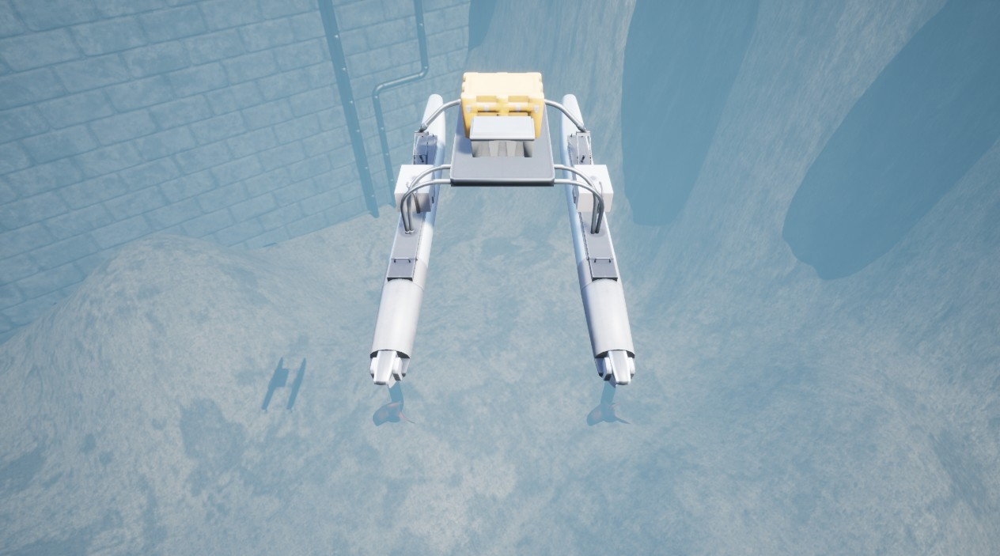

# PD 控制器 [pd_controllers.py](https://github.com/OpenHUTB/mujoco_plugin/blob/main/src/underwater/holo_ocean/pd_controllers.py)

部分内置智能体（如 [HoveringAUV](https://byu-holoocean.github.io/holoocean-docs/UE4.27_archival_develop/holoocean/agents.html#holoocean.agents.HoveringAUV) 和 [SurfaceVessel](https://byu-holoocean.github.io/holoocean-docs/UE4.27_archival_develop/holoocean/agents.html#holoocean.agents.SurfaceVessel)）集成了简单的 PD 控制器，以便在生成数据的过程中轻松进行导航。当选择 PD 控制方案时，传递给 HoloOcean 的控制指令即为目标导航状态。下图展示了**水面舰艇**（Surface Vessel）的一个应用示例：它在水面上依次导航至多个预设的航点。



```python
import holoocean
import numpy as np

config = {
    "name": "SurfaceNavigator",
    "world": "SimpleUnderwater",
    "package_name": "Ocean",
    "main_agent": "sv",
    "agents":[
        {
            "agent_name": "sv",
            "agent_type": "SurfaceVessel",
            "sensors": [
            {
                "sensor_type": "GPSSensor",
            }
            ],
            "control_scheme": 1, # PD 控制方案
            "location": [0,0,2],
            "rotation": [0, 0, 0]
        }
    ],
}

# 定义航点
idx = 0
locations = np.array([[25,25],
                    [-25,25],
                    [-25,-25],
                    [25,-25]])

# 开始模拟
with holoocean.make(scenario_cfg=config) as env:
    # 绘制航点
    for l in locations:
        env.draw_point([l[0], l[1], 0], lifetime=0)

    print("Going to waypoint ", idx)

    while True:
        # 将航点发送至 Holoocean
        state = env.step(locations[idx])

        # 检查我们是否已接近航点
        p = state["GPSSensor"][0:2]
        if np.linalg.norm(p-locations[idx]) < 1e-1:
            idx = (idx+1) % 4
            print("Going to waypoint ", idx)
```
