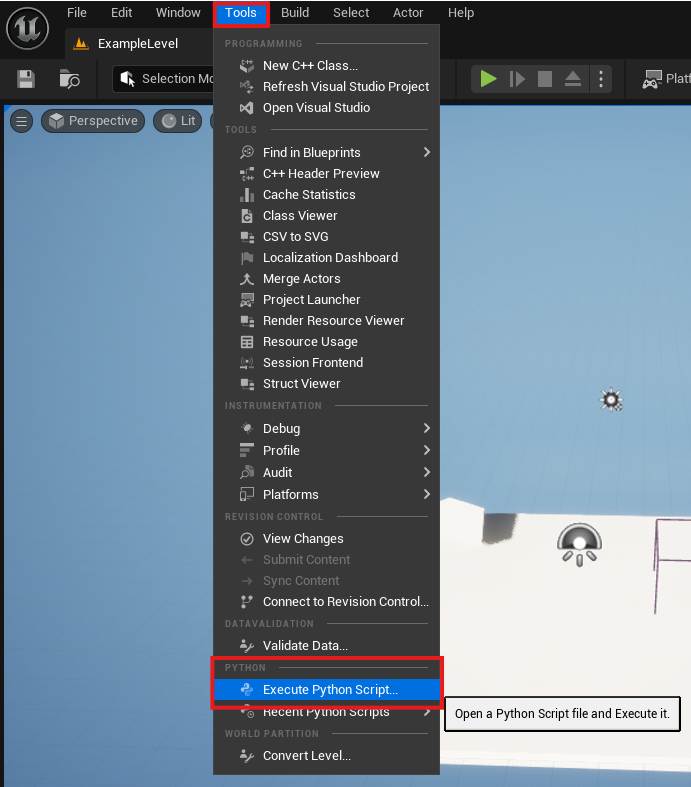
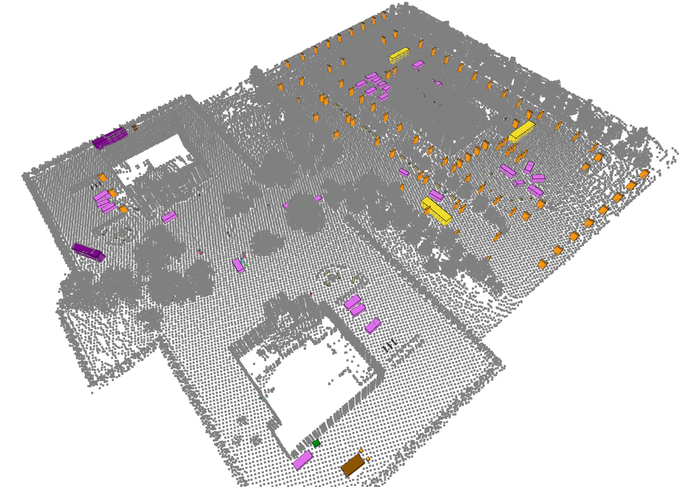

# 获取对象边界框

本示例演示如何根据对象的语义标签获取其边界框。由于需要在虚幻编辑器中运行 Python 脚本，因此此方法仅适用于自定义关卡。

首先，您需要配置虚幻编辑器以使用 Python。请参阅虚幻的 [Python 配置指南](https://openhutb.github.io/engine_doc/zh-CN/ProductionPipelines/ScriptingAndAutomation/Python/index.html)。

确保您的自定义关卡已设置语义标签。请参阅[添加自定义语义标签](../sensors/custom_semantics.md)部分。然后，您可以使用语义标签更新 `map_label2id`。

```json
import os
import csv
import unreal

def get_id(label):
    # 请在 map_label2id 中填写您世界地图的标签及其对应的数字
    map_label2id = {
        "None": 0,             # None         = 0u
        "Asphalt": 1,          # Asphalt      = 1u
        "Bench": 2,            # Bench        = 2u
        ...                    # 在此处添加更多标签
        "Any": 255             # Any          = 0xFF
    }
    return map_label2id.get(label, -1)  # 如果未找到标签，则返回 -1

if __name__ == '__main__':
    # 获取编辑器参与者子系统
    actor_subsystem = unreal.get_editor_subsystem(unreal.EditorActorSubsystem)

    # 获取当前关卡中的所有参与者
    actors = actor_subsystem.get_all_level_actors()

    # 调整保存 CSV 文件的路径
    csv_path = os.path.expanduser("/path/to/file.csv")

    # 如果您想要朝向边界框（能紧贴着物体旋转）而不是轴对齐边界框（必须平行于世界坐标系的坐标轴），请将值设置为 False
    getAxisAligned = True

    # 打开 CSV 文件进行写入
    with open(csv_path, mode="w", newline="") as csvfile:
        writer = csv.writer(csvfile)
        # 写入头
        # writer.writerow(["UniqueID", "ClassName", "ClassID", "OriginX", "OriginY", "OriginZ", "ExtentX", "ExtentY", "ExtentZ"])
        writer.writerow([
            "UniqueID", "ClassName", "ClassID",
            "OriginX", "OriginY", "OriginZ",
            "ExtentX", "ExtentY", "ExtentZ",
            "RotRoll_deg", "RotPitch_deg", "RotYaw_deg"
        ])
        unique_id_counter = 0
        for actor in actors:
            class_name = str(actor.get_folder_path())
            class_id = get_id(class_name)

            if getAxisAligned:
                ################################################
                ## 选项 1：返回轴对齐的边界框                   ##
                ################################################
                origin, extent = actor.get_actor_bounds(False)
                writer.writerow([
                    unique_id_counter,
                    class_name,
                    class_id,
                    origin.x, origin.y, origin.z,
                    extent.x, extent.y, extent.z
                ])
            else:
                ############################################
                ## 选项 2：返回朝向边界框                   ##
                ############################################
                origin, extent = actor.get_actor_bounds(False)
                rotation = actor.get_actor_rotation()  # 返回虚幻引擎旋转器：俯仰角、偏航角、横滚角
                writer.writerow([
                    unique_id_counter,
                    class_name,
                    class_id,
                    origin.x / 100, -origin.y / 100, origin.z / 100,
                    extent.x / 100, extent.y / 100, extent.z / 100,
                    rotation.roll, rotation.pitch, rotation.yaw,
                ])


            unique_id_counter += 1


    print(f"Saved actor bounds to {csv_path}")
```

要运行 Python 脚本，您可以转到“工具”>“执行 Python 脚本”。



以下是我们商务园区关卡边界框的示例。


