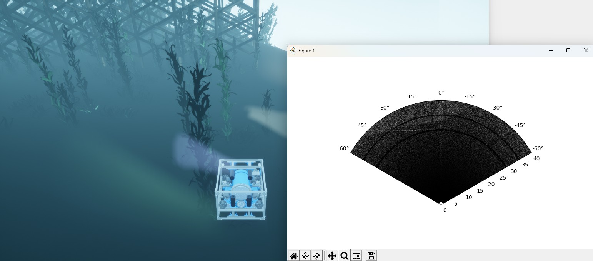

# 可视化成像声纳 [sonar_imaging.py](https://github.com/OpenHUTB/mujoco_plugin/blob/main/src/underwater/holo_ocean/sonar_imaging.py)

在仿真过程中，将声纳传感器的输出进行可视化通常很有帮助。本脚本即可实现这一功能，在每次接收到声纳数据时进行绘图。



!!! 注意
    运行此脚本期间会生成八叉树（octree，快速判断三维空间中的某个点是否在声纳的视场内），这可能会导致短暂的停顿，会在场景中出现红色提示：Premarking 797 Octrees, will take some time... 。有关解决方案及更多信息，请参阅[八叉树生成](../usage/octree.md)相关内容。


```python
import holoocean
import matplotlib.pyplot as plt
import numpy as np

#### 获取 Sonar 配置
scenario = "PierHarbor-HoveringImagingSonar"
config = holoocean.packagemanager.get_scenario(scenario)
config = config['agents'][0]['sensors'][-1]["configuration"]
azi = config['Azimuth']
minR = config['RangeMin']
maxR = config['RangeMax']
binsR = config['RangeBins']
binsA = config['AzimuthBins']

#### 准备好绘图
plt.ion()
fig, ax = plt.subplots(subplot_kw=dict(projection='polar'), figsize=(8,5))
ax.set_theta_zero_location("N")
ax.set_thetamin(-azi/2)
ax.set_thetamax(azi/2)

theta = np.linspace(-azi/2, azi/2, binsA)*np.pi/180
r = np.linspace(minR, maxR, binsR)
T, R = np.meshgrid(theta, r)
z = np.zeros_like(T)

plt.grid(False)
plot = ax.pcolormesh(T, R, z, cmap='gray', shading='auto', vmin=0, vmax=1)
plt.tight_layout()
fig.canvas.draw()
fig.canvas.flush_events()

#### 运行模拟
command = np.array([0,0,0,0,-20,-20,-20,-20])
with holoocean.make(scenario) as env:
    for i in range(1000):
        env.act("auv0", command)
        state = env.tick()

        if 'ImagingSonar' in state:
            s = state['ImagingSonar']
            plot.set_array(s.ravel())

            fig.canvas.draw()
            fig.canvas.flush_events()

print("Finished Simulation!")
plt.ioff()
plt.show()
```
