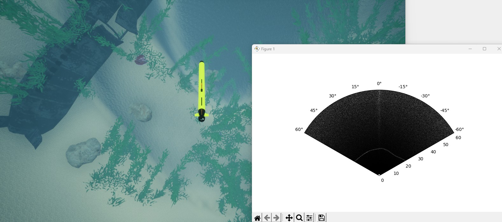

# 可视化声纳数据剖面 [sonar_profiling.py](https://github.com/OpenHUTB/mujoco_plugin/blob/main/src/underwater/holo_ocean/sonar_profiling.py)

在仿真过程中，将声纳传感器的输出数据可视化往往很有帮助。本脚本即可实现这一功能，在每次接收到声纳数据时进行绘图。



请注意，运行此脚本期间会生成八叉树（octree），这可能会导致程序出现短暂的停顿。有关应对方法及更多信息，请参阅[八叉树生成](https://byu-holoocean.github.io/holoocean-docs/UE4.27_archival_develop/usage/octree.html#octree)相关内容。

```python
import holoocean
import matplotlib.pyplot as plt
import numpy as np

#### 获取声呐（接纳回响）配置
scenario = "OpenWater-TorpedoProfilingSonar"
config = holoocean.packagemanager.get_scenario(scenario)
config = config['agents'][0]['sensors'][-1]["configuration"]
azi = config['Azimuth']
minR = config['RangeMin']
maxR = config['RangeMax']
binsR = config['RangeBins']
binsA = config['AzimuthBins']

#### 准备好绘图
plt.ion()
fig, ax = plt.subplots(subplot_kw=dict(projection='polar'), figsize=(8,5))
ax.set_theta_zero_location("N")
ax.set_thetamin(-azi/2)
ax.set_thetamax(azi/2)

theta = np.linspace(-azi/2, azi/2, binsA)*np.pi/180
r = np.linspace(minR, maxR, binsR)
T, R = np.meshgrid(theta, r)
z = np.zeros_like(T)

plt.grid(False)
plot = ax.pcolormesh(T, R, z, cmap='gray', shading='auto', vmin=0, vmax=1)
plt.tight_layout()
fig.canvas.flush_events()

#### 运行模拟
command = np.array([0,0,0,0,20])
with holoocean.make(scenario) as env:
    for i in range(1000):
        env.act("auv0", command)
        state = env.tick()

        if 'ProfilingSonar' in state:
            s = state['ProfilingSonar']
            plot.set_array(s.ravel())

            fig.canvas.draw()
            fig.canvas.flush_events()

print("Finished Simulation!")
plt.ioff()
plt.show()
```
