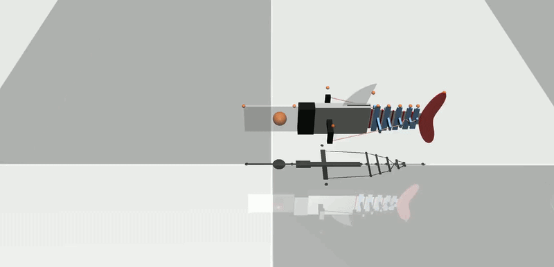
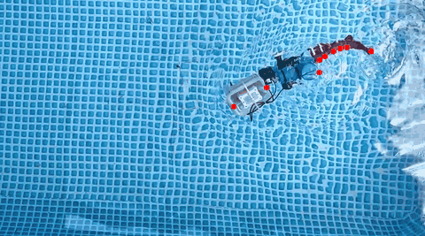
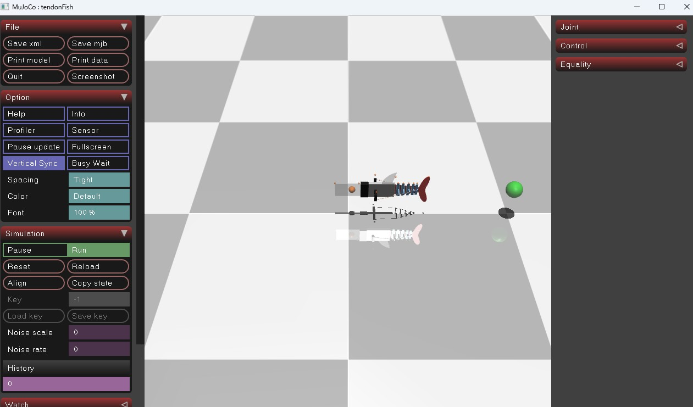

# Mujoco 中的鱼形机器人

本文提出了一种肌腱驱动的鱼形机器人，该机器人采用简化的无状态流体动力学模型，并在广泛应用的机器人框架 MuJoCo 中实现，模拟高效的水下游泳环境。
仅使用两条真实世界的游泳轨迹，我们就确定了五个流体参数，这些参数能够匹配实验行为并推广到一系列驱动频率。
我们证明，这种无状态流体模型可以推广到未见过的驱动情况，并且优于经典的解析模型，例如细长体理论。
该仿真环境的运行速度超过实时速度，并且可以轻松地支持下游学习算法，例如用于目标跟踪的强化学习，其成功率高达 93%。由于该模型简单易用，且我们采用开源仿真环境，我们的结果表明，即使是简单的无状态模型——当与物理数据仔细匹配时——也可以作为软体水下机器人的有效数字孪生体，为水生环境中的可扩展学习和控制开辟新的方向。


| 鱼形机器人仿真 | 标记叠加的真实视频 |
|:---:|:---:|
|  |  | 

## 运行

```shell
# 该代码库包含几何体生成、标记跟踪、系统识别和强化学习脚本
git clone https://github.com/donghaiwang/fishsim.git
cd fishsim
conda env create -f environment.yml

# 示例工作流
python run_sim.py
python opt_sysid.py --optType act -f f1_00 f1_75
python test_freq.py
python train_rl.py
```


MuJoCo 用于生成肌腱驱动鱼形机器人场景的 XML 文件可以在 Geometry 中找到（或者运行[generate_fish.py](https://github.com/donghaiwang/fishsim/blob/main/generate_fish.py)）。

```python
from Geometry.auto_tendonFish import generate_xml, SYSTEMPARAMETERS

SYSTEMPARAMETERS["fluidCoef"] = [0.4, 7.79, 2.81, 3.84, 0.27]
generate_xml(SYSTEMPARAMETERS, "Geometry/exampleFish.xml")
```


## 视频标记跟踪

我们提供 OpenCV 代码，用于从视频中提取标记位置，并将其导出到 CSV 文件，以便后续定义仿真到实际的度量标准。该脚本名为 [track_bbox.py](https://github.com/donghaiwang/fishsim/blob/main/track_bbox.py)，使用 CSRT 算法跟踪用户选择的边界框随时间的变化。脚本会指定起始帧和结束帧，以及要跟踪的标记数量。以下命令加载视频 Videos/f1_75.mp4，允许用户从第 0 帧选择 9 个标记边界框，并从第 0 帧跟踪到第 300 帧：
```shell
python track_bbox.py -f Data/f1_75.mp4 -n 9 -s 0 -e 300
```

## 数据

我们在 Data/ 文件夹中提供了已追踪的标记点，但用户也可以下载原始视频并从头开始追踪这些标记点。视频位于：[Google 云端](https://drive.google.com/drive/folders/1bM4Kjv0C_C5ZQyzxJUkwOnjJE2mTtik9)。`f1_25.mp4` 表示鱼以 1.25Hz 的恒定电机角速度游动。

## 仿真环境

我们提供了一个简单的函数，用于运行给定系统参数的仿真，并收集包含指标的日志。该函数位于 [_simulate.py](https://github.com/donghaiwang/fishsim/blob/main/_simulate.py) 文件中（此外还包含各种控制信号），您可以通过以下方式调用一个简单的鱼形机器人仿真示例：
```python
from _simulate import sim_fish

log = sim_fish(systemParameters, SineSignal(frequency=freq), SIMTIME, VIDEOFPS)
```

或者，如果需要渲染，可以调用 run_sim.py 来保存输出视频以及使用给定系统参数绘制的图表。

## 系统辨识

利用上述收集到的数据，我们可以优化仿真驱动和流体参数，使其与实验指标相匹配。我们可以运行以下脚本：
```shell
python opt_sysid.py --optType act -f f1_00 f1_75
```

上述命令将运行驱动优化，以找到与 [Data/Markers/rotatedMarkers_f1_00.csv](https://github.com/donghaiwang/fishsim/blob/main/Data/Markers/rotatedMarkers_f1_00.csv) 和 [Data/Markers/rotatedMarkers_f1_75.csv](https://github.com/donghaiwang/fishsim/blob/main/Data/Markers/rotatedMarkers_f1_75.csv) 中的标记相匹配的最佳频率和时间偏移。输出结果将是 Outputs/ 目录中模拟的最佳标记轨迹与真实标记轨迹的对比，优化结果将存储在 [Data/](https://github.com/donghaiwang/fishsim/tree/main/Data)Optimization/act_<file>.yml 文件中。

驱动优化运行完毕后，还可以运行流体系数优化。只需将 optType 更改为 fluid 即可。现在，将基于给定的旋转标记数据集优化 5 个流体参数，并存储与驱动优化类似的输出结果。

基线也在此 SysId Python 文件中实现，其中 --optType ebt 选项会将 EBT 参数拟合到给定的任何标记文件。输出结果将存储在 [Data/](https://github.com/donghaiwang/fishsim/tree/main/Data)Optimization 目录中的 .yml 文件中，其中包含参数。

## 评估

我们可以评估优化后的流体参数以及优化后的驱动装置在更宽频率范围内对向前游泳巡航速度的影响。
```python
python test_freq.py
```

这里所有频率都将使用 [Data/](https://github.com/donghaiwang/fishsim/tree/main/Data)Optimization/fluid.yml中优化的流体系数和同一文件夹中的驱动参数进行仿真。EBT基线也将运行，所有方法与实际数据的比较结果将绘制在 [Outputs/](https://github.com/donghaiwang/fishsim/tree/main/Outputs) 中。

## 强化学习

现在，训练强化学习智能体的流程已准备就绪。我们将奖励定义为目标跟踪奖励，并将目标位置随机化。可以通过运行以下命令来训练该智能体。
```shell
python train_rl.py
```

用户可以定义各种参数，例如网络架构。我们使用 [opt_hyperRL.py](https://github.com/donghaiwang/fishsim/blob/main/opt_hyperRL.py) 运行超参数扫描，通过权重和偏置来找到目标跟踪机器人鱼的最佳学习设置。

我们使用 [test_RLtraj.py](https://github.com/donghaiwang/fishsim/blob/main/test_RLtraj.py) 对各种跟踪目标（例如圆形轨迹）进行评估。

## 水族馆

运行
```shell
python run_passive_aquarium.py
```


## 参考

* [fishsim](https://github.com/donghaiwang/fishsim)

