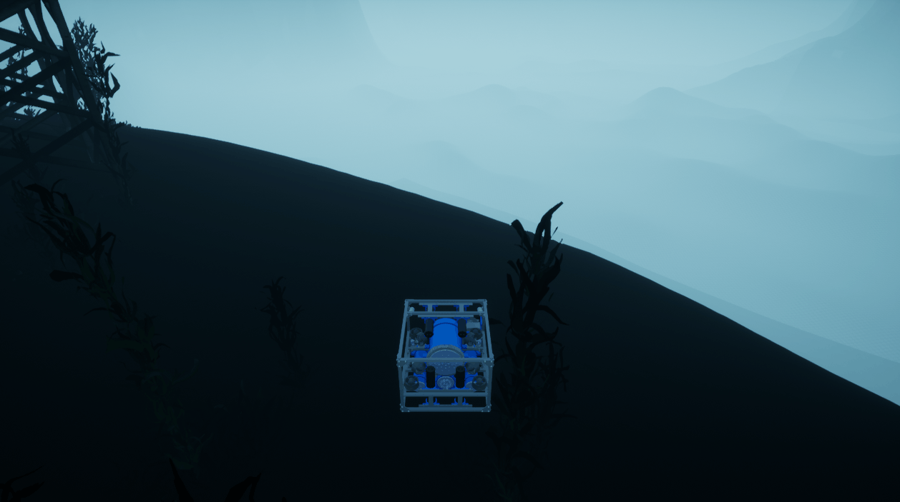

# 入门与示例

首先，请参阅安装以安装 holocean 包和 Ocean。

HoloOcean的最小使用示例（[getting_started.py](https://github.com/OpenHUTB/mujoco_plugin/blob/main/src/underwater/holo_ocean/getting_started.py)）如下：

```python
import holoocean
import numpy as np

env = holoocean.make("PierHarbor-Hovering")

# 悬停的AUV对每个推进器发出指令
command = np.array([10,10,10,10,0,0,0,0])

for _ in range(180):
   state = env.step(command)
```


请注意：

1. 您将场景的名称传递给 holoocean.make

   请参阅可用的所有不同世界和场景的软件包。

2. HoloOcean 的界面旨在让 OpenAI Gym 熟悉

您可以使用状态字典访问特定传感器的数据：

```python
dvl = state["DVLSensor"]
```

**就是这样！**HoloOcean的使用相当简单。

查看可用的不同[世界](./packages/packages.md#all_packages)，阅读[API文档](https://byu-holoocean.github.io/holoocean-docs/UE4.27_archival_develop/holoocean/index.html#holoocean-api-index)，或者开始制作自己的自定义[场景](./usage/scenarios.md#scenarios)。


下面是一些片段，展示了如何使用HoloOcean的不同方面。

## 内容

* [可视化 RGB 相机输出](./example/camera.md)

* [手动控制](./example/controller.md)

* [手动定义动力学](./example/custom_dynamics.md)

* [自定义场景配置](./example/custom_scenarios.md)

* [多智能体示例](./example/multi_agent.md)

* [多智能体通信](./example/multi_coms.md)

* [PD 控制器](./example/pd_controllers.md)

* [可视化成像声纳](./example/sonar_imaging.md)

* [可视化声纳数据剖面](./example/sonar_profiling.md)

* [侧扫声纳可视化](./example/sonar_sidescan.md)

仓库的根目录下还有一个 [examples.py](https://github.com/OpenHUTB/Underwater/blob/master/client/example.py) 文件，其中包含更多示例代码。

