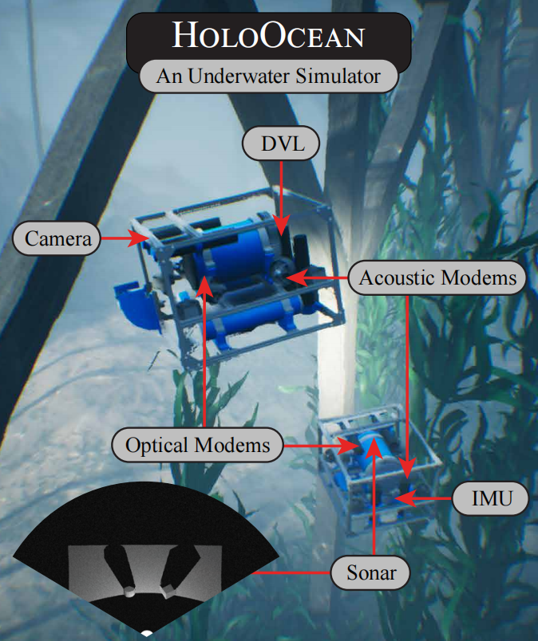
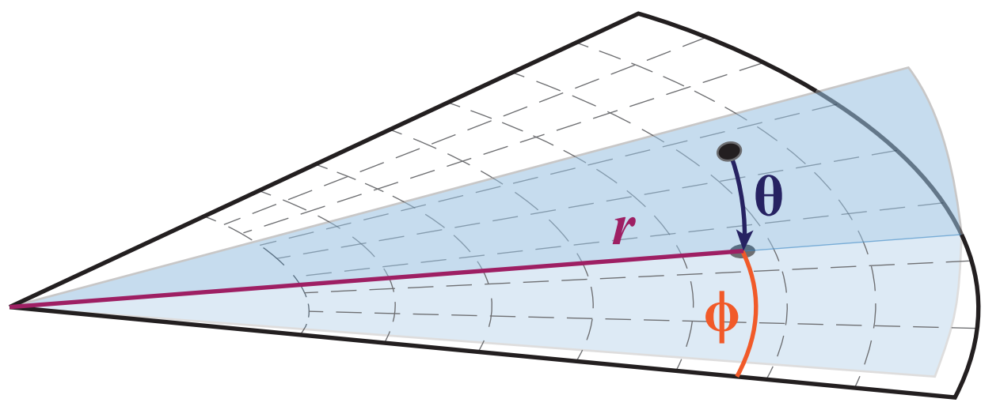

# HoloOcean：水下机器人模拟器

## 摘要

由于水下实地试验的困难和高昂成本，对于测试和开发算法来说，高保真水下模拟器是必不可少的。为满足这一需求，我们提出了 HoloOcean，一款基于虚幻引擎 4（UE4）构建的开源水下模拟器。HoloOcean 配备了多代理支持、各种常见水下传感器的实现以及模拟通信支持。我们还实现了一种新型声呐传感器模型，该模型利用环境的八叉树表示来高效且真实地生成声呐图像。由于基于 UE4 构建，新增环境非常容易，从而便于拓展功能的开发。最后，HoloOcean 通过一个简单的 Python 接口进行控制，可通过 pip 简便安装，并且只需少量代码即可执行模拟。

<i>HoloOcean 是一个开源的水下模拟器，基于虚幻引擎 4 构建。</i>

<i>它配备了各种常见的水下传感器，如 DVL、IMU、光学和声学调制解调器，以及成像声呐。</i>

## 一、引言

一个用于自主水下航行器（Autonomous Underwater Vehicles, AUV）的有效仿真环境可以加速算法和应用的开发。这对于所有机器人系统都是适用的，但对于AUV尤其必要，因为实地测试成本高且风险大。

现代自动水下航行器（AUV）有许多应用，可以显著提升科学知识、生活质量和安全性。这些应用包括对海洋基础设施如大坝、船体和通信线路的检查，以及对海洋的探索，这可能带来地质学、海洋生物学和医学领域的发现。然而，所有这些应用都需要复杂的算法设计和测试，如果没有先在虚拟环境中进行开发，这将是昂贵且极具挑战性的。

我们介绍 HoloOcean，一款开源的水下模拟器。它构建于强化学习模拟器 Holodeck [@HolodeckPCCL] 及 Unreal Engine 4 (UE4) [@unreal_engine] 的功能基础之上。UE4 特别提供了精确的模拟动力学、高保真图像、成熟的环境构建编辑器，以及用于添加自定义传感器、代理等的 C 接口。具体来说，HoloOcean 拥有以下特性：

* 一个简单的 Python 接口，允许快速安装和轻松使用。 

* 易于添加新环境。UE4 是一个文档完善的游戏开发引擎，已经制作了许多海洋和水下资产。 

* 一个新颖且高效的成像声纳实现，基于八叉树结构，能够生成逼真的声纳图像。

* 完全支持多代理任务，包括实现的声学和光学调制解调器传感器，以进行逼真的协作模拟。

本文的组织结构如下。第二部分回顾了当前的水下机器人模拟器和声纳传感器模型。在第三部分，我们描述了我们新颖的声纳成像算法，随后在第四部分中，我们回顾了其他各种常见水下传感器的实现和测量模型，如多普勒速度计（DVL）、惯性测量单元（IMU）、GPS、相机和深度传感器。第五部分描述了多代理任务以及通过光学和声学调制解调器的通信。第六部分介绍了任务的自定义以及简单的 Python 接口。第七部分展示了在 UE4 中制作的各种环境，第八部分总结了本文并提出了未来工作。

## 二、相关工作
创建一个逼真的水下模拟器需要许多功能才能对算法开发有用，包括但不限于多代理支持；逼真的传感器模拟；准确的水下动力学；易于使用；与现有系统的集成；以及最好是开源的 [@Cook2014]。另一个要求是没有过重的依赖。像机器人操作系统（ROS）[@Quigley2009]这样的重依赖可能会使安装和使用变得繁琐，尤其当模拟器只是用于数据生成时。这些功能的各种尝试列在表 I 中，但据我们所知，目前还没有哪一个能满足所有这些标准。

| 模拟器  | 多代理 | 通讯 | 声呐 | 开源 | 依赖少 | 维护 | 简单任务设置 |
|-------|--------|--------|--------|--------|--------|--------|--------|
| HoloOcean     | √  | √  | √  | √  | √  | √  | √  |
| UUV 模拟器     | √  | ×  | *  | √  | ×  | *  | √  |
| UWSim     | √  | ×  | *  | √  | ×  | ×  | √  |
| MarineSim     | √  | ×  | ×  | ×  | ×  | ×  | *  |

表 I：常见水下模拟器的比较。✓ 表示模拟器具有该功能，∗ 表示该功能实现有限或未知，× 表示没有该功能。还有许多其他常见的机器人模拟器没有列在这里，但大多数都不支持水下机器人。

UUV 模拟器[@Manhaes2016]是比较成熟的选项之一，它基于流行的开源机器人模拟器 Gazebo[@N_2004]构建。它对静水和流体动力学效应建模准确，支持多智能体，有初步的声纳实现[@Cerqueira2017]，而且配置起来很方便。不过，它需要安装 ROS，缺少多智能体通信，而且看起来没有在积极维护。

## 三、成像声纳

成像声纳是一种常见的水下传感器，用于生成环境的图像。这些图像可以用于定位、制图、可视化或各种其他算法。在本节中，我们讲解成像声纳的工作原理，并展示我们生成逼真图像的算法，概述如图 [2](#fig_3) 所示。

 

<i>成像声呐的几何结构。图中显示了单束波以及单个点的仰角 θ、方位角 ϕ 和距离 r。</i>

<i>当物体被投影到方位-距离平面并相应地分箱后，所有的仰角数据 θ 都会丢失。</i>

### 3.1 操作

&emsp;&emsp;多波束成像声呐传感器使用声波来捕捉周围环境的图像。它会发出声波，当遇到物体时，部分声波会反射回声呐，在那里记录强度，并使用波束形成技术来确定回波的方向。这个强度取决于它遇到的表面法向量以及声波的法向量。这是因为与波束对齐的表面比垂直的表面反射更多的能量。同时还会测量从发射到接收声波的时间，根据这个时间并利用水下声速可以计算出距离 \(r\)。

