# HoloOcean：水下机器人模拟器

## 摘要

由于水下实地试验的困难和高昂成本，对于测试和开发算法来说，高保真水下模拟器是必不可少的。为满足这一需求，我们提出了 HoloOcean，一款基于虚幻引擎 4（UE4）构建的开源水下模拟器。HoloOcean 配备了多代理支持、各种常见水下传感器的实现以及模拟通信支持。我们还实现了一种新型声呐传感器模型，该模型利用环境的八叉树表示来高效且真实地生成声呐图像。由于基于 UE4 构建，新增环境非常容易，从而便于拓展功能的开发。最后，HoloOcean 通过一个简单的 Python 接口进行控制，可通过 pip 简便安装，并且只需少量代码即可执行模拟。


<div class="div" style="text-align: center">
<i>HoloOcean 是一个开源的水下模拟器，基于虚幻引擎 4 构建。</i></div>
<div class="div" style="text-align: center">
<i>它配备了各种常见的水下传感器，如 DVL、IMU、光学和声学调制解调器，以及成像声呐。</i></div>
<style>
.div {
    height: 20px;
    line-height: 1px;
}
</style>


## 1. 引言

一个用于自主水下航行器（Autonomous Underwater Vehicles, AUV）的有效仿真环境可以加速算法和应用的开发。这对于所有机器人系统都是适用的，但对于AUV尤其必要，因为实地测试成本高且风险大。


现代自动水下航行器（AUV）有许多应用，可以显著提升科学知识、生活质量和安全性。这些应用包括对海洋基础设施如大坝、船体和通信线路的检查，以及对海洋的探索，这可能带来地质学、海洋生物学和医学领域的发现。然而，所有这些应用都需要复杂的算法设计和测试，如果没有先在虚拟环境中进行开发，这将是昂贵且极具挑战性的。


我们介绍 HoloOcean，一款开源的水下模拟器。它构建于强化学习模拟器 Holodeck [@HolodeckPCCL] 及 Unreal Engine 4 (UE4) [@unreal_engine] 的功能基础之上。UE4 特别提供了精确的模拟动力学、高保真图像、成熟的环境构建编辑器，以及用于添加自定义传感器、代理等的 C 接口。具体来说，HoloOcean 拥有以下特性：

* 一个简单的 Python 接口，允许快速安装和轻松使用。 

* 易于添加新环境。UE4 是一个文档完善的游戏开发引擎，已经制作了许多海洋和水下资产。 

* 一个新颖且高效的成像声纳实现，基于八叉树结构，能够生成逼真的声纳图像。

* 完全支持多代理任务，包括实现的声学和光学调制解调器传感器，以进行逼真的协作模拟。

本文的组织结构如下。第二部分回顾了当前的水下机器人模拟器和声纳传感器模型。在第三部分，我们描述了我们新颖的声纳成像算法，随后在第四部分中，我们回顾了其他各种常见水下传感器的实现和测量模型，如多普勒速度计（DVL）、惯性测量单元（IMU）、GPS、相机和深度传感器。第五部分描述了多代理任务以及通过光学和声学调制解调器的通信。第六部分介绍了任务的自定义以及简单的 Python 接口。第七部分展示了在 UE4 中制作的各种环境，第八部分总结了本文并提出了未来工作。

## 2. 相关工作
创建一个逼真的水下模拟器需要许多功能才能对算法开发有用，包括但不限于多代理支持；逼真的传感器模拟；准确的水下动力学；易于使用；与现有系统的集成；以及最好是开源的 [@Cook2014]。另一个要求是没有过重的依赖。像机器人操作系统（ROS）[@Quigley2009]这样的重依赖可能会使安装和使用变得繁琐，尤其当模拟器只是用于数据生成时。这些功能的各种尝试列在表 I 中，但据我们所知，目前还没有哪一个能满足所有这些标准。

| 模拟器  | 多代理 | 通讯 | 声呐 | 开源 | 依赖少 | 维护 | 简单任务设置 |
|-------|--------|--------|--------|--------|--------|--------|--------|
| HoloOcean     | √  | √  | √  | √  | √  | √  | √  |
| UUV 模拟器     | √  | ×  | *  | √  | ×  | *  | √  |
| UWSim     | √  | ×  | *  | √  | ×  | ×  | √  |
| MarineSim     | √  | ×  | ×  | ×  | ×  | ×  | *  |

表 I：常见水下模拟器的比较。✓ 表示模拟器具有该功能，∗ 表示该功能实现有限或未知，× 表示没有该功能。还有许多其他常见的机器人模拟器没有列在这里，但大多数都不支持水下机器人。


UUV 模拟器[@Manhaes2016]是比较成熟的选项之一，它基于流行的开源机器人模拟器 Gazebo[@N_2004]构建。它对静水和流体动力学效应建模准确，支持多代理，有初步的声纳实现[@Cerqueira2017]，而且配置起来很方便。不过，它需要安装 ROS，缺少多代理通信，而且看起来没有在积极维护。

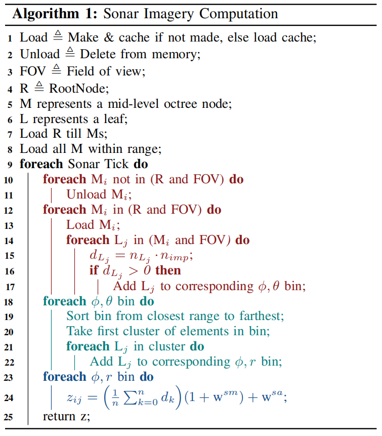 <span id='fig_2'></span>
<div class="div" style="text-align: center">
<i>以上是声呐成像算法的伪代码。第 10-17 行对应于递归搜索八叉树以查找视野中的叶子，</i></div>
<div class="div" style="text-align: center">
<i>第 18-22 行对应于移除可能位于阴影中的叶子，第 23-24 行对应于图像的最终计算。</i></div>
<style>
.div {
    height: 20px;
    line-height: 1px;
}
</style>

## 3. 成像声纳

成像声纳是一种常见的水下传感器，用于生成环境的图像。这些图像可以用于定位、制图、可视化或各种其他算法。在本节中，我们讲解成像声纳的工作原理，并展示我们生成逼真图像的算法，概述如图 [3](#fig_3) 所示。

 <span id='fig_3'></span>
<div class="div" style="text-align: center">
<i>成像声呐的几何结构。图中显示了单束波以及单个点的俯仰角 θ、方位角 ϕ 和距离 r。</i></div>
<div class="div" style="text-align: center">
<i>当物体被投影到方位-距离平面并相应地分箱后，所有的仰角数据 θ 都会丢失。</i></div>
<style>
.div {
    height: 20px;
    line-height: 1px;
}
</style>

!!! 笔记
    同一时刻发出的声波，会像一把扇子一样，同时照亮水面下几米到几十米深度范围内的所有物体。既然发射时就把所有仰角“打包”在了一起，接收时自然无法区分反射信号来自哪个具体仰角。

### 3.1 操作

&emsp;&emsp;多波束成像声呐传感器使用声波来捕捉周围环境的图像。它会发出声波，当遇到物体时，部分声波会反射回声呐，在那里记录强度，并使用波束形成技术来确定回波的方向。这个强度取决于它遇到的表面法向量以及声波的法向量。这是因为与波束对齐的表面比垂直的表面反射更多的能量。同时还会测量从发射到接收声波的时间，根据这个时间并利用水下声速可以计算出距离 \(r\)。


在给定的水平方向上，声呐的读数会形成一个波束。每个波束都有一个**水平角度**，称为方位角 ϕ，以及一个**垂直**宽度，称为俯仰角 θ，如图 [3](#fig_3) 所示。


每一束声波都会对应生成二维图像中的一列，而每一行则对应一个距离间隔，其结果数量由回波强度决定。通过这种方式，声纳将三维空间投影到二维图像上，高度则是丢失的维度。


### 3.2 投影模型

为了模拟声呐图像，我们使用八叉树实现对环境进行离散化。八叉树的每个叶节点都存储了点的位置和表面法线。这种八叉树方法允许我们将点投影到声呐图像上，而无需使用计算量巨大的光线追踪或依赖深度相机的方形视场。生成八叉树时，只有当节点仅部分被占据时才会添加节点。这避免了存储自由空间区域以及物体内部区域的需求。


为了找到视野范围内的八叉树叶节点，我们首先递归搜索根八叉树，找到视野范围内的所有中间层节点。需要注意的是，为了在运行过程中能够成像其他代理，我们为每个代理构建了一个小型八叉树，并在每个时间步后进行更新。然后，我们并行地递归搜索每个代理的八叉树以及之前找到的所有中间层节点，以找到视野范围内的所有叶节点。


找到叶节点后，计算每片叶片的表面单位法线 \(n_s\) 和冲击单位法线 \(n_i\) 之间的点积 \(d\)。由此可得两法线之间的夹角 \( \psi \) 的余弦值，如下所示：

$$
d \triangleq n_s \dot n_i
    = cos( \psi ) > 0
    \Rightarrow | \psi | < \frac{\pi}{2}
$$

如果角度大于 \( \frac{\pi}{2} \)，则意味着叶片必定位于物体的背面，因此不予保留。所以，我们保留所有点积大于 0 的叶节点。


### 3.3 阴影

找到物体正面所有叶节点后，我们需要移除位于阴影中的叶节点。为此，我们首先将每片叶片放入其对应的 \(\phi\)、\( \theta \) 坐标区间。我们发现，0.03° 的仰角区间大小能获得最佳效果。


同时，每个箱子都按范围升序排序。我们保留每个箱子的第一个簇。具体做法是遍历排序后的箱子，检查两个相邻元素的范围值之差是否小于预定义的 ϵ。一旦发现大于 ϵ 的间隙，则将其之后的所有内容都移除，因为它们属于阴影区域。


虽然存在更精确的阴影算法，但计算成本很高。本文提出的算法在精度和效率之间取得了良好的平衡。


然后将得到的叶节点按其对应的 \( \psi \), \( r \) 区间进行排序。接下来进行以下计算，以确定第 \(i\) 个和第 \( j \) 个区间的像素值 \( z_{ij} \)。

$$
z_{ij} = (\frac{1}{n} \sum_{n}^{k=0} d_k)
    (1 + w^{sm})
    + w^{sa}
$$

$$
w_{sm} \sim N(0, \sigma^{sm}),
    w^{sa} \sim R(\sigma^{sa})
$$

其中 \(d_k\) 已在公式 (1) 中计算得出，\( w^{sa} \) 和 \( w^{sm} \) 分别表示加性噪声和乘性噪声，\( R \) 为瑞利分布。所有这些步骤总结在图 [2](#fig_2) 中。


### 3.4 效率与内存

遗憾的是，由于我们很多环境的大小都是 2km×2km，一次性生成完整的八叉树表示需要耗费大量时间，而且将其全部存储在内存中也不可行。为了解决这个问题，我们实时生成、缓存和加载八叉树的叶子节点，具体方法如下。


启动时，系统会创建并缓存根八叉树到中间层节点，或者从文件中加载。然后，对于载具某个最大半径范围内尚未缓存的每个中间层节点，系统都会创建并保存到文件中。


在递归搜索过程中，当找到一个中层节点时，我们会检查它是否已被加载；如果没有，则从缓存中加载，或者创建并缓存该节点。所有不在搜索范围内的中层节点都会从内存中删除。


我们发现，从缓存（一个包含 JSON 文件的目录）加载数据速度很快，并且对性能的影响可以忽略不计，因为每次迭代视野中新增的中层节点数量通常很少。此外，缓存数据在模拟之间是持久的，因此可以重复用于每个新任务。这种方法还避免了在首次启动时生成完整的 2km×2km 八叉树表示，而只是生成可能用到的叶子节点。


如图 [4](#fig_4) 所示，该过程可生成逼真的声呐图像。在中层节点大小为 5.12 米、最小叶片大小为 2 厘米、最大距离为 50 米的情况下，我们可以每秒采样 2 幅声呐图像；在中层节点大小为 2.56 米、最小叶片大小为 1 厘米、距离为 10 米的情况下，我们可以每秒采样约 14 幅图像。

|  |  |
|:---:|:---:|
| 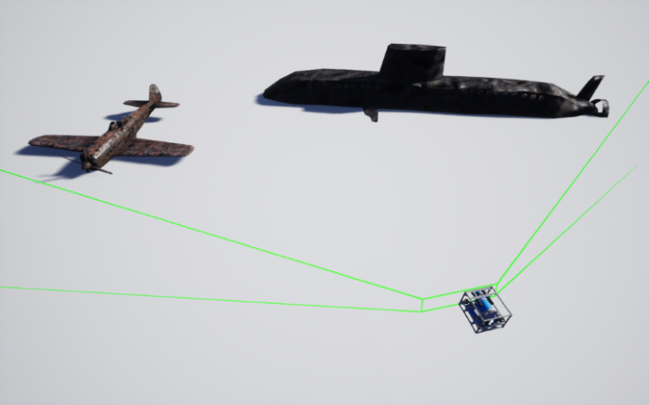 | 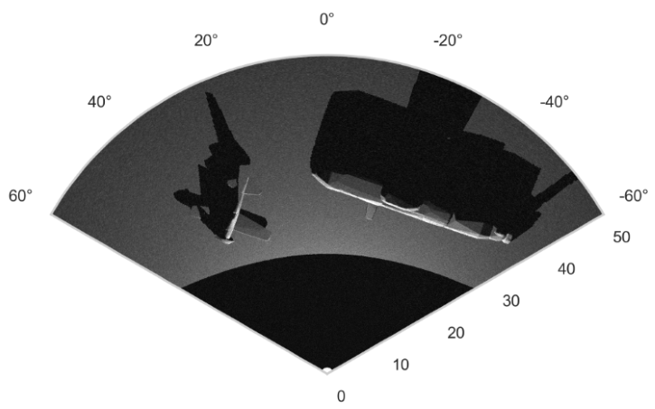 |  <span id='fig_4'></span>
<div class="div" style="text-align: center">
<i>成像声呐模拟示例。（a）显示了环境，绿色光线表示声呐视场的近似范围。</i></div>
<div class="div" style="text-align: center">
<i>可见范围由方位角 120°、仰角 20° 和 1 至 50 米的距离给出。采用 2 厘米分辨率的八叉树</i></div>
<div class="div" style="text-align: center">
<i>（b）显示了生成的声呐图像，其中包含少量乘性噪声和加性噪声。</i></div>
<div class="div" style="text-align: center">
<i>该图像包含 512 个方位波束和 1024 个距离单元。</i></div>
<style>
.div {
    height: 20px;
    line-height: 1px;
}
</style>


## 4. 传感器模块

HoloOcean 内置了多种用于水下机器人的传感器。这些传感器的设计充分考虑了实际应用场景，因此提供了丰富的配置选项和噪声模型。需要注意的是，所有传感器都配置了各自的传感器坐标系，相对于机器人坐标系定义为 \( R_s^r \), \( t^r_s\)。这些坐标系在世界坐标系 \( R_s^w \), \( t^w_s\) 中表示如下：


如图 [6](#fig_6) 所示，每个传感器都有多种配置，这些配置可以通过一个简单的 JSON 文件进行设置。这些配置包括 \( R_s^r \)、\( t^r_s\)、采样率（单位为 Hz）、噪声模型的协方差、如图 [5](#fig_5) 所示的可视化工具以及其他各种传感器特定的配置。此外，如果需要，还包含一个轻量级通信和编组 (Lightweight Communications and Marshalling, LCM) [@huang2010lcm] 封装器，以便与实际代码进行交互。在 HoloOcean 2 中开始支持 [ROS 封装器](./develop/ros2.md)。


本节将介绍每个传感器所使用的测量模型以及其他各种实现细节。


|  |  |  |
|:---:|:---:|:---:|
| 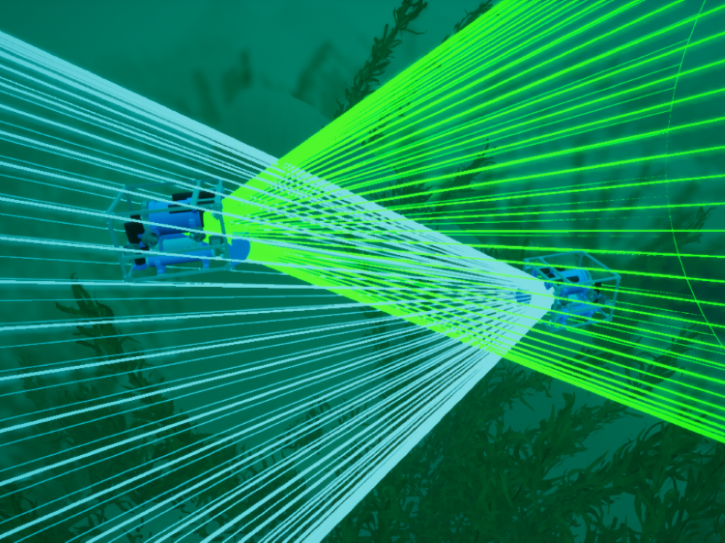 | 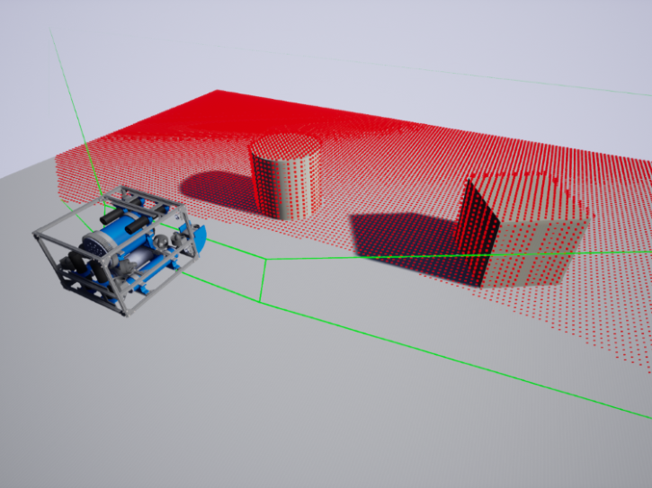 | 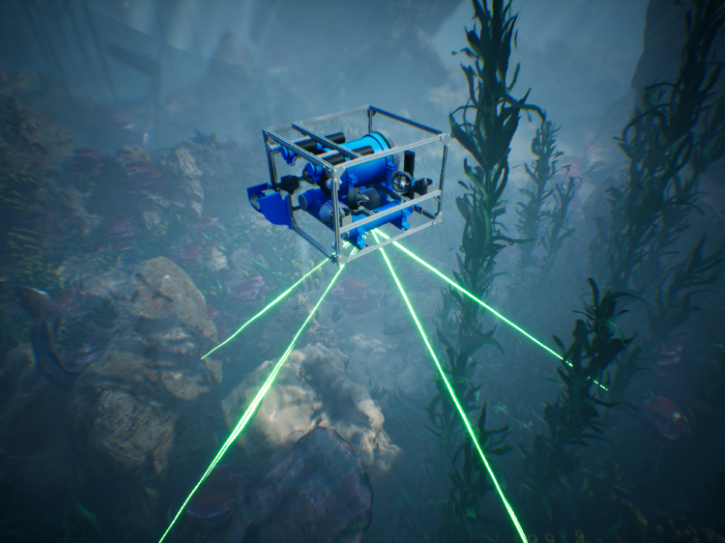 | 
<div class="div" style="text-align: center"> <span id='fig_5'></span>
<i>HoloOcean中包含的各种传感器可视化工具的演示。</i></div>
<div class="div" style="text-align: center">
<i>(a) 显示两艘水下航行器通过光纤调制解调器进行传输，其可用视线范围以锥形区域突出显示。</i></div>
<div class="div" style="text-align: center">
<i>（b）显示声呐模拟，其中在10厘米处生成了八叉树。</i></div>
<div class="div" style="text-align: center">
<i>绿色突出显示了声呐的视场，红色突出显示了视场内的每个八叉树叶子节点。</i></div>
<div class="div" style="text-align: center">
<i>(c) 显示DVL的波束，以绿色突出显示。</i></div>
<style>
.div {
    height: 20px;
    line-height: 1px;
}
</style>


!!! 笔记 
    下面的json文件内容为 任务配置示例。传感器插槽是载具身上预定义的框架，传感器可放置于其中。传感器的位置和旋转参数将用作相对于所选插槽的偏移量。<span id='fig_6'></span>
    ```json
    {
        "name": "MyMission",
        "world": "PierHarbor",
        "ticks_per_sec": 300,
        "agents": [
            {
                "agent_name": "auv0",
                "agent_type": "HoveringAUV",
                "sensors": [
            {
                "sensor_type": "IMUSensor",
                "socket": "IMUSocket",
                "location": [1.0, 2.0, 3.0],
                "rotation": [1.0, 2.0, 3.0],
                "Hz": 300,
                "configuration": {
                    "Sensor specific config"
                }
            }
            ],
            "location": [1.0, 2.0, 3.0],
            "rotation": [1.0, 2.0, 3.0],
            }
        ],
        "window_width": 1280,
        "window_height": 720
    }
    ```

### 4.1 多普勒测速仪 (DVL)

多普勒速度计 (DVL) 的工作原理是：发射四束声波，并利用多普勒效应，通过声波的入射和出射速度计算传感器在坐标系中的速度。我们将声波与负 z 轴的夹角记为 \( \alpha \)，并将计算得到的声波速度记为四维矢量 \( v_b \) 。传感器测量值 \( z_v \) 可以建模为：

$$
z^v = R_b^s (v_b + w^v) = R_w^s + R_b^s w^v,
    w^v \sim N(0, \sum^v)
$$
其中 \( w^v \) 是高斯噪声，\( R_b^s \) 是从光束坐标系到传感器坐标系的变换 [18]，\( v_w \) 是我们从 UE4 中提取的世界坐标系中的速度。


此外，DVL 还会计算每束波传播的距离，从而得到一个 4 维距离向量，该向量可用于组装稀疏点云。


## 5. 多代理任务与通信

HoloOcean 还允许在场景中使用任意数量的代理。添加代理（可连接任何类型的传感器）就像在 JSON 文件中添加几行代码一样简单。HoloOcean 提供两种代理模型：一种是我们基于 BlueRobotics 的 BlueROV2 自主开发的悬停式 AUV，另一种是通用 AUV。两者都遵循简单的浮力动力学模型，其中悬停式 AUV 的推进器位置会受到力的作用，而通用 AUV 则除了推进器外，还具有定义的鳍动力学特性[@harris2018preliminary]。


在许多多代理任务中，代理之间的通信对于协同工作至关重要。对于水下机器人而言，由于通信仅限于光学调制解调器或声学调制解调器，这成为一项艰巨的任务。为了更好地模拟这些场景，HoloOcean 也包含了这些调制解调器，具体描述如下。


## 5.1 声学调制解调器

我们的声学调制解调器模型基于 Blueprint Subsea SeaTrac X150 [@SeaTrac] 的功能。这意味着通信是通过在两个信标之间发送声波来实现的。在 HoloOcean 中，当声学调制解调器发送消息时，消息会包含消息类型及其数据有效载荷。我们会检查是否有其他消息同时发送；如果有，则丢弃所有消息以模拟声波干扰。


我们计算声波消息到达所需的时间步数。消息到达后，有效载荷被接收，并且根据消息类型，可能会发送返回消息。除了有效载荷之外，还会接收到其他数据，例如方位角、距离和深度，这些数据由消息类型指定。


## 5.2 光学调制解调器

光学调制解调器大致基于 Hydromea LumaX [@Hydromea]。它的工作原理与声学调制解调器类似，但也存在一些显著差异。在 HoloOcean 中，当光学调制解调器发送消息时，它首先会检查发送和接收信标的方向是否正确，以确保彼此能够看到对方，并且没有物体阻挡视线。


连接验证通过后，消息及其有效载荷就会被发送，在这种情况下，不会有任何延迟。


## 6. Python 接口

HoloOcean本质上是一个用Python封装的UE4编译游戏二进制文件。这使得它能够提供一个简单的Python接口来控制模拟，并且安装也非常简便。


## 7. 环境

为了提供各种逼真的场景，我们还为 HoloOcean 构建了多种环境。目前，这些环境包括水坝、码头和开阔水域。我们为每个环境都配置了逼真的水下图像，以及可用于多代理任务的大片水下区域。图 [7](#fig_7) 展示了一些示例。

|  |  |  |
|:---:|:---:|:---:|
| 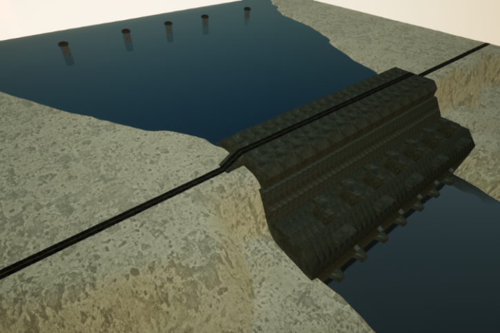 | 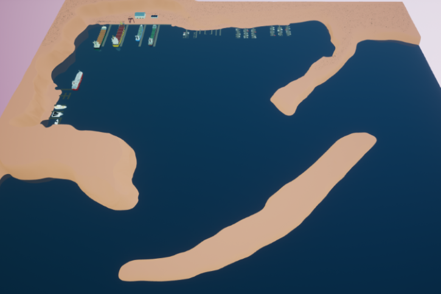 | 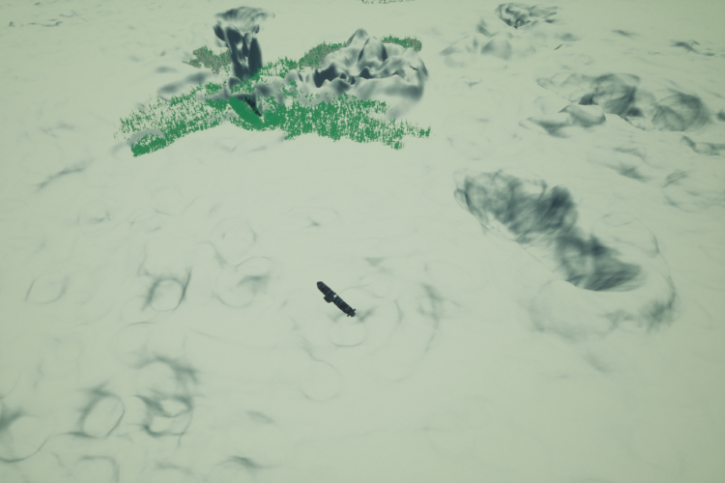 |
| 尺寸为 650 米 × 650 米的整个水坝环境 | 码头环境的概览，包括所有3种尺寸的码头，总面积为2km×2km | 开放水域环境，其中包括一些沉没的潜艇和飞机，总面积为 2km × 2km |
| 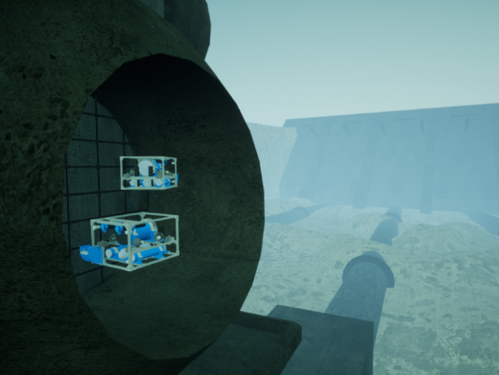 | 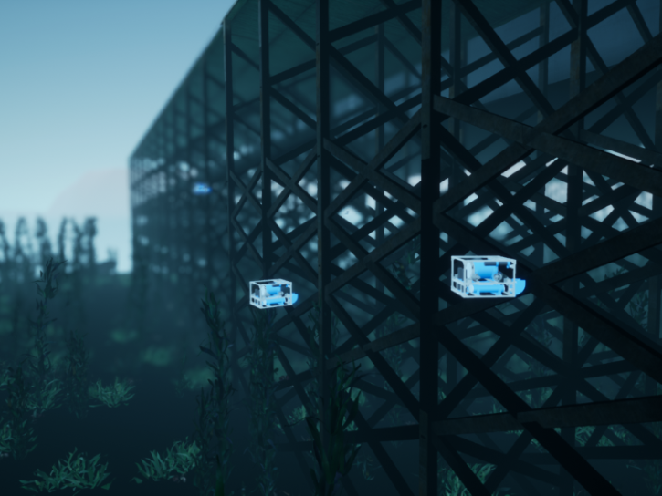 | 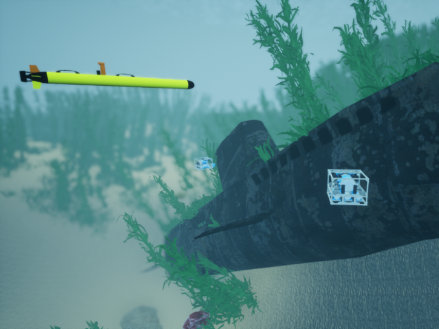 |
| 上图中一根管道的特写 | 上图左上角显示的码头特写 | 上图中一艘潜艇 |

<div class="div" style="text-align: center">
<i>HoloOcean 在 UE4 中创建的环境示例</i></div> <span id='fig_7'></span>
<style>
.div {
    height: 20px;
    line-height: 1px;
}
</style>

作为最受欢迎的游戏引擎之一，UE4 拥有庞大的资源市场，其中包含大量可供独立用户以合理价格购买的环境和网格模型。这使得快速开发高质量环境成为可能。此外，UE4 还拥有完善的文档和庞大的社区支持，为新用户提供了丰富的在线资源，显著降低了学习难度。


HoloOcean 已经帮助我们进行了研究，提供了用于验证水下导航不变扩展卡尔曼滤波器的真实数据[@potokar2021invariant]。


## 8. 结论

基于 Holodeck 和 UE4，我们创建了一个全新的开源水下模拟器，使用户能够轻松地从 UE4 构建自定义环境。它还提供了一个易于安装和使用的 Python 接口。此外，我们还实现了一种新型成像声呐模型，能够生成逼真的实时图像。该模拟器还集成了多种常用水下传感器，例如 DVL、IMU、摄像头、GPS 和深度传感器。它还支持通过声学和光学调制解调器进行多代理任务和通信。总而言之，我们打造了一个成熟、可扩展且易于使用的水下模拟器。未来的工作将包括添加更多声呐传感器、实现成像声呐算法的 GPU 版本、开发用于发布传感器数据的 ROS 封装器、添加更多代理（包括自主水面航行器）、更精确的传感器噪声模拟以及添加更多自定义环境。
