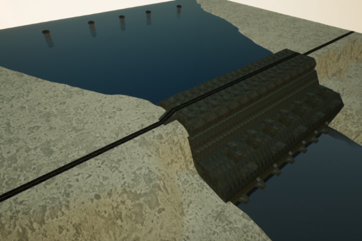
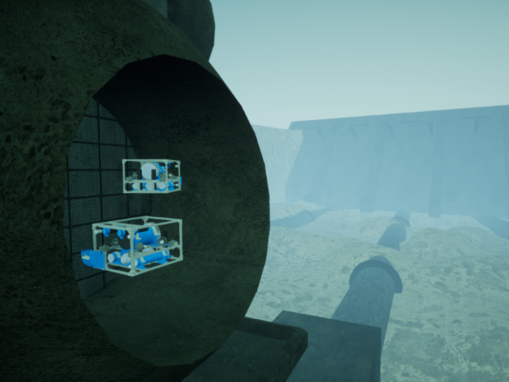

# 大坝（Dam）

这是一座可用于检查的水坝。整个区域面积约为 650 米 x 650 米。除了水坝本身，还有许​​多管道可供检查。

## 场景

* 大坝附近悬停（[Dam-Hovering](./Dam-Hovering.md)）

* 大坝附近悬停的相机（[Dam-HoveringCamera](./Dam-HoveringCamera.md)）

* 大坝附近悬停的成像声呐（[Dam-HoveringImagingSonar](./Dam-HoveringImagingSonar.md)）

