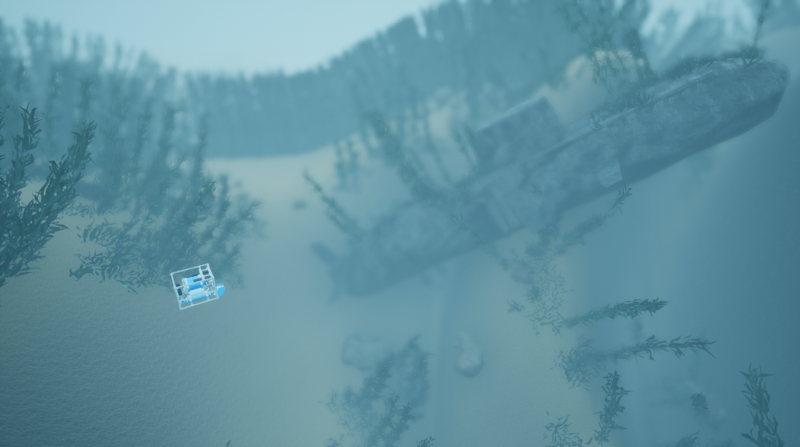

# 开放水域鱼雷型机器人单波束声呐（OpenWater-TorpedoSinglebeamSonar）

此场景开始时，一艘鱼雷型自主水下航行器（TorpedoAUV）位于潜艇附近。该航行器与基础版本相同，只是加装了声呐。八叉树叶片尺寸为2厘米。除非另有说明，所有传感器均与其类别名称相同，例如，惯性测量单元传感器（IMUSensor）的名称为“IMUSensor”。

* auv0：主[悬停自主水下航行器](https://byu-holoocean.github.io/holoocean-docs/UE4.27_archival_develop/agents/hovering-auv-agent.html#hovering-auv-agent)代理

    * [IMUSensor](https://byu-holoocean.github.io/holoocean-docs/UE4.27_archival_develop/holoocean/sensors.html#holoocean.sensors.IMUSensor) 配置了噪声和偏差，并返回偏差值。

    * [GPSSensor](https://byu-holoocean.github.io/holoocean-docs/UE4.27_archival_develop/holoocean/sensors.html#holoocean.sensors.GPSSensor) 获取表面 N(1, 0.25) 范围内的测量值，实际测量值也包含噪声。

    * [DVLSensor](https://byu-holoocean.github.io/holoocean-docs/UE4.27_archival_develop/holoocean/sensors.html#holoocean.sensors.DVLSensor) 配置了 22.5 度仰角和噪声，并返回 4 个距离测量值。

    * [SinglebeamSonar](https://byu-holoocean.github.io/holoocean-docs/UE4.27_archival_develop/holoocean/sensors.html#holoocean.sensors.SinglebeamSonar)（单波束声呐）配置为：开口角 30 度，200 个距离单元，带噪声，测量范围 0.5 至 30 米。

    * [DepthSensor](https://byu-holoocean.github.io/holoocean-docs/UE4.27_archival_develop/holoocean/sensors.html#holoocean.sensors.DepthSensor)（深度传感器）配置为带噪声。

    * [PoseSensor](https://byu-holoocean.github.io/holoocean-docs/UE4.27_archival_develop/holoocean/sensors.html#holoocean.sensors.PoseSensor) 用于获取真实值。

    * [VelocitySensor](https://byu-holoocean.github.io/holoocean-docs/UE4.27_archival_develop/holoocean/sensors.html#holoocean.sensors.VelocitySensor) 用于获取真实值。

