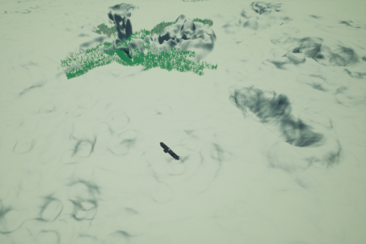
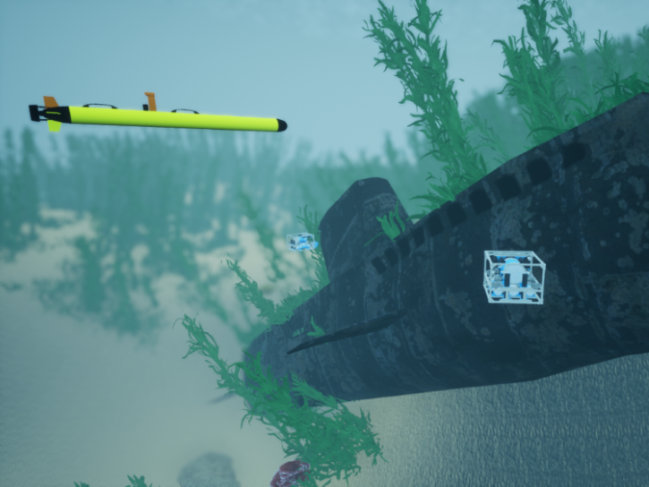

# 开放水域（OpenWater）

这是一个面积约为 2 公里 x 2 公里的大型开放水域环境。这里有一些起伏的丘陵、沉没的潜艇和飞机残骸，以及可供检查的植物。

## 场景

* 开放水域悬停（[OpenWater-Hovering](./OpenWater-Hovering.md)）

* 开放水域悬停相机（[OpenWater-HoveringCamera](./OpenWater-HoveringCamera.md)）

* 开放水域悬停成像声呐（[OpenWater-HoveringImagingSonar](./OpenWater-HoveringImagingSonar.md)）

* 开放水域鱼雷（[OpenWater-Torpedo](./OpenWater-Torpedo.md)）

* 开放水域鱼雷剖面声呐（[OpenWater-TorpedoProfilingSonar](./OpenWater-TorpedoProfilingSonar.md)）

* 开放水域鱼雷侧扫声呐（[OpenWater-TorpedoSidescanSonar](./OpenWater-TorpedoSidescanSonar.md)）

* 开放水域鱼雷单波束声呐（[OpenWater-TorpedoSinglebeamSonar](./OpenWater-TorpedoSinglebeamSonar.md)）

