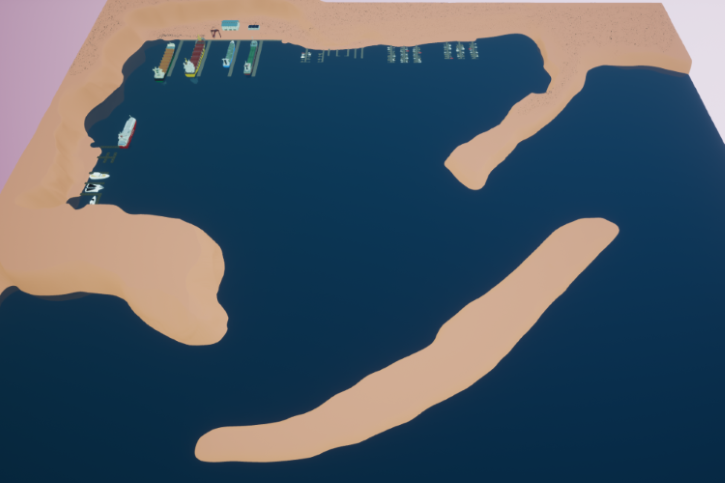
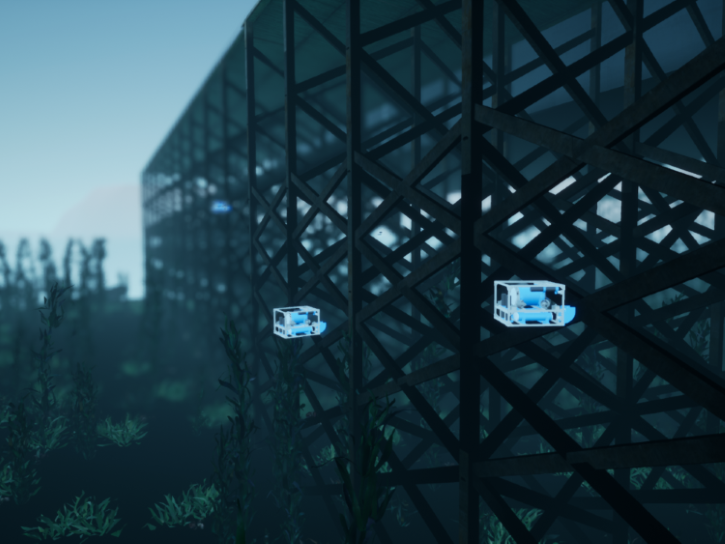

# 码头港口（PierHarbor）

该环境包含多个不同尺寸的码头，可供检查。环境总面积约为 2km x 2km。码头分为三种尺寸，从小型渔港到大型货运码头（包括船舶）不等。

## 场景

* 码头港口悬停（[PierHarbor-Hovering](./PierHarbor-Hovering.md)）

* 码头港口悬停的相机（[PierHarbor-HoveringCamera](./PierHarbor-HoveringCamera.md)）

* 码头港口悬停的成像声呐（[PierHarbor-HoveringImagingSonar](./PierHarbor-HoveringImagingSonar.md)）

* 码头港口鱼雷（[PierHarbor-Torpedo](./PierHarbor-Torpedo.md)）

