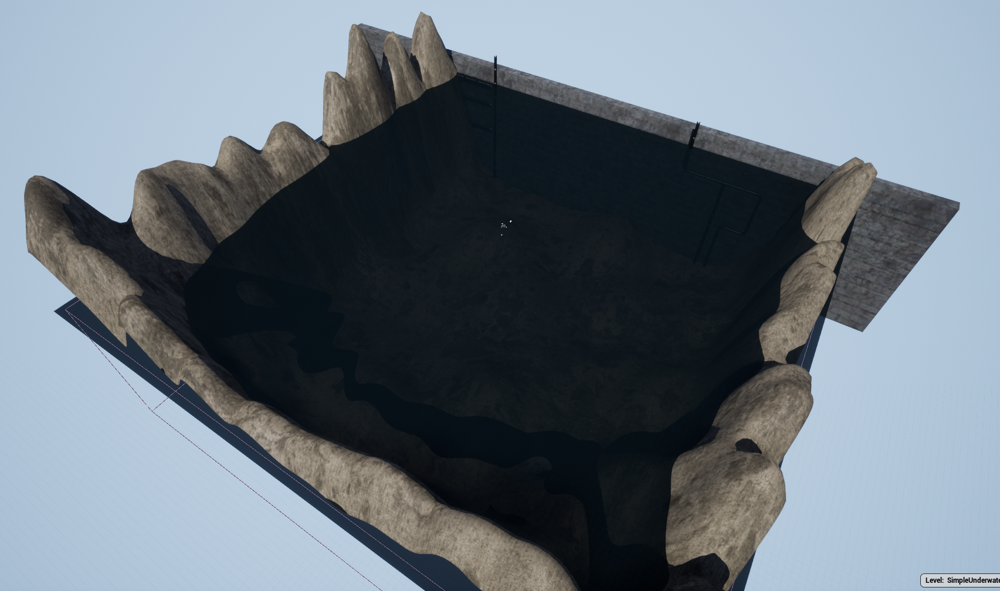

# 简易水下（SimpleUnderwater）

这是一个用于模拟的基本水下世界。它的一端设有管道供检查，并配备了非常基础的水下图像。当您需要一个轻量级的环境且对图像质量要求不高时，可以使用它。

## 场景

* 简易水下悬停（[SimpleUnderwater-Hovering](./SimpleUnderwater-Hovering.md)

* 简易水下鱼雷（[SimpleUnderwater-Torpedo](./SimpleUnderwater-Torpedo.md)）
