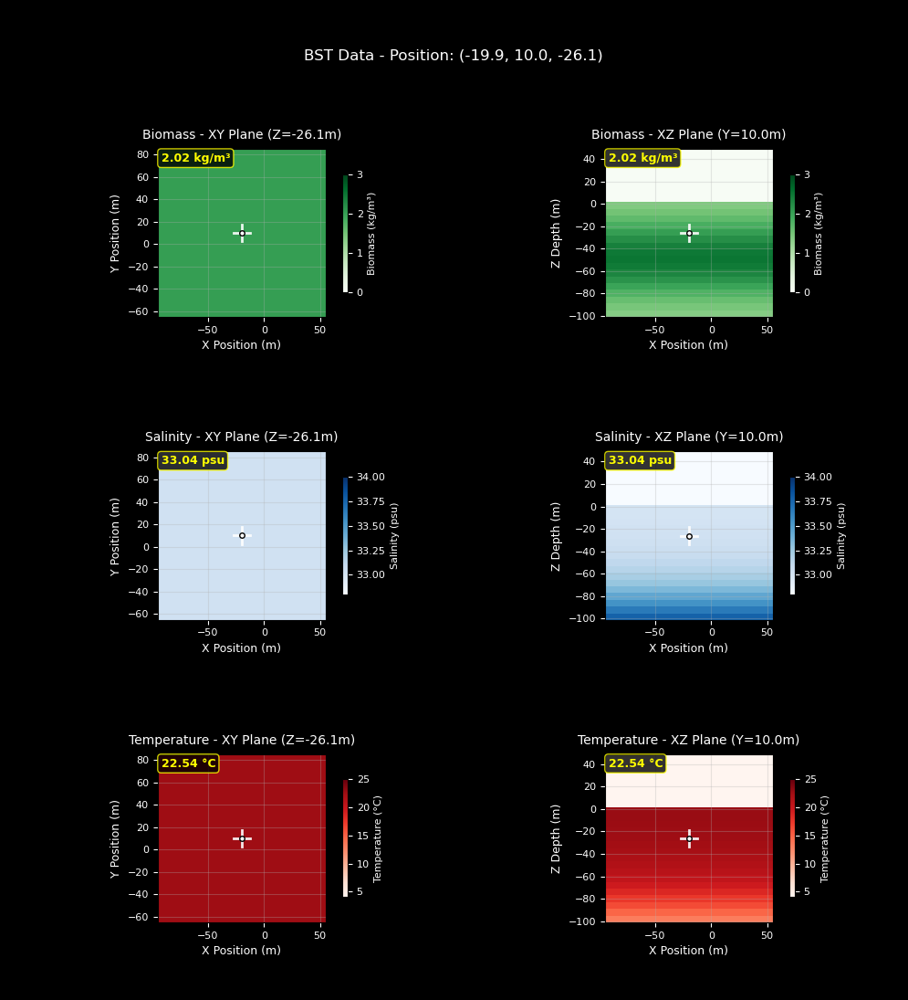
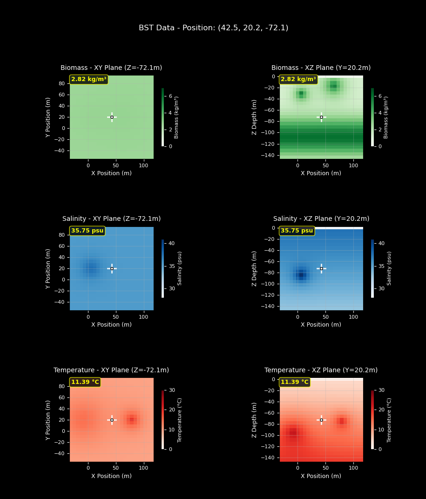
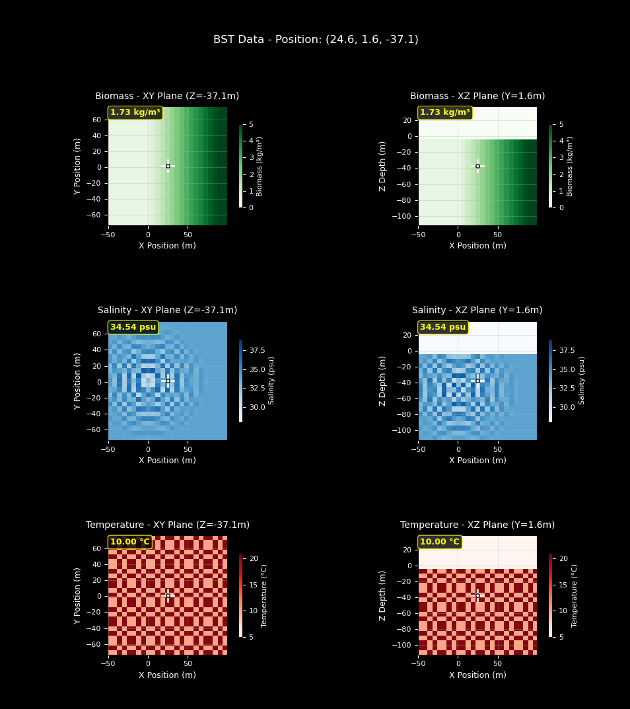

# 生物量、盐度和温度 (BST) 传感器

基于真实数据，模拟全球生物量、盐度和温度的分布和采样。

有关如何使用此传感器的示例，请参阅[生物量、盐度和温度采样](https://byu-holoocean.github.io/holoocean-docs/v2.3.0/examples/examples/sampling_bst.html#sampling-bst)。

有关 Python API，请参阅 [BSTSensor](https://byu-holoocean.github.io/holoocean-docs/v2.3.0/holoocean/sensors.html#holoocean.sensors.BSTSensor)。

要将自定义函数传递给用于计算生物量、盐度或温度的 BST 传感器，请在脚本开头调用以下命令。有关自定义 BST 传感器的更多信息，请参阅下面的示例配置、上面链接的示例脚本以及 API 文档：`set_temperature_function(new_function)`，其中“new_function”是指向您的自定义函数的指针，该函数仅接受参数“location”（一个包含 3 个元素的数组）。

## 图表绘制

您可以通过调用以下命令实时绘制 BST 数据图表：`visualizer = env.initialize_bst_graphs()`，不同的图表参数请参见 API 文档和示例 `visualizer.update(location)`，其中 `location` 是从位置传感器获取的实时位置。

!!! 注意
    自从实现了生物量、盐度和温度采样以来，我们也实现了动态潮汐。默认的生物量、盐度和温度函数没有考虑动态潮汐和动态水位，因此，如果您希望将这些动态模型纳入计算，您可以设置使用动态潮汐数据的自定义生物量、盐度和温度函数。

!!! 注意
    我们注意到，实时更新的热图可能会导致延迟，并对模拟运行时间产生显著影响。[生物量、盐度、温度采样](https://byu-holoocean.github.io/holoocean-docs/v2.3.0/examples/examples/sampling_bst.html#sampling-bst)示例页面演示了如何使用 Python 多进程在实时更新热图的同时显著提升模拟性能。如果您希望使用 BST 传感器的绘图功能，我们强烈建议您使用多进程。

以下示例展示了生物量、盐度和温度分布的默认配置以及两种不同的配置方法。默认配置示例展示了在不更改任何其他参数的情况下，分布的默认状态。第二个示例演示了如何仅通过更改环境场景配置来实现自定义。最后一个示例演示了如何设计自定义函数并将其设置为生物量、盐度和温度的新分布模型。



默认配置：
```json
scenario = {
"name": "test_currents",
"world": "PierHarbor",
"package_name": "Ocean",
"main_agent": "auv0",
"ticks_per_sec": 60,
"frames_per_sec": 60,
"agents": [
        {
            "agent_name": "auv0",
            "agent_type": "HoveringAUV",
            "sensors": [
                {
                    "sensor_type": "BSTSensor",
                    "socket": "COM",
                    "configuration":{}
                },
                {
                    "sensor_type": "LocationSensor",
                    "socket": "COM"
                }
            ],
        "control_scheme": 0,
        "location": [-20, 10, -10]
        }
    ],
}
```

## 定制配置



自定义配置参数：

```json
{
    "sensor_type": "BSTSensor",
    "socket": "COM",
    "Hz": 1,
    "configuration": {
        "max_biomass": 6,
        "biomass_range": (0, 7),
        "peak_depth": 110.0,
        "biomass_clusters": [
            {
                "position": [65, 20, -15],
                "strength": 5,
                "falloff": 15
            },
            {
                "position": [5, 20, -30],
                "strength": 5,
                "falloff": 10
            }
        ],
        "surface_psu": 40,
        "deep_psu": 30,
        "halocline_depth": 90,
        "halocline_thickness": 75,
        "salinity_range": (28, 41),
        "salinity_clusters": [
            {
                "position": [5, 20, -85],
                "strength": 8,
                "falloff": 10
            }
        ],
        "surface_temp": 2,
        "deep_temp": 26,
        "thermocline_depth": 110,
        "thermocline_thickness": 50,
        "temperature_range": (0, 30),
        "temperature_clusters": [
            {
                "position": [80, 20, -75],
                "strength": 12,
                "falloff": 12
            },
            {
                "position": [-10, 20, -95],
                "strength": 12,
                "falloff": 25
            }
        ]
    }
}
```

## 自定义函数

由于实现自定义函数不仅仅是修改配置参数，我们仅包含了传递给 `HoloOceanEnvironment.initialize_bst_graphs` 函数调用的自定义函数。如果您想查看自定义函数的完整实现，请参阅[生物量、盐度、温度采样](https://byu-holoocean.github.io/holoocean-docs/v2.3.0/examples/examples/sampling_bst.html#sampling-bst)示例。



自定义函数和配置参数：

```python
def biomass_fx(location):
    # NOTE: It's required that we name this parameter "location"
    x, y, z = location
    x_fade = max(0, min(1, x / 100))  # fades from 0 at x=0.5 to 5.5 at x=100, then stays at 5.5
    return 5.0 * x_fade + 0.5

def salinity_fx(location):
    # This function creates decaying oscillations that originate from a single point
    import math
    x, y, z = location
    center = [0, 0, -50]
    # The zip() function in Python pairs corresponding values in two iterables together in tuples
    dist = math.sqrt(sum((a - b)**2 for a, b in zip(location, center)))
    if dist > 80:
        return 34  # base salinity
    amplitude = 4 * (1 - dist/80)
    return 34 + amplitude * math.cos(dist * 2 * math.pi / 10)

def temperature_fx(location):
    # This function creates a checkerboard-type pattern across the world
    x, y, z = location
    square_size = 5
    checks = sum(int(coord // square_size) % 2 for coord in [x, y, z])
    return 10 if checks % 2 == 0 else 20  # alternate between two temps

scenario = {
    "name": "BST Custom Functions",
    "main_agent": "auv0",
    "ticks_per_sec": 60,
    "frames_per_sec": 60,
    "agents": [
            {
                "agent_name": "auv0",
                "agent_type": "HoveringAUV",
                "sensors": [
                    {
                        "sensor_type": "BSTSensor",
                        "socket": "COM",
                        "configuration": {
                            "biomass_range": (0, 5),
                            "salinity_range": (28, 39),
                            "temperature_range": (5, 21)
                        }
                    },
                    {
                        "sensor_type": "LocationSensor",
                        "socket": "COM"
                    }
                ],
            "control_scheme": 0,
            "location": [-20, 10, -10]
            }
        ],
    }
```
