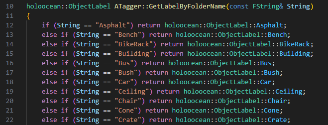
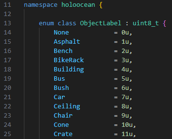
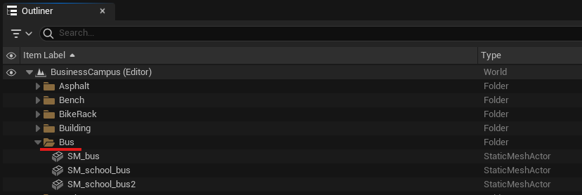
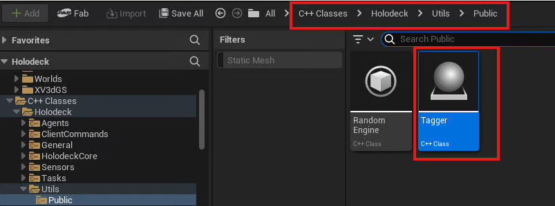
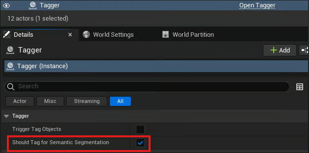
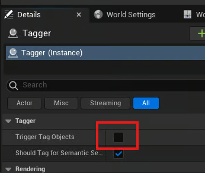
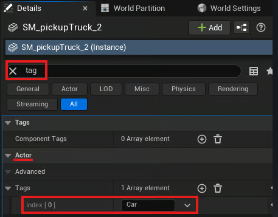
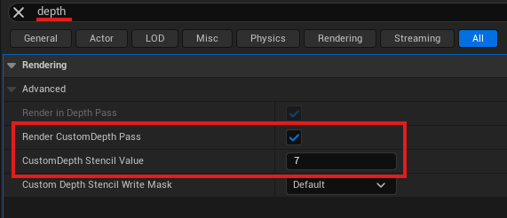
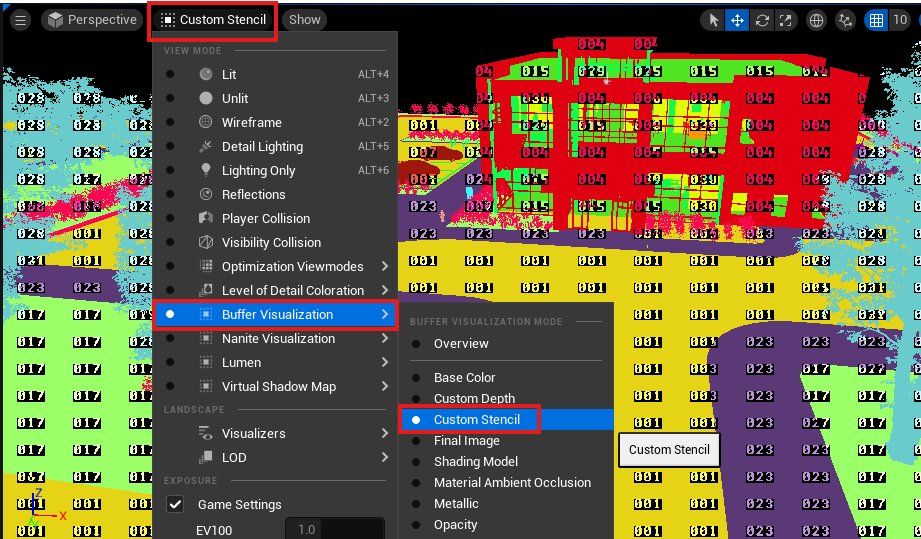

# 添加自定义语义标签

为了让 HoloOcean 识别语义标签，关卡中的每个资源都必须添加标签并更改渲染设置。这些更改必须在虚幻引擎编辑器中完成。

!!! 注意
    HoloOcean 的语义实现使用模板值作为标签，因此标签值范围为 0-255。

为了方便操作，HoloOcean 提供了一个 Tagger 类，可以根据对象的文件夹标题自动应用标签。如果您不需要任何自定义标签，可以参考 HoloOcean 提供的标签列表（位于[可用语义标签](#semantic_labels)页面），然后继续[使用 Tagger 类自动添加标签](#automatic_labels)。

## 设置自定义标签

要向 HoloOcean 添加新标签，您需要将其添加到几个 C++ 文件中，并选择一种颜色与标签关联。

### 自定义标签

要添加自定义标签，请将标签名称添加到 Tagger.cpp 中的 GetLabelByFolderName 函数以及 ObjectLabel.h 中的 ObjectLabel 枚举中。

“GetLabelByFolderName”中包含的文件夹标题示例

“对象标签”中与文件夹标题关联的数字示例

### 更改标签颜色

要更改每个标签关联的颜色，您可以修改 engine/source/Holodeck/Utils/Public/HolooceanPallete.h 中列出的 RGB 值。

## 为资源添加标签

### 使用标签器自动添加标签 

要让标签器自动添加标签，您需要确保资源放置在与其标签对应的文件夹中。例如，所有放置在“Bus”文件夹中的公交车资源都将被标记为与“Bus”对应的模板值。

接下来，启用标签器。在虚幻编辑器中，找到 C++ 类，然后导航到 Holodeck/Utils/Public/Tagger 目录，找到标签器的 C++ 文件。

将 Tagger C++ 文件拖入关卡中。在“详细信息”面板中，单击 Tagger 并启用“应为语义分割添加标签”。

然后，点击“触发标签对象”以自动应用标签。

### 手动添加标签

要手动设置标签，请在“详细信息”面板中选择要添加标签的资源。在该资源下，搜索“标签”以查找演员标签。将您的标签添加到参与者标签列表中。

然后，搜索“深度”，启用“渲染自定义深度通道”，并将“自定义深度模板值”设置为与您的标签关联的值。对每个要添加标签的资源执行此操作。此外，为景观启用“渲染自定义深度通道”，以确保其在深度输出中可见。

## 在编辑器中可视化标签

要可视化关卡并确保对象标签正确，请将视图模式从“点亮”更改为“自定义模板”。

## 可用语义标签 

以下是 HoloOcean 当前已实现的所有标签列表。Ocean 和 BusinessCampus 包中的每个世界都使用这些标签的子集，具体取决于该世界中的资源（请参阅 [BusinessCampus](https://byu-holoocean.github.io/holoocean-docs/v2.3.0/packages/BusinessCampus/BusinessCampus.html#business-campus) 和 [Ocean 包](https://byu-holoocean.github.io/holoocean-docs/v2.3.0/packages/Ocean/Ocean.html#ocean)中的世界子页面）。

| 文件夹名字  | 模板值 | RGB 值 |
|-------|--------|-------|
| None（无）     | 0  | {0, 0, 0}  |
| Cube（立方体）     | 1  | {240, 29, 219}  |
| Sphere（球体）     | 2  | {29, 89, 240}  |
| BaseShape（基础形状）     | 3  | {29, 240, 89}  |
| Landscape（景色）     | 4  | {153, 153, 153}  |
| GroundGrass（草地）     | 5  | {91, 235, 52}  |
| GroundRock（地面岩石）     | 6  | {196, 101, 6}  |
| Ground（地面）     | 7  | {194, 164, 159}  |
| GroundPath（地面路径）     | 8  | {76, 117, 252}  |
| WaterPlane（水面）     | 9  | {66, 135, 245}  |
| Boat（小船）     | 10  | {128, 64, 128}  |
| Yacht（游艇）     | 11  | {70, 70, 70}  |
| ContainerBoat（集装箱船）     | 12  | {102, 102, 156}  |
| Concrete（混泥土）     | 13  | {214, 138, 230}  |
| Pipe（管道）     | 14  | {73, 227, 78}  |
| PipeCover（管道盖板）     | 15  | {85, 166, 3}  |
| VentCover（通气孔盖）     | 16  | {245, 215, 66}  |
| Rock（石头）     | 17  | {153, 115, 9}  |
| Seaweed（海藻）     | 18  | {75, 166, 5}  |
| Coral（珊瑚）     | 19  | {235, 64, 52}  |
| Plane（飞机）     | 20  | {176, 165, 146}  |
| Sub（潜艇）     | 21  | {146, 161, 176}  |
| Pier（码头）     | 22  | {186, 76, 2}  |
| Buoy（浮标）     | 23  | {237, 53, 7}  |
| Trash（垃圾）     | 24  | {107, 156, 137}  |
| Grass（草）     | 25  | {91, 235, 52}  |
| Asphalt（沥青）     | 26  | {79, 82, 77}  |
| Bench（长凳）     | 27  | {212, 191, 125}  |
| BikeRack（自行车架）     | 28  | {209, 208, 203}  |
| Building（建筑物）     | 29  | {31, 240, 205}  |
| Bus（公共汽车）     | 30  | {240, 220, 43}  |
| Bush（灌木）     | 31  | {177, 247, 124}  |
| Car（汽车）     | 32  | {224, 109, 237}  |
| Ceiling（天花板）     | 33  | {161, 247, 233}  |
| Chair（椅子）     | 34  | {65, 13, 255}  |
| Cone（圆锥体）     | 35  | {255, 169, 10}  |
| Crate（板条箱）     | 36  | {140, 86, 0}  |
| Desk（书桌）     | 37  | {242, 65, 224}  |
| Dumpster（大垃圾桶）     | 38  | {0, 138, 14}  |
| FireHydrant（消防栓）     | 39  | {255, 0, 0}  |
| Floor（地板）     | 40  | {2, 125, 104}  |
| GarbageCan（垃圾桶）     | 41  | {0, 184, 92}  |
| Pallet（托盘）     | 42  | {143, 129, 6}  |
| ParkingGate（停车门）     | 43  | {222, 164, 177}  |
| PatioUmbrella（庭院遮阳伞）     | 44  | {195, 0, 255}  |
| Railing（栏杆）     | 45  | {242, 97, 130}  |
| SemiTruck（半挂式卡车）     | 46  | {124, 6, 138}  |
| Sidewalk（人行道）     | 47  | {232, 232, 232}  |
| SpeedLimitSign（限速标志）     | 48  | {222, 218, 245}  |
| StopSign（停车标志）     | 49  | {250, 37, 62}  |
| StreetLamps（路灯）     | 50  | {255, 149, 10}  |
| Table（桌子）     | 51  | {186, 17, 169}  |
| Tree（树）     | 52  | {69, 99, 46}  |
| Wall（墙）     | 53  | {126, 60, 250}  |
| Unlabeled（未贴标签）     | 54  | {0, 0, 0}  |
| Any（任何一个）     | 255  | {255, 255, 255}  |

## 参考

* [Adding Custom Semantic Labels](https://byu-holoocean.github.io/holoocean-docs/v2.3.0/develop/env-docs/custom-semantics.html)