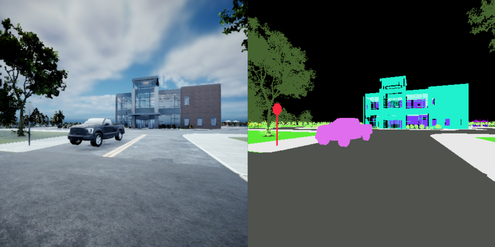

# 语义分割相机

一种用于获取语义标注相机数据的相机传感器。

下图展示了RGB相机输出与相应的语义分割相机输出的对比。




请参阅[可视化语义分割相机输出](https://byu-holoocean.github.io/holoocean-docs/v2.3.0/examples/examples/camera.html#visualizing-semanticsegcamera-output)示例，了解如何使用此传感器。

!!! 注意
    所有 HoloOcean 关卡均已应用语义标签。如果您要创建自定义关卡，则必须启用语义标签并定义任何新标签。请参阅[添加自定义语义标签](https://byu-holoocean.github.io/holoocean-docs/v2.3.0/develop/env-docs/custom-semantics.html#semantic-segmentation)以获取说明和我们当前的语义标签列表。

有关 Python API，请参阅 [SemanticSegmentationCamera](https://byu-holoocean.github.io/holoocean-docs/v2.3.0/holoocean/sensors.html#holoocean.sensors.SemanticSegmentationCamera)。

传感器定义示例：
```json
{
    "sensor_type": "SemanticSegmentationCamera",
    "sensor_name": "SemanticForwardFacingCamera",
    "socket": "CameraSocket",
    "configuration": {
        "CaptureWidth": 512,
        "CaptureHeight": 512,
    }
}
```
