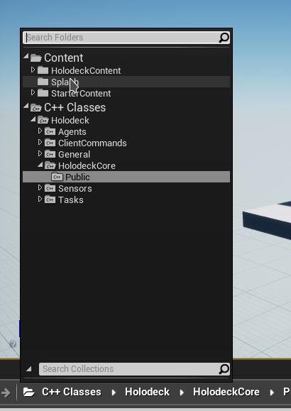
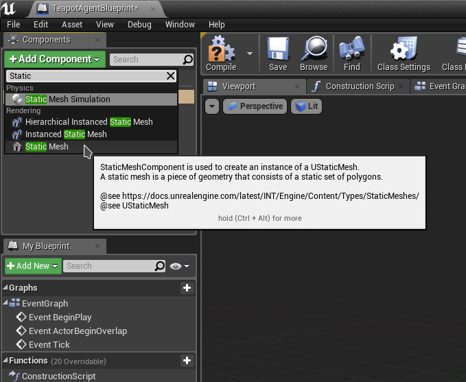
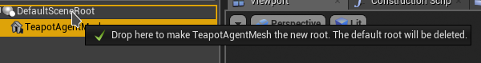
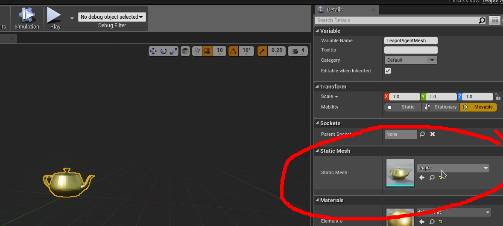

# WORK IN PROGRESS

### Fair Warning:

Adding custom agents in holodeck is not for the faint of heart.

If you just want a variation on an agent, it might be best to modify an existing
agent and swap out the mesh or modify its behavior.

## Overview

You will need to modify both [holodeck-engine](https://github.com/BYU-PCCL/holodeck-engine)
and [holodeck](https://github.com/BYU-PCCL/holodeck). Be sure to have both of
those set up and ready for development (see [Onboarding](https://github.com/BYU-PCCL/holodeck/wiki/Holodeck-Onboarding)).

Particularly, follow
 - [Building Holodeck Engine](https://github.com/BYU-PCCL/holodeck/wiki/Building-Holodeck-Engine)
 - [Developing `holodeck` package](https://github.com/BYU-PCCL/holodeck/wiki/Developing-%60holodeck%60-package)

During this tutorial we will make a "TeapotAgent". We recommend using Windows, 
since UE4 on Linux isn't very polished. 

#### `holodeck` changes
- Subclass `HolodeckAgent`, implement:
  - `agent_type`
  - `control_schemes`
  - `__repr__`
  - `__act__`
- Create identifiers for control schemes (`ControlSchemes` class)
- Add type key to `AgentDefinition` (maps agent name, ie `"SphereAgent"`, to the class)

#### `holodeck-engine` changes
- Subclass:
  - `HolodeckAgent`
  - `HolodeckControlScheme`
  - `HolodeckPawnController`
- Create blueprint
- 
## Part 0: Validating Dev Setup

Let's make sure that you're ready to build holodeck. 

Open `holodeck.uproject` from `holodeck-engine`. It may tell you that it needs 
to rebuild, allow it to. The Unreal Editor should open and 
[show the example level](images/editor.png). 

From the editor, select File -> Refresh Visual Studio Project. You should now
be able to open the project in Visual Studio. Build it and ensure there are no
errors.

## Part 1: Unreal Engine Changes

For some background see [UE4s Controller explaination](https://docs.unrealengine.com/en-US/Gameplay/Framework/Controller/index.html).
In holodeck, agent controllers are mainly used to initialize and configure 
control schemes. Control schemes map inputs from the client to actions on the
UE4 object. 

For this example, we won't implement a control scheme or a complex
controller, and the agent will have only one hard-coded control scheme. Look
at the UAV for an example if you want to do this.

### Create C++ classes

1. In the editor, press the folder icon in the content browser and change the
   it to "C++ Classes". Navigate to `Holodeck\HolodeckCore\Public`

   
2. Right click on "HolodeckPawnController" and select "Create C++ class derived from HolodeckPawnController"
3. Set the name to "HolodeckPawnController" and change the path to
   `holodeck-engine/Source/Holodeck/Agents/Public/`
4. Make sure the project still builds (press the "Compile" button in the editor)
5. Since we will only have one control scheme, the `TeapotAgentController` 
   doesn't really need to do anything. For brevity, we will put everything in 
   the header file. Open your IDE and put the following in 
   `TeapotAgentController.h`:
   ```c++
    #pragma once

    #include "CoreMinimal.h"
    #include "HolodeckCore/Public/HolodeckPawnController.h"
    #include "TeapotAgentController.generated.h"

    /**
    * 
    */
    UCLASS()
    class HOLODECK_API ATeapotAgentController : public AHolodeckPawnController
    {
      GENERATED_BODY()
      
    public:

      ATeapotAgentController(const FObjectInitializer& ObjectInitializer)
          : AHolodeckPawnController(ObjectInitializer) {
        UE_LOG(LogTemp, Warning, TEXT("TeapotAgentController Initialized"));
      }

      /**
        * Default Destructor
        */
      ~ATeapotAgentController() {};

      void AddControlSchemes() override {
        // no control schemes
      }
      
    };
   ```
6. Now we need to subclass `Holodeck/HolodeckCore/Public/HolodeckAgent` and make
   `TeapotAgent`, repeat steps 2-4.
7. Once again, we'll put all the implementation in the header, for brevity's
   sake. `TeapotAgent.h`:
   ```cpp
    #pragma once

    #include "CoreMinimal.h"
    #include "HolodeckCore/Public/HolodeckAgent.h"
    #include "TeapotAgent.generated.h"

    /**
    * 
    */
    UCLASS()
    class HOLODECK_API ATeapotAgent : public AHolodeckAgent
    {
      GENERATED_BODY()

      // ^ do not anger this macro, or bad things will happen
    public:
      ATeapotAgent() {
        this->PrimaryActorTick.bCanEverTick = true;

        // Load the controller and set it as the default. 
        this->AIControllerClass = LoadClass<AController>(NULL, TEXT("/Script/Holodeck.TeapotAgentController"), NULL, LOAD_None, NULL);
        this->AutoPossessAI = EAutoPossessAI::PlacedInWorld;
      };

      void InitializeAgent() override {
        Super::InitializeAgent();
        RootMesh = Cast<UStaticMeshComponent>(RootComponent);
      };

      void Tick(float DeltaSeconds) override {
        float max_thrust = 10.0f;  // meters

        // clamp the thrust to within +/- 10
        FVector Impulse = FVector(
          FMath::Clamp(this->CommandArray[0], -max_thrust, max_thrust),
          FMath::Clamp(this->CommandArray[1], -max_thrust, max_thrust),
          FMath::Clamp(this->CommandArray[2], -max_thrust, max_thrust)
        );

        // Holodeck's units are in meters, but UE4 uses centimeters. Helper function to convert
        // between the two
        Impulse = ConvertLinearVector(Impulse, ClientToUE);

        // Note that this doesn't rotate the imulse into the agent's frame of reference, so
        // Impulse is aligned with the world. See TurtleAgent.cpp
        this->RootMesh->AddForce(Impulse);

        if (static_cast<bool>(this->CommandArray[4])) {
          // engage teapot mode! teapots grow when in teapot mode
          this->RootMesh->SetWorldScale3D(FVector(2));
        } else {
          this->RootMesh->SetWorldScale3D(FVector(1));
        }
      };

      UPROPERTY(BlueprintReadWrite, Category = UAVMesh)
        UStaticMeshComponent* RootMesh;
      
      
      // This function should match the size of CommandArray. Holodeck uses this value to allocate
      // the shared memory buffer between the engine/server any the client/python interpreter.
      unsigned int GetRawActionSizeInBytes() const override { return 4 * sizeof(float); };
      // The action sent from the client will be copied into this buffer
      void* GetRawActionBuffer() const override { return (void*)CommandArray; };

      // This has to do with the AbuseSensor. Set it to -1 to disable it, teapots are strong
      float GetAccelerationLimit() override { return 400; }

      private:
      /**
      * 0: x impulse
      * 1: y impulse
      * 2: z impulse
      * 3: engage teapot mode (t/f)
      */
      float CommandArray[4];

    };
   ```

### Create Agent Blueprint

We've made a C++ class for our agent, but most agents are blueprints that
subclass the C++ class, since there are various things that are easier to do in
blueprints.

1. Find the `TeapotAgent`, right click and select "Create Blueprint class based
   on TeapotAgent" called `TeapotAgentBlueprint`, place it in 
   `Content/HolodeckContent/Agents/TeapotAgent/`. Another Editor window will 
   open.
2. Press "Add Component" in the upper left corner and add a "Static Mesh", name
   it `TeapotAgentMesh`.

   
3. Drag `TeapotAgentMesh` on top of `DefaultSceneRoot` to make it the new root
   component

  
4. On the right, set the static mesh to `teapot` (there is a teapot mesh included
   with holodeck)
  
  
5. 