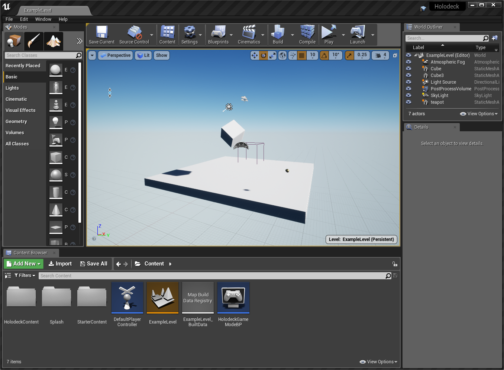

The engine side of holodeck is an Unreal project that has synchronization code written in C++ to communicate with the engine, found in the [`holodeck-engine`](https://github.com/BYU-PCCL/holodeck-engine) repo. For details on how those two halves communicate, see [Holodeck Communication Protocol](https://github.com/BYU-PCCL/holodeck/wiki/Holodeck-Communication-Protocol).

### 1. Get Unreal Editor
In order to modify the engine, you must have the Unreal Editor installed. For Windows, you can just install it from the Epic Game Launcher (see https://www.unrealengine.com/), but for Linux you must compile the editor  yourself (see [here](https://docs.unrealengine.com/en-US/Platforms/Linux/BeginnerLinuxDeveloper/SettingUpAnUnrealWorkflow/index.html)

You must install the version of Unreal Editor that holodeck is currently using, check the [changelog](https://holodeck.readthedocs.io/en/latest/changelog/changelog.html) to see which version holodeck-engine is currently using. As of this writing the current version is 4.22.

### 2. Clone Repo

To start, clone the repo (https://github.com/BYU-PCCL/holodeck-engine). You must have git-lfs installed and enabled, after running `git clone` you should be able to run `git lfs pull` and get output like the following:
```console
jayden@NAGA:~/dev/temp$ git clone git@github.com:BYU-PCCL/holodeck-engine.git
Cloning into 'holodeck-engine'...
remote: Enumerating objects: 57, done.
remote: Counting objects: 100% (57/57), done.
remote: Compressing objects: 100% (44/44), done.
remote: Total 6769 (delta 22), reused 24 (delta 12), pack-reused 6712
Receiving objects: 100% (6769/6769), 4.53 MiB | 9.84 MiB/s, done.
Resolving deltas: 100% (3884/3884), done.
Filtering content: 100% (181/181), 224.26 MiB | 9.61 MiB/s, done.
jayden@NAGA:~/dev/temp$ cd holodeck-engine/
jayden@NAGA:~/dev/temp/holodeck-engine$ git lfs pull
jayden@NAGA:~/dev/temp/holodeck-engine$
```

### 3. Opening Project
You should now be able to open `holodeck.uproject` in the editor.

If you get an error about assets being corrupt, you didn't do a git lfs pull correctly.

If you get an error about assets being saved with a different engine version, make sure you installed the correct version.

You should see the ExampleLevel loaded up:



### 4. 生成项目文件

在 Windows 系统中，右键单击资源管理器中的 `holodeck.uproject` 文件，然后选择"Refresh Visual Studio Projects"。

在 Linux 系统中，请参阅[如何在 Linux 上调试 Holodeck 引擎](./How-to-Configure-Debugger-on-Linux.md)以生成项目文件。

这样，您就可以在 IDE 中打开 Holodeck 并编辑 C++ 文件，以及调试已编译的项目。


### 5. 烘焙内容

在虚幻编辑器中，选择“文件”->“为 {平台} 烘焙内容”。几分钟后，右下角应该会弹出成功提示。

必须先执行此操作，才能从调试器运行 Holodeck。


### 6. 运行项目

您可以从这里开始，打包项目以便从客户端启动（例如使用 `holodeck.make()` 或实例化一个 `HolodeckEnvironment`），或者将客户端附加到在调试器或虚幻编辑器中运行的引擎实例。

- [打包项目](./Packaging-Project.md)

待办事项：编写并链接到相关页面，解释如何在此处运行项目。


## FAQ

#### 所有关卡/资产都去哪儿了？

我们购买了许多素材的授权来创建我们打包分发的关卡，但我们并不拥有这些素材的所有权。根据这些授权协议的条款，我们无法以未处理的形式分发它们。很遗憾，holodeck-engine 代码库中的内容就是我们所能提供的全部，抱歉。您可以自由创建自己的关卡/世界并自行授权。


