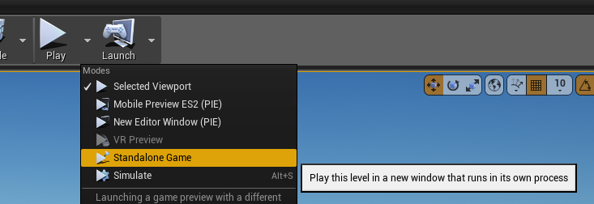
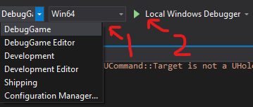

When working on `holodeck` or `holodeck-engine`, you may be wondering how to
debug your code. 

- [Modifying the `holodeck` package](#modifying-%60holodeck%60-package)
- [Modifying the `holodeck-engine` project](#Modifying-%60holodeck-engine%60)

## Modifying `holodeck` package

If you are just modifying the Python package, you just need to make sure that
there is a compatible package installed in the [Holodeck search path.](https://holodeck.readthedocs.io/en/latest/packages/docs/installation.html)

### Working off of master

If you are building off of master, you should be able to just use the binaries
we provide with (`holodeck.install`) as long as you don't make any breaking
changes.

### Working off of develop

We don't provide builds of `develop` so you will need to build the engine
yourself ([Building Holodeck Engine](https://github.com/BYU-PCCL/holodeck/wiki/Building-Holodeck-Engine)).

After you can build it, [package it](https://github.com/BYU-PCCL/holodeck/wiki/Packaging-Project) and [place it in the install directory](https://github.com/BYU-PCCL/holodeck/wiki/Packaging-Project#place-in-install-directory).

After following those instructions, you should be able to call `holodeck.make`.

## Modifying `holodeck-engine`

Working on the engine is trickier. You can build it and place it in the expected
directory, [as above](#working-off-of-develop), but that's slow and annoying,
and you can't attach a debugger.

The crux of both of the following methods is that the engine must have a client
attach for it in order for it to tick (ie advance the state and parse input).

If you've read and understood [Holodeck Communication Protocol](https://github.com/BYU-PCCL/holodeck/wiki/Holodeck-Communication-Protocol)
, the reason for this should make sense.

### Launch From the Unreal Editor

If you want to debug a particular level you have open in the editor, from the

1. Launch game
   
   From the toolbar above the viewport select the down arrow next to 
   **Play** -> Standalone Game

   .

   Running in its own process means that if the engine crashes or the client
   disconnects, the editor won't lock up or crash.

2. Attach Client

   [See below](#attaching-client)

### Launch from Visual Studio 
Make sure you have [cooked content](https://github.com/BYU-PCCL/holodeck/wiki/Packaging-Project#cooking-content)
before attempting this.

0. Optional: Select Level

   If you want to launch a particular level:

   1. Go to Debug Menu -> Holodeck Properties -> Debugging
   2. In "Command Arguments", put the name of the level to load
   3. OK

1. Launch the game from Visual Studio (play button, make sure DebugGame is 
   selected)
   
   

2. Attach Client

   [See below](#attaching-client)

### Attaching Client

Once you have the engine running, you need to attach a client to it. This is
most easily done by creating your own [`HolodeckEnvironment`](https://holodeck.readthedocs.io/en/latest/holodeck/environments.html#holodeck.environments.HolodeckEnvironment)
object.

```python
env = HolodeckEnvironment(
    start_world=False
)
```

This attaches because the default UUID for both `HolodeckEnvironent` and the 
engine (if `--HolodeckUUID=` is not provided on the engine's command line) is 
`""` or the empty string.

After that object is created, you should be able to call `env.tick(5000)` and
move the camera around.

If you want to spawn agents and sensors, provide a scenario configuration dict 
to the `scenario` option in the constructor for `HolodeckEnvironment` (see 
[Scenarios](https://holodeck.readthedocs.io/en/latest/packages/docs/scenarios.html))