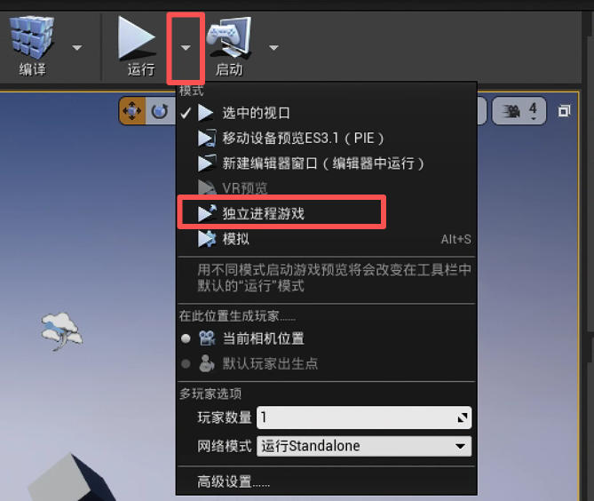

在使用 `holodeck` 或 `holodeck-engine` 时，您可能会想知道如何调试代码。

- [修改 `holodeck` 包](#modifying_holodeck_package)
- [修改 `holodeck-engine` 项目](#modifying_holodeck_engine)

## 修改 `holodeck` 包 <span id="modifying_holodeck_package"></span>

如果您只是修改 Python 包，只需确保 [Holodeck 搜索路径](../packages/installation.md)中已安装兼容的包即可。

### 基于 master 分支

如果您基于 master 分支构建，只要不进行任何破坏性更改，您应该可以直接使用我们提供的二进制文件（`holodeck.install`）。


### 基于 develop 分支 <span id="working_off_of_develop"></span>

我们不提供 `develop` 分支的构建版本，因此您需要自行构建引擎（[构建 Holodeck 引擎](./Building-Holodeck-Engine.md)）。


构建完成后，将其[打包](./Packaging-Project.md)并[放置在安装目录](../packages/installation.md)中。


按照这些说明操作后，您应该可以调用 `holodeck.make`。


## 修改 `holodeck-engine` 项目 <span id="modifying_holodeck_engine"></span>

引擎的开发比较棘手。你可以[像上面那样](#working_off_of_develop)构建引擎并将其放置在预期的目录中，但这既慢又麻烦，而且你无法附加调试器。


以下两种方法的关键在于，引擎必须有客户端连接才能运行（即推进状态并解析输入）。


如果你已经阅读并理解了 [Holodeck 通信协议](../develop/semaphores.md)，那么这一点就很容易理解了。


### 从虚幻编辑器启动

如果您想调试编辑器中打开的特定关卡，请从以下位置启动游戏：

1. 启动游戏
   
   在视窗上方的工具栏中，选择“**运行**”旁边的向下箭头->“**独立进程游戏**”。

   

   在独立进程中运行意味着，即使引擎崩溃或客户端断开连接，编辑器也不会卡死或崩溃。

2. 客户端附着

   [请参见下方](#attaching_client)

### 从 Visual Studio 启动

请确保在尝试此操作之前[已烘焙好内容](../develop/env.md#cooking_content)。


0. 可选：选择关卡

   如果您想启动特定关卡：

   1. 转到“调试”菜单 -> “Holodeck 属性” -> “调试”
   2. 在“命令参数”中，输入要加载的关卡名称
   3. 确定

1. 从 Visual Studio 启动游戏（点击“运行”按钮，确保已选择“DebugGame”）。
   
   

2. 客户端附着

   请查看下方[客户端附着](#attaching-client)。

### 客户端附着  <span id="attaching_client"></span>

引擎运行起来之后，你需要将客户端连接到它。最简单的方法是创建你自己的 [`HolodeckEnvironment`](https://holodeck.readthedocs.io/en/latest/holodeck/environments.html#holodeck.environments.HolodeckEnvironment) 对象。

```python
env = HolodeckEnvironment(
    start_world=False
)
```

这是因为 `HolodeckEnvironent` 和引擎的默认 UUID（如果引擎命令行中未提供 `--HolodeckUUID=` 参数）均为空字符串 `""`。

创建该对象后，您应该可以调用 `env.tick(5000)` 并移动摄像机。


如果您想要生成代理和传感器，请在 `HolodeckEnvironment` 的构造函数中为 `scenario` 选项提供一个场景配置字典（参见[场景](../usage/scenarios.md)部分）。
