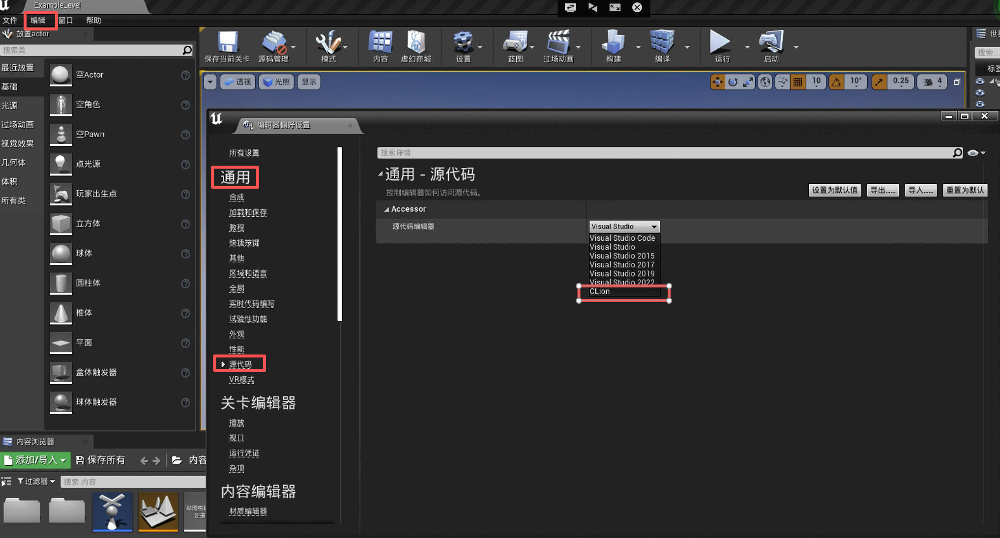

## CLion

#### 1. 创建 CLion 工程文件
- 在虚幻引擎中打开 Holodeck
- 选择菜单中的：编辑 -> 编辑器偏好设置 -> 通用 -> 源代码 -> 源代码编辑器 -> CLion
- 选择菜单中的：文件 -> 生成 CLion 工程 (如果项目已生成，则此选项将显示为“刷新 CLion 项目”)

#### 2. 在 CLion 中打开项目
在 CLion 中从项目根目录打开项目，或者在虚幻引擎编辑器中，转到“File -> Open CLion”。

#### 3. 编辑配置

!!! 注意
    您需要将 libopenvr_api.so 从 `{您克隆 ue4 的位置}/UnrealEngine/Engine/Binaries/ThirdParty/OpenVR/OpenVRv1_0_16/linux64` 复制到 `holodeck-engine/Binaries/Linux`，以便能够按照这些说明运行/调试游戏。

- 在 CLion 中，转到“Run -> Edit Configurations”（也可在工具栏的“运行”部分找到）
- 选择 Holodeck-Linux-DebugGame
- 将`Executable`的值设置为 {HOLODECK-ENGINE-ROOT}/Binaries/Linux/Holodeck-Linux-DebugGame
- 将“程序参数”留空。或者，您可以指定要加载的地图/世界，例如 `TestWorld`
- 点击 OK
- 使用调试图标调试游戏，或按 `Shift + F9`。

#### 4. 以调试模式运行 Holodeck
设置完成后，您应该可以点击“Run -> Debug <configuration_name>”，点击工具栏右上角的调试图标，或者直接使用 Shift + F9 来调试 Holodeck。

!!! 注意
    这将构建项目并以调试模式打开虚幻引擎。在虚幻引擎中运行 Holodeck 应该会触发您设置的所有断点。

## VSCode
#### 1. 创建 VSCode 项目文件
- 在虚幻引擎中打开 Holodeck
- 选择菜单中的：编辑 -> 编辑器偏好设置 -> 通用 -> 源代码 -> 源代码编辑器 -> VSCode
- 选择菜单中的：文件 -> 生成 VSCode 项目(如果项目已生成，则此选项将显示为“刷新 CLion 项目”)

#### 2. 在 VSCode 中打开项目
在 VSCode 中从项目根目录打开工作区。

#### 3. 复制缺失的库
将 `libopenvr_api.so` 从 `{您克隆 ue4 的位置}/UnrealEngine/Engine/Binaries/ThirdParty/OpenVR/OpenVRv1_0_16/linux64` 复制到 `holodeck-engine/Binaries/Linux`

#### 4. Run
按 F5 进行调试，按 Ctrl + Shift + B 进行构建

## 命令行
#### 1. 从命令行构建：
`{UnrealEngineDir}/Engine/Build/BatchFiles/Linux/Build.sh holodeck Linux {BuildConfiguration} {HolodeckEngineDir}/Holodeck.uproject -waitmutex`

`ExecutableName` 可以是任何值。生成的可执行文件将以此命名。通常格式为 Holodeck-{BuildConfiguration}。例如：Holodeck-Debug。如果出现“找不到目标规则”错误，只需使用“holodeck”即可。

`BuildConfiguration` 必须是以下选项之一：
- `Debug`: 包含用于调试引擎和游戏的符号
- `DebugGame`: 引擎已优化，但包含游戏的调试符号，因此游戏可调试
- `Development`: 启用除最耗时的优化之外的所有优化
- `Shipping`: 优化游戏和引擎代码
- `Test`: 与 Shipping 相同，但启用了一些控制台命令、统计信息和性能分析工具

#### 2. 从命令行运行游戏:
`{HolodeckEngineDir}/Build/Linux}/{TargetName}-{Linux}-{BuildConfiguration}`

!!! 注意
    您可能需要为 Linux 系统编译项目，否则可能会出现“未编译”的游戏错误。要为 Linux 系统编译游戏，请在 UnrealEditor 中打开游戏，然后单击“文件”->“烘焙内容”->“[平台名称]”或“文件”->“烘焙 Linux 内容”。 

#### 3. 将调试器附加到进程:
您可以使用您选择的调试器附加到游戏的运行进程。

#### 相关虚幻引擎文档链接:

[项目打包](https://docs.unrealengine.com/en-US/Engine/Basics/Projects/Packaging/index.html)

[构建配置](https://docs.unrealengine.com/en-US/Programming/Development/CompilingProjects/index.html)