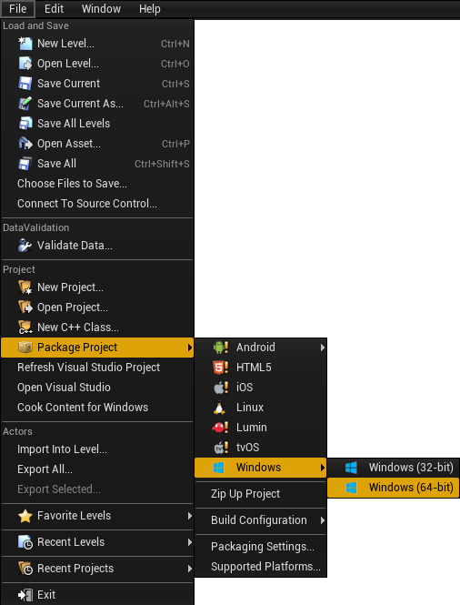

An Unreal project needs to be packaged before it can be distributed. This 
process produces the engine executables and bundles up all of the assets that
are needed for the client to start up the engine by itself without starting it
from the editor or Visual Studio.

This process will compile the C++ code for Holodeck and "cook" the `.uasset`
files (including blueprints!) into one large `.pak` file, and create the 
directory structure needed.

[Visual aid](https://lucid.app/lucidchart/invitations/accept/b6a8ee14-4fd7-44ca-a73f-39d77de9200e)

## Adding Holodeck Worlds
The finished package will only contain the worlds (called "levels" in the editor) that are added into the project. The `holodeck-engine` repo only contains the example level. The rest of the worlds are found in the [holodeck-worlds repo](https://github.com/BYU-PCCL/holodeck-worlds), which contains multiple vanilla unreal projects. To add them to the project, clone the worlds repo and copy the `Content` folder from the worlds you want to add. Paste this folder into the `holodeck-engine` repo and allow it to overwrite any conflicting files. 

**Note**: Because these worlds contain purchased assets, they are only available to official BYU PCCL members. Others will have to develop their own worlds in the holodeck-engine.

## Cooking Content
When you are running `holodeck-engine` from Visual Studio, you may need to cook
the content to "refresh" the assets, levels, and blueprints that 
`holodeck-engine` reads. 

**From Unreal Editor:**

File ➡ Cook Content for Windows/Linux

## Packaging holodeck-engine

**From Unreal Editor:**

1. File ➡ Package Project ➡ Windows x64/Linux
   

2. Select an output folder
    
   I usually pick "dist" inside the root of the `holodeck-engine` repo

## Place in install directory

In order to be able to call `holodeck.make()`, you will need to place the 
packaged engine in [holodeck's package install directory](https://holodeck.readthedocs.io/en/latest/packages/docs/installation.html).

Make sure the version in the path matches the output of the 
`holdoeck.util.get_holodeck_version` command.

1. Copy contents of `dist` folder into the package path found above.
   
   ```
   + worlds
   |--+ PackageName
      |-- config.json
      |-- WorldName-ScenarioName.json
      |--+ LinuxNoEditor (output from dist folder)
         | UE4 build output
   ```

2. Copy configurations from `holodeck-configs` following the file structure above.
   
   **IMPORTANT** The `config.json` file is written for Linux, and must be edited to work in windows.
   Edit the `platform` and `path` fields to the following:
   
    `"platform": "windows"`
   
    `"path": "WindowsNoEditor/Holodeck/Binaries/Win64/Holodeck.exe"`

 